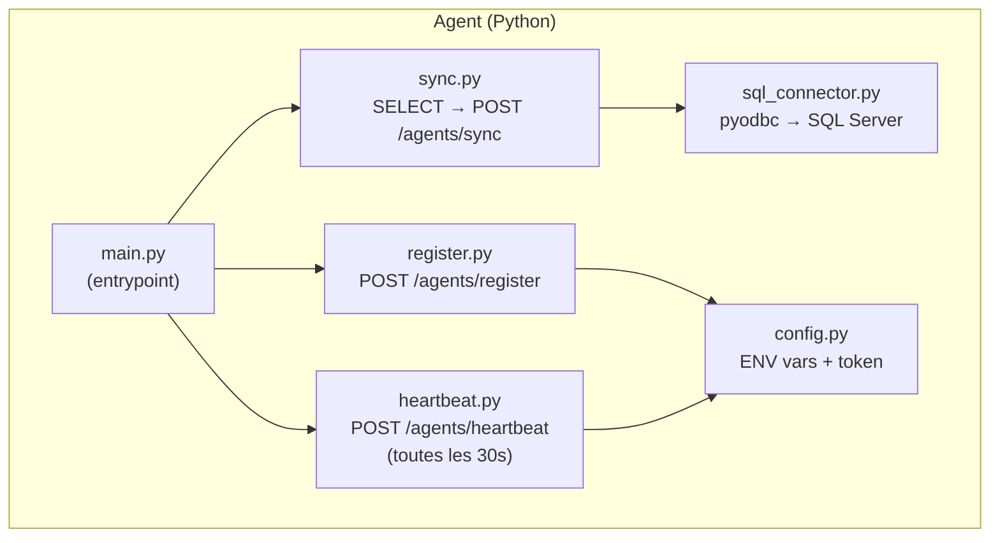
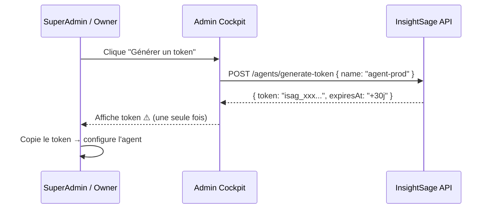
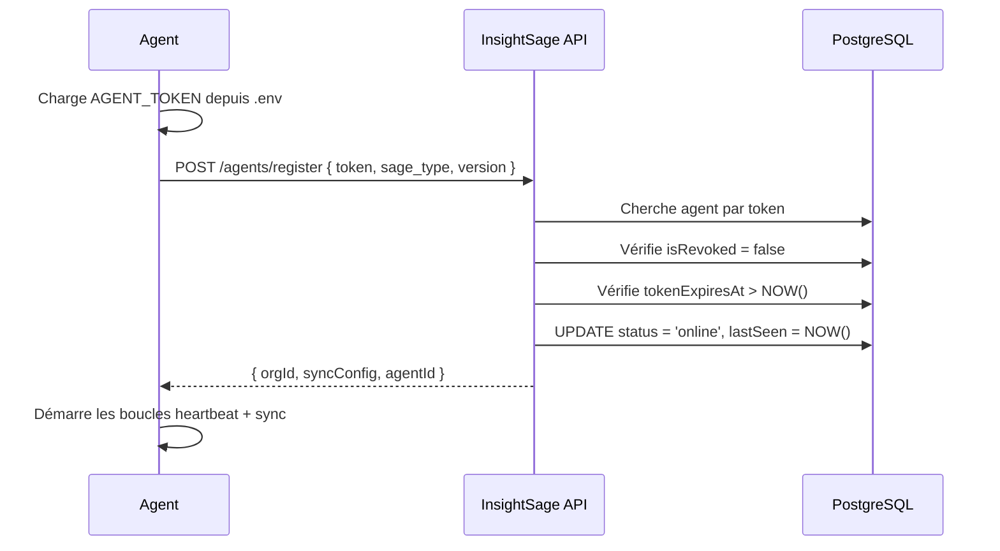
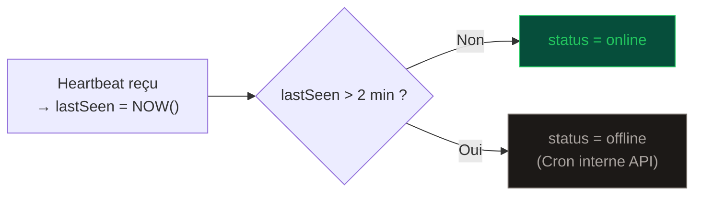

# L'Agent — Pont Sécurisé

L'Agent est un processus léger déployé **on-premise** chez le client. Son rôle est d'établir un tunnel sécurisé et unidirectionnel entre le serveur Sage ERP du client et l'infrastructure cloud InsightSage.

## Principe de fonctionnement

```mermaid
graph LR
    subgraph Site Client ["🏢 Site Client (On-Premise)"]
        SAGE["🖥️ Sage ERP\nSQL Server\n(local network)"]
        AGT["🤖 Agent\nPython / Docker\nOutbound HTTPS uniquement"]
        SAGE -->|"SQL SELECT\n(localhost/LAN)"| AGT
    end

    subgraph Cloud ["☁️ Cloud (InsightSage)"]
        API["⚙️ InsightSage API\nHTTPS 443"]
    end

    AGT -->|"HTTPS + Bearer token\n→ Outbound only\n← Aucune connexion entrante"| API

    style SAGE fill:#1e293b,stroke:#475569
    style AGT fill:#0f3d3d,stroke:#0d9488,color:#2dd4bf
    style API fill:#0f172a,stroke:#0d9488
```



### Points clés de sécurité

| Aspect | Implémentation |
|--------|----------------|
| **Direction** | Outbound uniquement (Agent → API) — jamais entrant |
| **Protocole** | HTTPS/TLS 1.3 — chiffré de bout en bout |
| **Authentification** | Bearer token `isag_<64hex>` avec TTL 30 jours |
| **Révocation** | Instantanée via `POST /agents/:id/revoke` |
| **SQL** | `SELECT` uniquement — aucun accès en écriture sur Sage |
| **Réseau** | Seul le port 443 sortant est requis |

---

## Architecture interne de l'Agent



---

## Cycle de vie complet

### 1. Génération du token (Admin Cockpit)



!!! danger "Token à usage unique d'affichage"
    Le token est affiché **une seule fois** lors de la génération.
    Copiez-le immédiatement et configurez-le dans les variables d'environnement de l'agent.

### 2. Démarrage de l'agent



### 3. Heartbeat (30 secondes)

```typescript
// Corps du heartbeat
POST /agents/heartbeat
{
  "agentToken": "isag_xxx...",
  "status": "online",    // "online" | "error"
  "errorCount": 0,
  "lastError": null
}
```

### 4. Détection d'agent hors ligne



---

## États de l'agent

| État | Couleur | Condition |
|------|---------|-----------|
| `pending` | 🟡 Jaune | Token généré, agent jamais démarré |
| `online` | 🟢 Vert | Dernier heartbeat < 2 minutes |
| `offline` | ⚫ Gris | Dernier heartbeat > 2 minutes |
| `error` | 🔴 Rouge | Dernier heartbeat avec `status: error` |

---

## Gestion de l'expiration du token

L'API calcule les champs suivants pour chaque agent :

```typescript
const daysUntilExpiry = tokenExpiresAt
  ? Math.ceil((tokenExpiresAt.getTime() - Date.now()) / 86400000)
  : null;

const isExpiringSoon = daysUntilExpiry !== null && daysUntilExpiry <= 7;
```

!!! warning "Token expirant bientôt"
    Quand `isExpiringSoon = true`, le dashboard Admin Cockpit affiche une alerte.
    Procédez à une régénération via `POST /agents/:id/regenerate-token` avant l'expiration.

---

## Permissions SQL requises (Sage ERP)

L'agent se connecte à SQL Server avec un compte **limité en lecture** :

```sql
-- Créer un utilisateur dédié pour l'agent
CREATE LOGIN cockpit_agent WITH PASSWORD = 'StrongPassword123!';
CREATE USER cockpit_agent FOR LOGIN cockpit_agent;

-- Accorder SELECT sur les tables Sage
GRANT SELECT ON SCHEMA::dbo TO cockpit_agent;

-- OU plus granulaire (recommandé)
GRANT SELECT ON dbo.VENTET TO cockpit_agent;
GRANT SELECT ON dbo.BPCUSTOMER TO cockpit_agent;
GRANT SELECT ON dbo.ITMMASTER TO cockpit_agent;
```

!!! success "Principe du moindre privilège"
    L'agent ne nécessite **aucun** droit INSERT, UPDATE, DELETE ou DDL sur la base Sage.

---

## Métriques collectées par l'agent

| Métrique | Table Sage X3 | Description |
|----------|--------------|-------------|
| Chiffre d'affaires | `VENTET` | Lignes de vente |
| DSO / DMP | `BPCUSTOMER` + `VENTET` | Délai moyen de paiement |
| AR Aging | `GESBPC` | Balance âgée clients |
| Stock | `STOJOU` + `ITMMASTER` | Niveaux de stock |
| Commandes | `PORDER` | Pipeline commandes |
