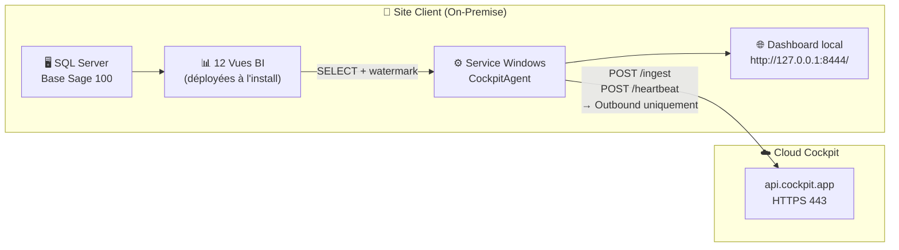
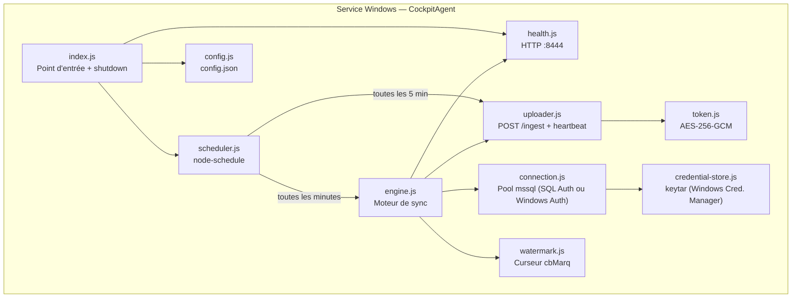
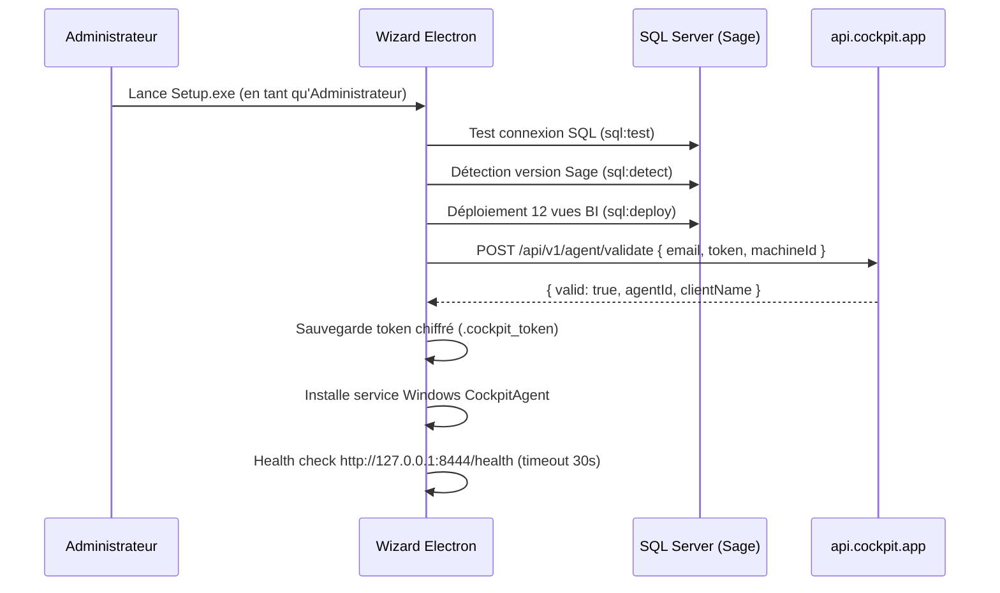
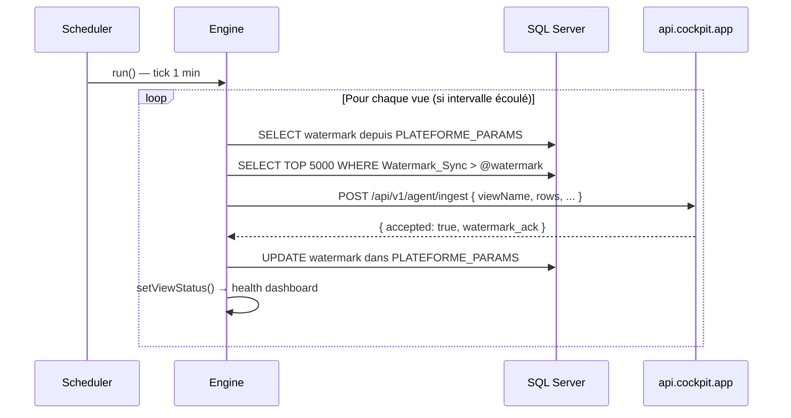

# L'Agent Cockpit — Pont Sécurisé

L'Agent Cockpit est un **service Windows** déployé on-premise chez le client. Son rôle est de lire les données Sage 100 via SQL Server et de les synchroniser vers la plateforme SaaS Cockpit en push HTTPS. Aucune donnée brute ne transite dans le cloud — uniquement les agrégats des vues BI déployées localement.

## Principe de fonctionnement



### Points clés de sécurité

| Aspect | Implémentation |
|--------|----------------|
| **Direction** | Outbound uniquement (Agent → API) — aucun port entrant |
| **Protocole** | HTTPS/TLS — chiffré de bout en bout |
| **Authentification** | Bearer token `isag_<48hex>` avec TTL 30 jours |
| **Token chiffré** | AES-256-GCM lié au machine ID (inutilisable sur une autre machine) |
| **Mot de passe SQL** | Stocké dans Windows Credential Manager — jamais en clair |
| **SQL** | `SELECT` uniquement sur les vues BI — aucun accès en écriture Sage |
| **Réseau** | Seul le port 443 sortant est requis |

---

## Architecture interne



---

## Cycle de vie complet

### 1. Installation (wizard Electron)

L'installeur `Cockpit Agent Setup.exe` guide l'administrateur en 6 étapes :



### 2. Démarrage du service

Au démarrage, le service :
1. Lance le serveur health HTTP sur `:8444`
2. Démarre le scheduler (sync 1min / heartbeat 5min)
3. Récupère la config distante en arrière-plan (`GET /api/v1/agent/config`)

### 3. Cycle de synchronisation (toutes les minutes)



### 4. Heartbeat (toutes les 5 minutes)

```
POST /api/v1/agent/heartbeat
{
  "status": "online",
  "lastSync": "2026-04-10T14:30:00.000Z",
  "nbRecordsTotal": 145230
}
```

La plateforme peut répondre avec des commandes :

```json
{ "ok": true, "commands": ["FORCE_FULL_SYNC"] }
```

---

## Mécanisme watermark (cbMarq)

Sage 100 ajoute un champ `cbMarq` (entier auto-incrémenté) à toutes ses tables. Les vues l'exposent sous l'alias `Watermark_Sync`. L'agent persiste le dernier cbMarq traité dans `PLATEFORME_PARAMS` et ne re-lit que les lignes supérieures au curseur — synchronisation incrémentale **sans aucune modification de la base Sage**.

---

## 12 Vues synchronisées

| Vue | Intervalle | Mode |
|-----|-----------|------|
| `VW_KPI_SYNTESE` | 5 min | FULL |
| `VW_METADATA_AGENT` | 5 min | FULL |
| `VW_GRAND_LIVRE_GENERAL` | 15 min | INCRÉMENTAL |
| `VW_CLIENTS` | 15 min | INCRÉMENTAL |
| `VW_FOURNISSEURS` | 15 min | INCRÉMENTAL |
| `VW_TRESORERIE` | 15 min | INCRÉMENTAL |
| `VW_COMMANDES` | 30 min | INCRÉMENTAL |
| `VW_ANALYTIQUE` | 30 min | INCRÉMENTAL |
| `VW_STOCKS` | 60 min | INCRÉMENTAL |
| `VW_FINANCE_GENERAL` | 60 min | INCRÉMENTAL |
| `VW_IMMOBILISATIONS` | 6 h | FULL |
| `VW_PAIE` | 6 h | FULL |

Les intervalles peuvent être surchargés par la config distante (`GET /api/v1/agent/config`).

---

## Dashboard de statut local

Le service expose une interface web sur `http://127.0.0.1:8444/` (auto-refresh 10s) :

- Badge statut global (Opérationnel / En erreur)
- Uptime, connexion SQL Server, connexion plateforme
- Tableau de toutes les vues avec dernier sync et nb lignes

```
GET http://127.0.0.1:8444/        → Dashboard HTML
GET http://127.0.0.1:8444/health  → JSON machine-readable
```

---

## États de l'agent (plateforme)

| État | Couleur | Condition |
|------|---------|-----------|
| `pending` | 🟡 Jaune | Token validé, service pas encore démarré |
| `online` | 🟢 Vert | Dernier heartbeat < 2 minutes |
| `offline` | ⚫ Gris | Dernier heartbeat > 2 minutes |
| `error` | 🔴 Rouge | Dernier heartbeat avec `status: error` |

---

## Permissions SQL requises (Sage 100)

| Droit | Opération | Quand |
|-------|-----------|-------|
| `db_datareader` | SELECT sur tables Sage | En continu (sync) |
| `db_ddladmin` | CREATE VIEW, CREATE TABLE | À l'installation uniquement |

Le compte n'a **aucun** droit INSERT, UPDATE, DELETE sur les données Sage.

---

## Gestion de l'expiration du token

- Durée : 30 jours depuis la génération
- Alerte proactive : J-7, J-3, J-1 (email automatique)
- Renouvellement : **Portail Cockpit → Agents → Régénérer le token** puis réinstaller l'agent

!!! warning "Token expirant bientôt"
    Quand `isExpiringSoon = true`, le portail Cockpit affiche une alerte orange.
    Procédez à une régénération avant l'expiration pour éviter toute interruption de sync.