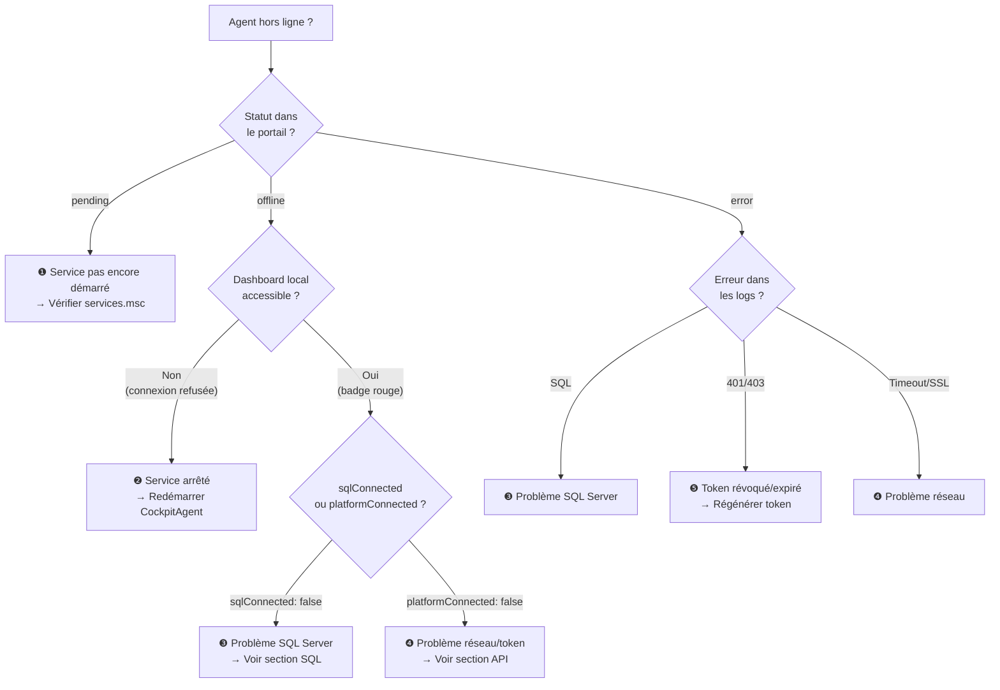

# Dépannage de l'Agent

## Diagnostic rapide



---

## Accès au dashboard local

La première chose à faire est d'ouvrir le dashboard de l'agent :

```
http://127.0.0.1:8444/
```

Le dashboard affiche en temps réel :

- **Badge vert/rouge** → statut global
- **sqlConnected** → connexion SQL Server active
- **platformConnected** → dernier heartbeat réussi
- **Tableau des vues** → dernière sync et nb lignes par vue

Pour le JSON brut (monitoring, scripts) :

```powershell
Invoke-WebRequest http://127.0.0.1:8444/health | ConvertFrom-Json
```

---

## Lire les logs

Les logs sont dans `%ProgramData%\CockpitAgent\logs\` :

```powershell
# Logs en temps réel
Get-Content "$env:ProgramData\CockpitAgent\logs\cockpit-agent-$(Get-Date -f yyyy-MM-dd).log" -Wait

# 100 dernières lignes
Get-Content "$env:ProgramData\CockpitAgent\logs\cockpit-agent-$(Get-Date -f yyyy-MM-dd).log" -Tail 100

# Filtrer les erreurs
Select-String "ERROR" "$env:ProgramData\CockpitAgent\logs\*.log"
```

---

## Problèmes courants

### ❶ Agent en statut `pending` — jamais en ligne

**Symptôme :** L'agent reste `pending` après installation.

**Causes et solutions :**

| Cause | Solution |
|-------|---------|
| Service pas démarré | `services.msc` → CockpitAgent → Démarrer |
| Erreur à l'installation | Relancer `Cockpit Agent Setup.exe` en tant qu'Administrateur |
| Port 8444 déjà occupé | `netstat -ano \| findstr :8444` → tuer le processus conflictuel |

---

### ❷ Dashboard inaccessible (`ERR_CONNECTION_REFUSED`)

Le service `CockpitAgent` est arrêté ou en crash.

```powershell
# Vérifier l'état
sc query CockpitAgent

# Démarrer
sc start CockpitAgent

# Voir les logs de démarrage Windows
Get-EventLog -LogName Application -Source "CockpitAgent" -Newest 20
```

Si le service démarre puis crashe immédiatement :

```powershell
# Lancer manuellement pour voir l'erreur
& "C:\Users\<user>\AppData\Local\Programs\Cockpit Agent\resources\service\cockpit-agent-service.exe"
```

---

### ❸ `sqlConnected: false` — Problème SQL Server

**Symptôme dans les logs :**

```
[ERROR] Connexion SQL Server : MONSRV/BIJOU — ConnectionError: Failed to connect
[ERROR] Login failed for user 'cockpit_agent'
```

**Checklist :**

- [ ] SQL Server est-il démarré ? (`services.msc → SQL Server (INSTANCE)`)
- [ ] Le protocole TCP/IP est-il activé ? (SQL Server Configuration Manager)
- [ ] Port accessible ?
  ```powershell
  Test-NetConnection -ComputerName MONSRV -Port 1433
  ```
- [ ] Driver ODBC 17 installé ? (requis pour Windows Auth)
  ```powershell
  Get-OdbcDriver -Name "ODBC Driver 17 for SQL Server"
  ```
- [ ] Credentials corrects ?

  Si le mot de passe a changé, relancez l'installeur (étape 2) pour mettre à jour le credential dans Windows Credential Manager.

  ```powershell
  # Voir le credential actuel
  cmdkey /list | Select-String "Cockpit"
  ```

---

### ❹ `platformConnected: false` — Problème réseau ou API

**Symptôme dans les logs :**

```
[WARN] [scheduler] Heartbeat échoué : connect ECONNREFUSED / ETIMEDOUT
[WARN] [engine] Impossible de récupérer la config distante
```

**Checklist :**

```powershell
# DNS résolu ?
Resolve-DnsName api.cockpit.app

# Port 443 joignable ?
Test-NetConnection api.cockpit.app -Port 443

# Proxy configuré sur Windows ?
netsh winhttp show proxy
```

Si un proxy est requis :

```powershell
netsh winhttp set proxy proxy-server="http=proxy.acme.com:8080"
# puis redémarrer le service
sc stop CockpitAgent && sc start CockpitAgent
```

---

### ❺ Token révoqué ou expiré (HTTP 401)

**Symptôme dans les logs :**

```
[ERROR] [uploader] Ingest échoué : 401 — Token révoqué ou expiré
[ERROR] [uploader] Heartbeat échoué : 401 Unauthorized
```

**Solution :**

1. Dans **Portail Cockpit → Agents → votre agent** → **Régénérer le token**
2. Relancez `Cockpit Agent Setup.exe` en tant qu'Administrateur
3. Passez à l'étape 5 (Activation) et saisissez le nouveau token
4. Le service est réinstallé avec le nouveau token chiffré

---

### ❻ Les vues ne se synchronisent pas

**Symptôme :** `platformConnected: true` mais les vues restent à `lastSync: null` dans le dashboard.

**Causes possibles :**

| Cause | Vérification |
|-------|-------------|
| Vue non déployée | Relancer l'étape 4 du wizard |
| Colonne watermark absente | `SELECT COLUMN_NAME FROM INFORMATION_SCHEMA.COLUMNS WHERE TABLE_NAME = 'VW_KPI_SYNTESE'` — vérifier `Watermark_Sync` |
| Intervalle pas encore écoulé | Attendre le prochain cycle (5 min pour VW_KPI_SYNTESE) |
| Erreur SQL sur la vue | Chercher `[engine] Erreur sync` dans les logs |

**Forcer une synchronisation complète** (réinitialise tous les watermarks) :

Via le portail Cockpit → Agents → votre agent → **Forcer une resync**

Cette action envoie la commande `FORCE_FULL_SYNC` au prochain heartbeat (délai max 5 min).

---

### ❼ Service se lance avec le mauvais exécutable

Si `sc qc CockpitAgent` affiche un chemin incorrect (ex: electron.exe au lieu du .exe service) :

```powershell
# Supprimer et réinstaller proprement
sc stop CockpitAgent
sc delete CockpitAgent
# Relancer Cockpit Agent Setup.exe en tant qu'Administrateur
```

---

## Commandes de diagnostic

```powershell
# Statut du service Windows
sc query CockpitAgent

# Chemin du binaire enregistré
sc qc CockpitAgent

# Port 8444 ouvert et processus
netstat -ano | findstr :8444

# Health check JSON
Invoke-WebRequest http://127.0.0.1:8444/health | ConvertFrom-Json

# Credential SQL stocké
cmdkey /list | Select-String "Cockpit"

# Logs récents
Get-Content "$env:ProgramData\CockpitAgent\logs\cockpit-agent-$(Get-Date -f yyyy-MM-dd).log" -Tail 50

# Événements Windows Service
Get-EventLog -LogName System -Source "Service Control Manager" -Newest 20 | Where-Object { $_.Message -like "*Cockpit*" }
```

---

## Support

!!! info "Contacter le support Nafaka Tech"
    Avant de contacter le support, fournissez :

    1. **Logs complets** de la dernière heure (`cockpit-agent-YYYY-MM-DD.log`)
    2. **JSON health** : `Invoke-WebRequest http://127.0.0.1:8444/health`
    3. **OS et SQL Server** : `winver` + `SELECT @@VERSION`
    4. **Version de l'agent** visible dans le dashboard local

    Email : `support@nafaka.tech`