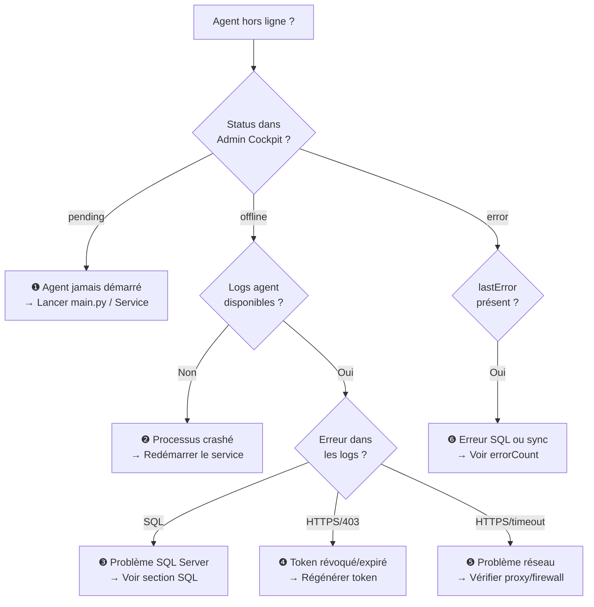

# Dépannage de l'Agent

## Diagnostic rapide



---

## Lire les logs de l'agent

=== "Python Service"
    ```bash
    # Logs en temps réel
    Get-Content .\logs\agent-2026-03-02.log -Wait

    # 100 dernières lignes
    Get-Content .\logs\agent-2026-03-02.log -Tail 100

    # Filtrer les erreurs
    Select-String "ERROR" .\logs\*.log
    ```

=== "Docker"
    ```bash
    # Logs en temps réel
    docker logs cockpit-agent-prod -f

    # 100 dernières lignes
    docker logs cockpit-agent-prod --tail 100

    # Avec timestamps
    docker logs cockpit-agent-prod -f --timestamps
    ```

=== "Windows Event Viewer"
    ```
    Démarrer → Observateur d'événements
    → Journaux Windows → Application
    → Filtrer par source : "CockpitAgent"
    ```

---

## Problèmes courants

### ❶ Agent en statut `pending` — jamais en ligne

**Symptôme :** L'agent reste `pending` après génération du token.

**Causes et solutions :**

| Cause | Solution |
|-------|---------|
| Agent pas encore démarré | Lancer `python main.py` ou `net start CockpitAgent` |
| Mauvais `AGENT_TOKEN` dans `.env` | Vérifier le token copié (pas de espaces) |
| Port 443 bloqué | Tester `curl https://api.cockpit.nafaka.tech/health` |

---

### ❷ Agent passe de `online` à `offline` répétitivement

**Symptôme :** Status alterne online/offline toutes les quelques minutes.

**Causes :**

```
[ERROR] 2026-03-02 10:15:32 - Heartbeat failed: ConnectionError
[ERROR] 2026-03-02 10:15:32 - requests.exceptions.ConnectionError: HTTPSConnectionPool
```

**Solutions :**

1. Vérifier la connectivité continue :
   ```bash
   ping api.cockpit.nafaka.tech
   curl -v https://api.cockpit.nafaka.tech/health
   ```

2. Si proxy : configurer `HTTP_PROXY` et `HTTPS_PROXY` dans `.env`

3. Vérifier le certificat SSL :
   ```bash
   python -c "import ssl; print(ssl.get_default_verify_paths())"
   ```

---

### ❸ Erreur de connexion SQL Server

**Symptômes courants :**

```
[ERROR] pyodbc.Error: ('08001', 'Unable to connect to data source')
[ERROR] pyodbc.OperationalError: Could not connect to SQL Server
[ERROR] pyodbc.InterfaceError: ('IM002', '[IM002] Data source name not found')
```

**Checklist de diagnostic :**

- [ ] SQL Server est-il démarré ? (`services.msc → SQL Server (SAGE_INSTANCE)`)
- [ ] Le protocole TCP/IP est-il activé ? (SQL Server Configuration Manager)
- [ ] Le port SQL Server est-il accessible ?
    ```powershell
    Test-NetConnection -ComputerName localhost -Port 1433
    ```
- [ ] Le driver ODBC est-il installé ?
    ```powershell
    Get-OdbcDriver -Name "ODBC Driver 17 for SQL Server"
    # Si absent : télécharger depuis Microsoft
    ```
- [ ] Les credentials SQL sont-ils corrects ?
    ```sql
    -- Tester dans SSMS
    SELECT SYSTEM_USER  -- Devrait retourner 'cockpit_agent'
    ```
- [ ] L'utilisateur a-t-il les droits SELECT ?
    ```sql
    SELECT * FROM fn_my_permissions(NULL, 'DATABASE') WHERE permission_name = 'SELECT';
    ```

**Drivers ODBC disponibles :**

```env
# Variantes selon la version installée
SQL_DRIVER=ODBC Driver 17 for SQL Server
SQL_DRIVER=ODBC Driver 18 for SQL Server
SQL_DRIVER=SQL Server Native Client 11.0
```

---

### ❹ Token révoqué ou expiré (HTTP 401/403)

**Symptôme dans les logs :**

```
[ERROR] 2026-03-02 10:00:00 - Registration failed: 401 Unauthorized
[ERROR] Response: {"message": "Token révoqué ou expiré", "statusCode": 401}
```

**Solution :**

1. Dans **Admin Cockpit** → **Agents** → Votre agent
2. Cliquez **Régénérer le token**
3. Copiez le nouveau token
4. Mettez à jour `.env` : `AGENT_TOKEN=isag_nouveau_token`
5. Redémarrez l'agent

---

### ❺ Erreur HTTPS/SSL

```
[ERROR] SSLError: [SSL: CERTIFICATE_VERIFY_FAILED]
```

**Solutions :**

=== "Python"
    ```bash
    # Mettre à jour les certificats
    pip install --upgrade certifi

    # Vérifier
    python -c "import certifi; print(certifi.where())"
    ```

=== "Windows (certificats système)"
    ```powershell
    # Exporter et mettre à jour les certificats Windows
    # Vérifier que le certificat Nafaka Tech est dans le store
    certmgr.msc
    ```

---

### ❻ Agent en statut `error` — Erreurs SQL

**Symptôme :** `status: error` avec `errorCount > 0`.

**Logs typiques :**

```
[ERROR] SQL query failed: Invalid column name 'MONTANT_HT'
[ERROR] Table 'dbo.VENTET_CUSTOM' not found
```

**Solutions :**

1. Vérifier la version de Sage et les noms de tables/colonnes
2. Contacter le support Nafaka Tech avec le `lastError` exact
3. Vérifier que le compte SQL a accès aux vues/tables nécessaires

---

## Commandes de diagnostic utiles

```bash
# Vérifier l'état de l'agent via l'API
curl -H "Authorization: Bearer TOKEN" \
  https://api.cockpit.nafaka.tech/api/agents/STATUS_ID

# Tester la connexion à l'API
curl https://api.cockpit.nafaka.tech/api/health

# Tester la résolution DNS
nslookup api.cockpit.nafaka.tech

# Tester le port 443
Test-NetConnection api.cockpit.nafaka.tech -Port 443  # PowerShell
telnet api.cockpit.nafaka.tech 443                    # Windows

# Lister les drivers ODBC installés
Get-OdbcDriver | Select-Object Name  # PowerShell
odbcinst -q -d                       # Linux
```

---

## Support

!!! info "Contacter le support Nafaka Tech"
    Avant de contacter le support, préparez :

    1. **Logs complets** de la dernière heure (fichier `agent-YYYY-MM-DD.log`)
    2. **Version de l'agent** : `python main.py --version`
    3. **OS et version** : Windows 11, SQL Server 2019...
    4. **Message d'erreur exact** depuis `lastError` dans le Admin Cockpit
    5. **Résultat du test** : `python main.py --test`

    Email : `support@nafaka.tech`
    GitHub Issues : `https://github.com/Nafaka-tech/cockpit-agent/issues`
