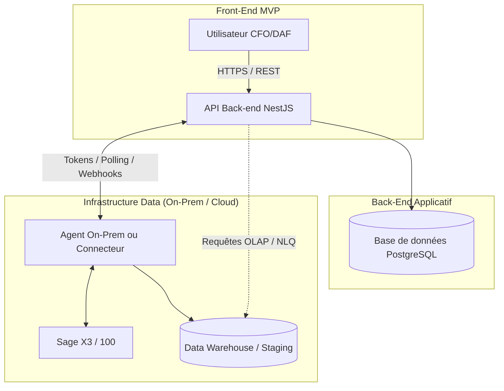

# Documentation d'Architecture InsightSage

## 1. Diagramme High-Level des Composants

## 2. Choix Techniques et Conventions

*   **Framework Principal** : NestJS (TypeScript).
*   **Base de Données** : PostgreSQL.
*   **ORM** : Prisma.
*   **Authentification** : JWT (JSON Web Tokens) avec stratégies Passport.
*   **Outils de Qualité** :
    *   ESLint et Prettier pour le linter/formatteur.
    *   Husky + lint-staged pour les pre-commit hooks (garantissant un formatage automatique avant chaque commit).
*   **Structure de Code** : Orientée module (Domain-Driven Design léger), où chaque domaine métier (Users, Auth, Dashboards, etc.) dispose de son propre module, contrôleur et service.
*   **Conventions de Nommage** :
    *   Fichiers : `kebab-case.ts` (ex: `auth.controller.ts`).
    *   Classes / Interfaces : `PascalCase`.
    *   Variables / Méthodes : `camelCase`.
    *   Base de données (Prisma) : Tables en `snake_case` plurielles (via `@@map()`), champs en `camelCase`.

## 3. Liste des Endpoints Prévus (OpenAPI Base Spec)

L'API sera documentée interactivement via Swagger (accessible sur `/api` en développement). Voici les groupements principaux à implémenter :

*   **Auth** :
    *   `POST /auth/login` : Authentification.
    *   `POST /auth/refresh` : Rotation de token.
*   **Users** :
    *   `GET /users/me` : Profil courant.
    *   `GET /users`, `POST /users`, `PATCH /users/:id`, `DELETE /users/:id` : Gestion CRUD utilisateurs.
*   **Organizations (Tenants)** :
    *   Attribut `organizationId` partagé sur l'ensemble des requêtes (isolation des données).
*   **Onboarding** :
    *   `GET /subscriptions/plans`
    *   `POST /onboarding/step[1-5]` : Wizard de setup (plan, infos org, source de données, profils métiers).
    *   `POST /datasource/test-connection`
*   **Dashboards & Widgets** :
    *   `GET /dashboards/me`, `POST /dashboards`, `PATCH /dashboards/:id`
    *   `GET /kpi-packs`, `GET /widget-store`
    *   `POST /dashboards/:id/widgets`
*   **NLQ (Natural Language Querying)** :
    *   `POST /nlq/query` : Traduction texte vers données/SQL.
    *   `POST /nlq/add-to-dashboard` : Sauvegarde sous forme de widget.
*   **Logs (Audit)** :
    *   `GET /logs/audit` : Récupération des logs par filtrage (Admin uniquement).
