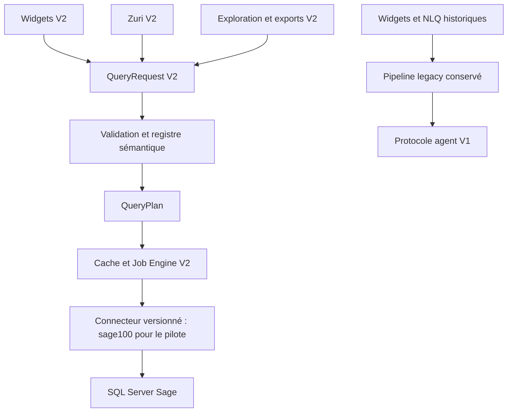

# ADR-001 — Coexistence du Data Engine V2 et du pipeline historique

**Statut :** proposé, en attente de validation. **Périmètre :** architecture documentaire uniquement.

## Problème

Les widgets, Zuri et les exports doivent partager une même définition métier des données. Le chemin actuel fait passer les KPI par `useKpiData` → `/api/nlq/query` → `NlqTemplate.sqlQuery` → `AgentJob` → Socket.IO. Il ne traduit pas systématiquement période, devise et périmètre en contraintes SQL. Une migration directe des dashboards existants risquerait de modifier leurs résultats et de casser les agents installés.

## Architecture actuelle

- `src/nlq/nlq.service.ts` choisit un template SQL selon l'intention et le type Sage.
- `src/agents/agents.service.ts` valide sommairement le SQL, crée un job et le transmet à l'agent.
- `src/agents/agents.gateway.ts` route le SQL et reçoit les résultats.
- `../Client-cockpit/src/hooks/use-kpi-data.ts` reconstitue une valeur à partir du résultat et possède un cache navigateur.
- `prisma/schema.prisma` persiste les jobs et leurs résultats JSON.

Le code, les tests et les données déployées restent à vérifier à chaque phase ; cette ADR ne transforme pas les commentaires historiques en preuves d'exploitation.

## Décision proposée

Créer un module `src/data-engine/` **indépendant du chemin NLQ historique**. Tous les nouveaux consommateurs passent par `QueryRequest` V2, validé puis résolu par un registre sémantique avant de produire un `QueryPlan`. Le plan passe par un moteur de jobs V2 et un connecteur versionné. Le résultat public adopte un schéma typé et sépare succès, absence de lignes et erreur. Un premier pilote `revenue_ht` démontre le trajet complet sans changer les widgets existants.

Le contrat public et les clés métier du registre sont indépendants des connecteurs. Les mappings source et le `QueryPlan` interne utilisent un identifiant de connecteur extensible ; `sage100` est le seul connecteur défini pour le pilote. Le backend dérive un `SecurityScope` interne de l’identité et des permissions, puis applique les `AnalyticalFilters` demandés à l’intérieur de ce périmètre. Le RBAC actuel contrôle l’organisation ; société, établissement et agence exigent un modèle de droits vérifié avant de devenir des périmètres de sécurité. Aucun `QueryRequest` ne peut élargir ce périmètre.

Le registre contient des métriques, dimensions, sources et combinaisons autorisées explicites. Les templates NLQ restent disponibles pendant la coexistence. L'adaptateur historique est un **outil de classification et de migration** : il n'affirme jamais qu'un SQL ancien respecte les filtres V2 sans preuve. Les catégories sont `COMPATIBLE`, `ADAPTABLE`, `INCOMPATIBLE`, `BROKEN`, `PLACEHOLDER`.

## Alternatives étudiées

| Option | Décision et motif |
|---|---|
| Réécriture immédiate de tous les widgets | Écartée : surface de régression et absence de référence métier validée. |
| Étendre les chaînes NLQ avec davantage de mots-clés | Écartée : impossible de garantir qu'un filtre ou une période a réellement été appliqué. |
| Faire du frontend le planificateur SQL | Écartée : règles métier et contrôle des ressources doivent rester côté backend. |
| Module V2 parallèle avec pilote | Retenue : permet une comparaison mesurable et un retour au chemin historique. |

## Avantages et inconvénients

**Avantages :** contrat commun, résultats explicites, validation indépendante du navigateur, comparaison pilote contre Sage, bascule progressive. **Coûts :** deux chemins à maintenir temporairement, mapping des anciens KPI, observabilité et tests contractuels supplémentaires.

## Impacts et stratégie de migration

Phase 0 stabilise les erreurs, caches, diagnostics, sécurité locale et transitions de jobs du chemin actuel. Phase 1 crée le contrat, le registre, le planificateur, les résultats et les jobs V2 sans changer les widgets. Phase 2 ajoute seulement `revenue_ht`, ses périodes et comparaisons, puis compare les valeurs avec une requête Sage de référence avant toute bascule. Les phases ultérieures demandent chacune un nouveau checkpoint.

## Compatibilité et condition de validation

Les routes `/api/nlq/*`, `/api/agents/*`, les données PostgreSQL et le protocole agent V1 demeurent utilisables pendant les phases 0 à 2. Aucun repli silencieux d'une requête V2 invalide vers un SQL ancien n'est autorisé. La Phase 2 ne passe pas le gate si les valeurs, l'isolation tenant, les erreurs, les états de jobs ou les tests contractuels divergent.

**Fichiers sources :** `src/nlq/nlq.service.ts` (`processQuery`), `src/agents/agents.service.ts` (`executeRealTimeQuery`, `updateJobResult`), `src/agents/agents.gateway.ts` (`emitExecuteSql`, `handleSqlResult`), `prisma/schema.prisma` (`AgentJob`, `KpiDefinition`, `NlqTemplate`), `../Client-cockpit/src/hooks/use-kpi-data.ts` (`useKpiData`).
