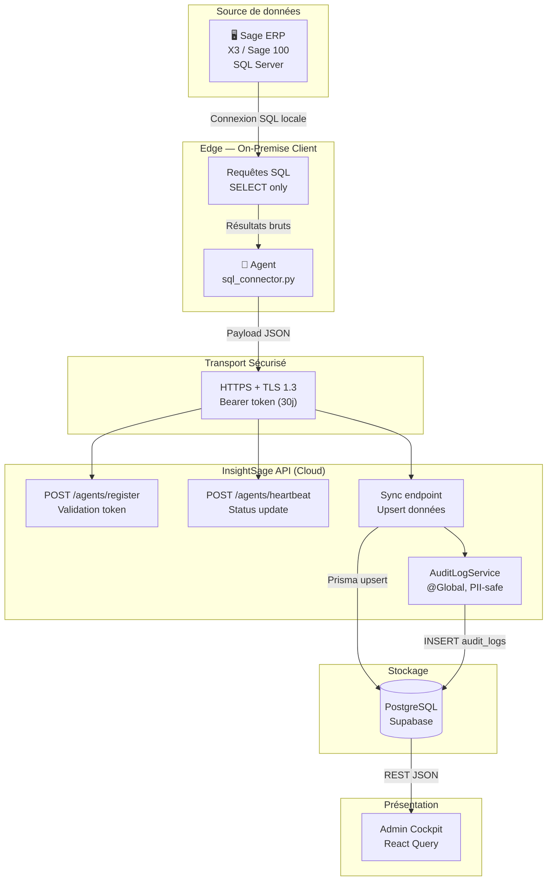
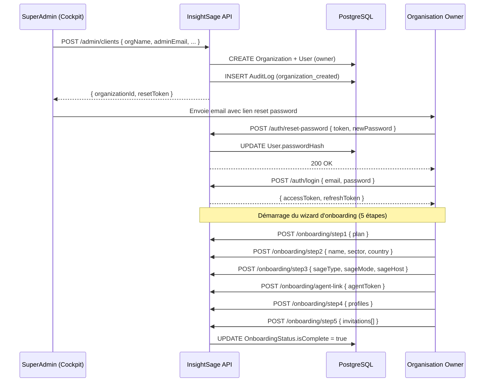
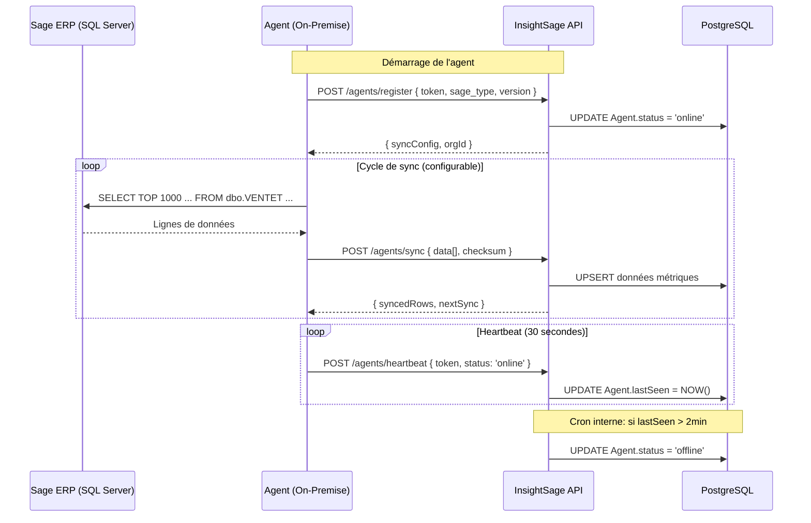
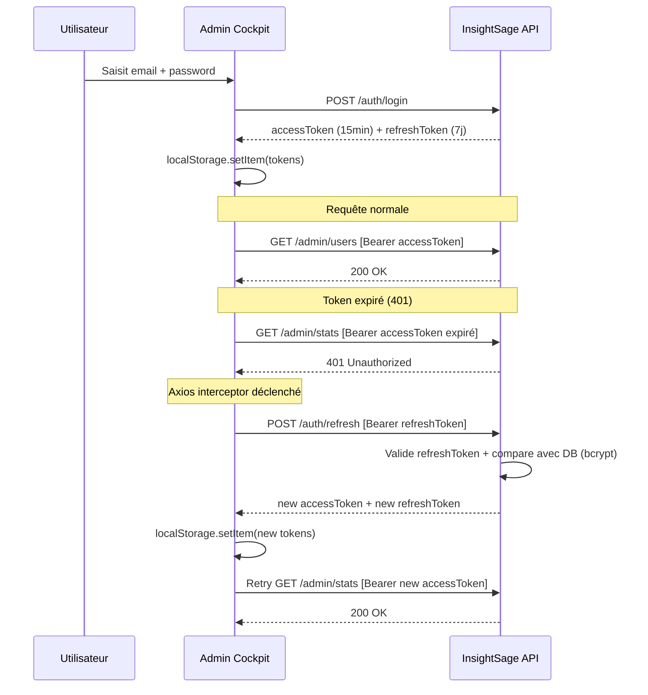
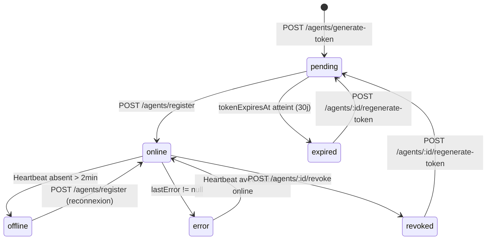
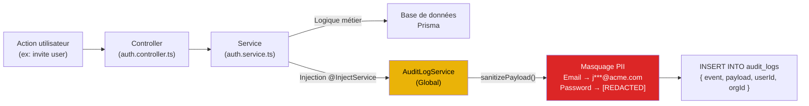

# Flux de données

## Parcours complet de la donnée



---

## Flux 1 : Onboarding d'un nouveau client



---

## Flux 2 : Synchronisation agent → API



---

## Flux 3 : Authentification et refresh de token



---

## Flux 4 : Gestion du cycle de vie du token agent



---

## Flux 5 : Audit trail d'une action



### Exemple de payload avant/après sanitization

=== "Avant masquage"
    ```json
    {
      "email": "jean.dupont@acme.com",
      "password": "SecretPass123!",
      "role": "daf",
      "organizationId": "uuid-org-a"
    }
    ```

=== "Après sanitization"
    ```json
    {
      "email": "j***@acme.com",
      "password": "[REDACTED]",
      "role": "daf",
      "organizationId": "uuid-org-a"
    }
    ```

---

## Matrice des événements d'audit

| Domaine | Événements loggés |
|---------|-------------------|
| **Auth** | `user_login`, `user_logout`, `password_reset_requested`, `password_reset_completed` |
| **Users** | `user_created`, `user_updated`, `user_deleted`, `user_invited` |
| **Roles** | `role_created`, `role_updated`, `role_deleted` |
| **Agents** | `agent_registered`, `agent_token_generated`, `agent_token_regenerated`, `agent_token_revoked`, `agent_heartbeat`, `agent_error` |
| **Onboarding** | `onboarding_step_completed`, `onboarding_completed`, `agent_linked`, `users_invited_bulk`, `subscription_plan_selected` |
| **Organisations** | `organization_created`, `organization_updated`, `organization_deleted` |
| **Dashboards** | `dashboard_created`, `dashboard_updated`, `dashboard_deleted` |
| **Widgets** | `widget_added`, `widget_updated`, `widget_removed` |
| **NLQ** | `nlq_executed`, `nlq_saved_to_dashboard` |
| **Datasource** | `datasource_configured` |
