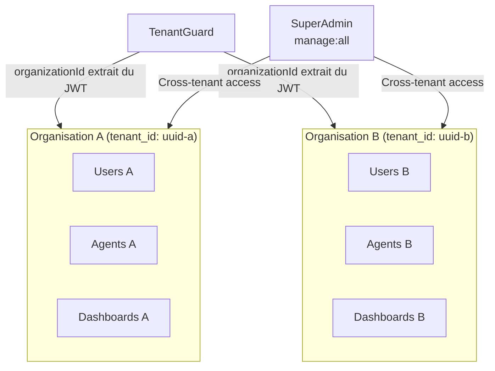
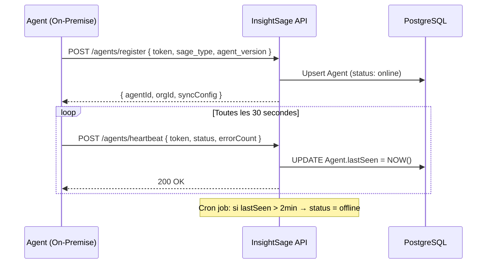
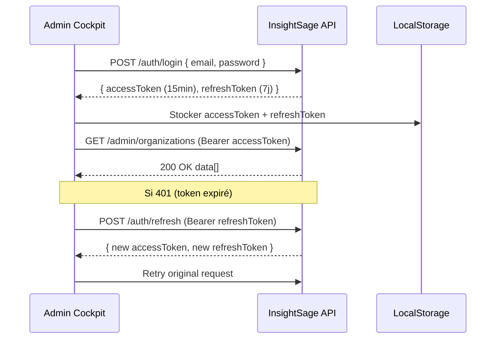
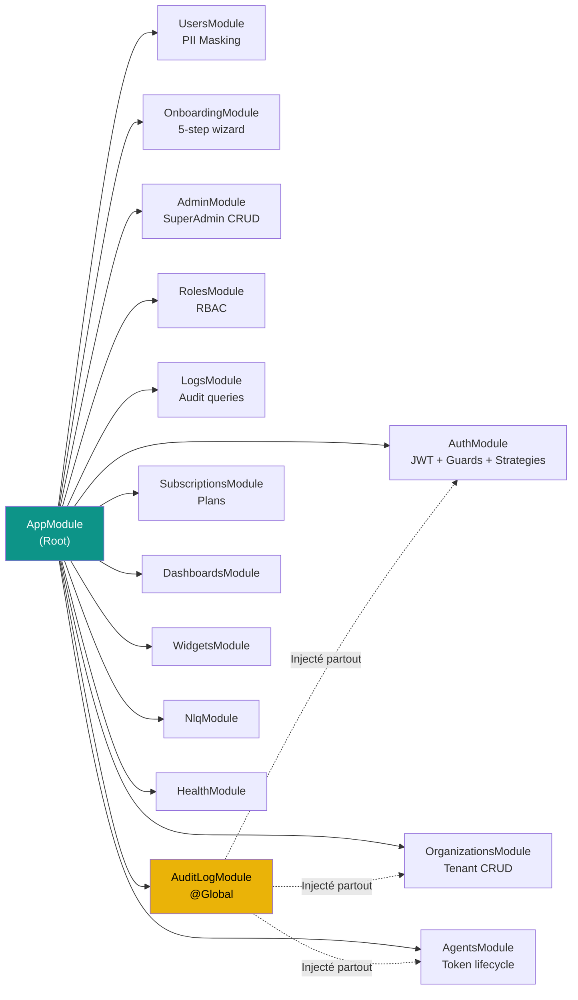

# Vue d'ensemble de l'architecture

## Schéma haut-niveau

```mermaid
graph TB
    subgraph Client["🏢 Client (Entreprise)"]
        ERP["🖥️ Sage ERP\nX3 ou Sage 100\nSQL Server"]
        AGT["🤖 Agent\nPython/Docker\nOn-Premise"]
        ERP -->|"SQL (SELECT only)"| AGT
    end

    subgraph Cloud["☁️ Infrastructure Cloud"]
        subgraph API["⚙️ InsightSage API"]
            AUTH["Auth Module\nJWT + Refresh"]
            TENANT["TenantGuard\nIsolation multi-tenant"]
            RBAC["PermissionsGuard\nRBAC granulaire"]
            CORE["Core Modules\nOrgs / Users / Agents"]
            AUDIT["AuditLog Service\n@Global + PII Masking"]
        end
        DB[("🗄️ PostgreSQL\nSupabase")]
    end

    subgraph Admin["🎛️ Administration"]
        COCKPIT["Admin Cockpit\nReact + Vite\nSuperAdmin UI"]
    end

    AGT -->|"HTTPS + Bearer token\n(30j TTL, révocable)"| API
    COCKPIT -->|"REST API + JWT"| API
    API <-->|"Prisma ORM\nPg adapter"| DB

    style Client fill:#0f172a,stroke:#475569
    style Cloud fill:#0a1628,stroke:#0d9488
    style Admin fill:#0f172a,stroke:#475569
    style API fill:#0d1f2d,stroke:#0d9488
    style AUTH fill:#1e293b,stroke:#0d9488,color:#2dd4bf
    style TENANT fill:#1e293b,stroke:#0d9488,color:#2dd4bf
    style RBAC fill:#1e293b,stroke:#0d9488,color:#2dd4bf
    style AUDIT fill:#1e293b,stroke:#eab308,color:#fbbf24
```

---

## Les trois piliers

### 1. InsightSage API — Le cerveau

Construit avec **NestJS v11**, le backend est une API REST multi-tenant qui orchestre l'ensemble de la plateforme.

**Responsabilités :**

- Authentification et autorisation (JWT + RBAC)
- Isolation stricte des tenants (organizations)
- Gestion du cycle de vie des agents
- Wizard d'onboarding en 5 étapes
- Audit logging global avec masquage PII
- Gestion des plans d'abonnement

**Guard chain (appliquée globalement) :**

```mermaid
graph LR
    REQ["Request"] --> J["JwtAuthGuard\n@Public() bypass"]
    J --> T["TenantGuard\nOrganizationId check"]
    T --> P["PermissionsGuard\n(sur routes @RequirePermissions)"]
    P --> S["Service Handler"]

    style REQ fill:#1e293b,stroke:#475569
    style J fill:#0f3d3d,stroke:#0d9488,color:#2dd4bf
    style T fill:#0f3d3d,stroke:#0d9488,color:#2dd4bf
    style P fill:#0f3d3d,stroke:#0d9488,color:#2dd4bf
    style S fill:#1e293b,stroke:#22c55e,color:#22c55e
```

### 2. Admin Cockpit — Le cockpit

Interface d'administration React pour les **SuperAdmins** (équipe Nafaka Tech). Permet de :

- Créer et gérer les organisations clientes
- Administrer les utilisateurs cross-tenant
- Monitorer les agents et leur santé
- Configurer les plans d'abonnement
- Consulter les logs d'audit globaux

### 3. L'Agent — Le pont sécurisé

Processus léger (Python/Docker) déployé **on-premise** chez le client. Il :

- Se connecte à Sage ERP via SQL Server
- Exécute uniquement des requêtes `SELECT`
- Envoie les données vers l'API via HTTPS
- Maintient un heartbeat toutes les 30 secondes
- Utilise un token Bearer à durée de vie de 30 jours

---

## Modèle multi-tenant

Chaque **Organisation** est un tenant isolé. L'isolation est appliquée à plusieurs niveaux :

| Niveau | Mécanisme |
|--------|-----------|
| **Guard** | `TenantGuard` vérifie que le JWT `organizationId` == `request.params.organizationId` |
| **Service** | Toutes les queries Prisma incluent `where: { organizationId }` |
| **SuperAdmin** | Permission `manage:all` bypass le TenantGuard |
| **Cascade** | `onDelete: Cascade` dans Prisma sur toutes les relations enfants |

---

## Communication entre composants

### Agent → API (heartbeat)

### Frontend → API (authentification)

---

## Modules NestJS

---

## Principes architecturaux

| Principe | Implémentation |
|----------|----------------|
| **Domain-Driven Design** | Un module par domaine métier (auth, agents, onboarding…) |
| **Global Guards** | JwtAuthGuard + TenantGuard appliqués sans décoration manuelle |
| **Fail-Safe Audit** | AuditLogService ne plante jamais — erreurs loggées en console |
| **PII by Default** | Aucun email/password en clair dans les logs |
| **Token TTL strict** | Access 15min, Refresh 7j, Agent 30j avec révocation instantanée |
| **No Migrate** | `prisma db push` uniquement — drift existant en DB Supabase |
