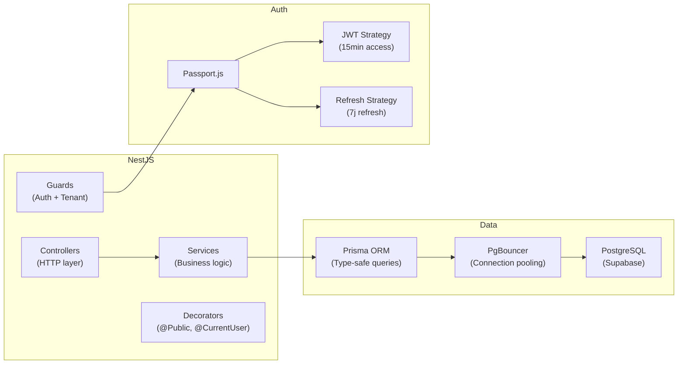
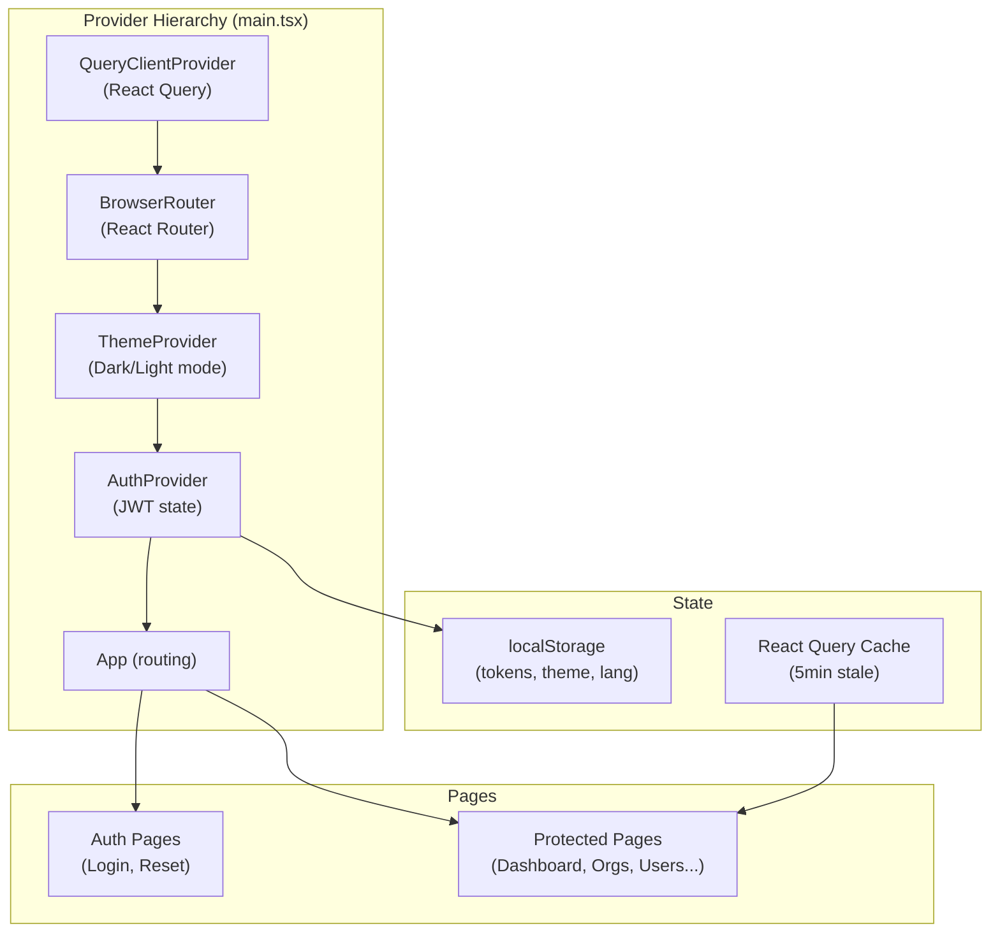

# Stack technique

## Backend — Cockpit API

| Couche | Technologie | Version | Rôle |
|--------|-------------|---------|------|
| **Runtime** | Node.js | 20.x LTS | Environnement d'exécution |
| **Framework** | NestJS | v11 | Architecture modulaire DI |
| **ORM** | Prisma | v7.4.2 | Accès DB type-safe |
| **DB** | PostgreSQL | 14+ | Base relationnelle |
| **DB Host** | Supabase | — | PaaS PostgreSQL managé |
| **Auth** | Passport + JWT | — | Authentification JWT |
| **Crypto** | bcrypt | v6 | Hash des mots de passe |
| **Validation** | class-validator + class-transformer | — | DTO validation |
| **Cache / Queue** | Redis + ioredis | — | Sessions, rate limiting, cooldowns notifications |
| **Storage** | MinIO (S3-compatible) | RELEASE | Fichiers binaires (releases agent, pièces jointes bugs) |
| **Email** | Nodemailer | v6 | Emails transactionnels (SMTP) — fallback console en dev |
| **Logging** | Winston + DailyRotateFile | v3 | Logs fichier rotatifs |
| **Monitoring** | Sentry | v10 | Error tracking |
| **Docs** | Swagger UI | v5 | Documentation interactive |
| **Tests** | Jest + ts-jest | v30 | Tests unitaires/e2e |
| **Linting** | ESLint v9 | — | Qualité de code |
| **Formatting** | Prettier | — | Formatage uniforme |
| **Git hooks** | Husky | — | Pre-commit hooks |



### Adapter Prisma (Pg)

Le projet utilise `@prisma/adapter-pg` pour une connexion via pool PgBouncer compatible Supabase :

```typescript
// prisma/prisma.service.ts
const pool = new Pool({ connectionString: process.env.DATABASE_URL });
const adapter = new PrismaPg(pool);
super({ adapter });
```

!!! note "Pourquoi `prisma db push` et non `migrate dev` ?"
    La base de données Supabase contient un drift existant (tables créées manuellement).
    `migrate dev` génèrerait des conflits. `db push` synchronise le schéma sans créer de fichiers de migration.

---

## Frontend — Admin Cockpit

| Couche | Technologie | Version | Rôle |
|--------|-------------|---------|------|
| **Bundler** | Vite | v6 | Build ultra-rapide HMR |
| **Framework** | React | 18.3.1 | UI déclaratif |
| **Langage** | TypeScript | 5.6.2 | Type safety |
| **Routing** | React Router DOM | v7.1.1 | SPA routing |
| **Server State** | TanStack React Query | v5 | Cache + fetching |
| **Table** | TanStack React Table | v8 | Tables complexes |
| **HTTP Client** | Axios | v1.7 | Requêtes + interceptors |
| **UI Base** | Radix UI | — | Composants accessibles headless |
| **Styling** | Tailwind CSS | 3.4 | Utility-first CSS |
| **Design System** | Shadcn/UI | — | Composants pré-stylés |
| **Icons** | Lucide React | v0.468 | Icônes SVG |
| **Charts** | Recharts | v2.15 | Graphiques SVG |
| **Forms** | React Hook Form | v7.54 | Forms performants |
| **Validation** | Zod | v3.24 | Schemas de validation |
| **i18n** | i18next + react-i18next | v24 | FR/EN multilangue |
| **Animations** | tailwindcss-animate | — | Transitions CSS |
| **Tests** | Vitest | v4 | Tests unitaires rapides |
| **Test Utils** | Testing Library | — | React component testing |



---

## Infrastructure & DevOps

| Composant | Technologie | Notes |
|-----------|-------------|-------|
| **Hébergement API** | PM2 + Node.js | `dist/main.js` — Windows Server 2022 prod |
| **Base de données** | Supabase (PostgreSQL) | PaaS managé, PgBouncer pooling |
| **Hébergement Frontend** | IIS + Vite build | Static `dist/` servi par IIS |
| **Stockage objet** | MinIO | Service Windows (NSSM), exposé via IIS reverse proxy `/storage/*` |
| **Cache** | Redis | Service Windows, port 6379 |
| **Agent on-premise** | PM2 + Python | `socket_client.py`, reconnexion exponentielle |
| **CI/CD** | GitHub Actions | `git fetch` + `git reset --hard origin/main` (évite les conflits lock) |
| **Monitoring santé** | HealthMonitorService | Vérifie DB/Redis/MinIO toutes les 5 min, alerte par email |
| **Job observability** | JobRegistryService | Registre global de tous les crons/intervals |
| **Logs** | Winston + rotate | Fichiers journaliers |
| **Error tracking** | Sentry | Erreurs runtime prod |

---

## Choix architecturaux justifiés

### Pourquoi NestJS ?

- Architecture modulaire inspirée d'Angular (DI, decorators)
- Intégration native Passport, JWT, Swagger
- Support TypeScript first-class
- Écosystème mature pour les projets SaaS

### Pourquoi Prisma ?

- Type safety complète des queries (génération automatique)
- `PrismaPg` adapter pour compatibilité Supabase/PgBouncer
- Studio intégré pour l'exploration des données
- `db push` adapté aux environnements avec drift

### Pourquoi React + Vite ?

- Vite offre un HMR quasi-instantané (< 50ms)
- React Query remplace Redux pour le server state
- Radix UI + Tailwind = design system accessible et customisable
- TypeScript strict avec `noUnusedLocals` et `noUncheckedSideEffectImports`

### Pourquoi JWT Access + Refresh ?

| Token | TTL | Stockage | Renouvellement |
|-------|-----|----------|----------------|
| **Access** | 15 minutes | `localStorage` | Automatique via interceptor |
| **Refresh** | 7 jours | `localStorage` | POST `/auth/refresh` |
| **Agent** | 30 jours | DB (hash) | POST `/agents/:id/regenerate-token` |

!!! warning "Note sécurité localStorage"
    Les tokens sont stockés en `localStorage` pour la simplicité de l'implémentation actuelle.
    Pour un niveau de sécurité supérieur en production, considérez les cookies `HttpOnly` + `Secure`.

---

## Versions de Node.js et npm recommandées

```bash
# Vérifier avec nvm (recommandé)
nvm use 20

# Versions exactes en prod
node  v20.18.0
npm   v10.9.2
```
