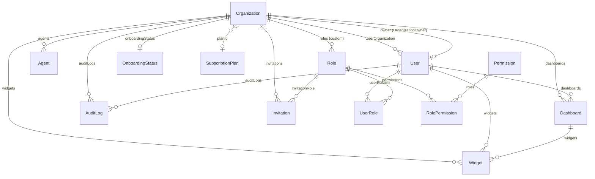

# Base de données

## Diagramme Entité-Relation



---

## Modèles Prisma — Référence complète

### Organization

Table racine du modèle multi-tenant. Chaque client possède une organisation unique.

```prisma
model Organization {
  id               String            @id @default(uuid())
  name             String            @db.VarChar(255)
  sector           String?           @db.VarChar(100)
  size             String            @default("pme")     // "startup" | "pme" | "enterprise"
  country          String?
  sageType         String?           // "X3" | "100"
  sageMode         String?           // "local" | "cloud"
  sageHost         String?
  sagePort         Int?
  sageConfig       Json?
  selectedProfiles String[]          // ["daf", "dg", "controller", "analyst"]
  createdAt        DateTime          @default(now())
  updatedAt        DateTime          @updatedAt

  planId           String?
  subscriptionPlan SubscriptionPlan? @relation(fields: [planId], references: [id])
  ownerId          String?           @unique

  // Relations
  owner            User?             @relation("OrganizationOwner", fields: [ownerId], references: [id])
  users            User[]            @relation("UserOrganization")
  dashboards       Dashboard[]
  widgets          Widget[]
  auditLogs        AuditLog[]
  agents           Agent[]
  invitations      Invitation[]
  roles            Role[]
  onboardingStatus OnboardingStatus?

  @@map("organizations")
}
```

**Champs clés :**

| Champ | Type | Description |
|-------|------|-------------|
| `id` | UUID | Identifiant tenant (clé d'isolation) |
| `sageType` | String? | Version Sage : `X3` ou `100` |
| `sageMode` | String? | Déploiement : `local` ou `cloud` |
| `selectedProfiles` | String[] | Profils métier activés |
| `planId` | UUID? | Référence vers le plan d'abonnement |

---

### User

```prisma
model User {
  id                   String    @id @default(uuid())
  email                String    @unique @db.VarChar(255)
  firstName            String?
  lastName             String?
  passwordHash         String    // bcrypt, jamais exposé en API
  isActive             Boolean   @default(true)
  emailVerified        Boolean   @default(false)
  createdAt            DateTime  @default(now())
  updatedAt            DateTime  @updatedAt

  // Tokens (jamais exposés en API — SAFE_USER_SELECT les exclut)
  hashedRefreshToken   String?
  resetPasswordToken   String?
  resetPasswordExpires DateTime?

  organizationId       String
  organization         Organization @relation("UserOrganization",
                         fields: [organizationId], references: [id], onDelete: Cascade)
  ownedOrganization    Organization? @relation("OrganizationOwner")

  userRoles            UserRole[]
  dashboards           Dashboard[]
  widgets              Widget[]
  auditLogs            AuditLog[]

  @@index([organizationId])
  @@map("users")
}
```

!!! danger "Champs jamais exposés"
    `passwordHash`, `hashedRefreshToken`, `resetPasswordToken`, `resetPasswordExpires`
    sont **systématiquement exclus** des réponses API via `SAFE_USER_SELECT`.

---

### Agent

```prisma
model Agent {
  id             String    @id @default(uuid())
  token          String    @unique   // Format: isag_<64hex>
  name           String
  version        String?
  status         String    @default("pending") // "pending"|"online"|"offline"|"error"
  lastSeen       DateTime?
  lastSync       DateTime?
  nextSync       DateTime?
  rowsSynced     BigInt    @default(0)
  errorCount     Int       @default(0)
  lastError      String?
  createdAt      DateTime  @default(now())
  updatedAt      DateTime  @updatedAt

  // Cycle de vie du token
  tokenExpiresAt DateTime?
  isRevoked      Boolean   @default(false)
  revokedAt      DateTime?

  organizationId String
  organization   Organization @relation(fields: [organizationId], references: [id])

  @@index([organizationId])
  @@index([token])
  @@map("agents")
}
```

---

### SubscriptionPlan

```prisma
model SubscriptionPlan {
  id                  String   @id @default(uuid())
  name                String   @unique  // "startup" | "pme" | "business" | "enterprise"
  label               String            // "Startup" | "PME" | "Business" | "Enterprise"
  description         String?
  priceMonthly        Float?            // null = sur devis
  isActive            Boolean  @default(true)

  // Limites
  maxUsers            Int?              // null = illimité
  maxKpis             Int?
  maxWidgets          Int?
  maxAgentSyncPerDay  Int?

  // Fonctionnalités
  allowedKpiPacks     String[]          // ["finance", "stock", "ventes"]
  hasNlq              Boolean  @default(false)
  hasAdvancedReports  Boolean  @default(false)

  // Stripe (futur)
  stripeProductId     String?
  stripePriceId       String?

  sortOrder           Int      @default(0)
  createdAt           DateTime @default(now())
  updatedAt           DateTime @updatedAt

  organizations       Organization[]

  @@map("subscription_plans")
}
```

### Plans par défaut (seed)

| Plan | `maxUsers` | `maxKpis` | `maxWidgets` | NLQ | Prix/mois |
|------|:----------:|:---------:|:------------:|:---:|----------:|
| **Startup** | 3 | 10 | 5 | ❌ | 99€ |
| **PME** | 10 | 30 | 15 | ❌ | 299€ |
| **Business** | 25 | 100 | 50 | ✅ | 699€ |
| **Enterprise** | illimité | illimité | illimité | ✅ | Sur devis |

---

### OnboardingStatus

```prisma
model OnboardingStatus {
  id               String       @id @default(uuid())
  organizationId   String       @unique
  organization     Organization @relation(fields: [organizationId], references: [id], onDelete: Cascade)
  currentStep      Int          @default(1)    // étape courante (1–6)
  completedSteps   Int[]                       // ex: [1, 2, 3]
  isComplete       Boolean      @default(false) // true si completedSteps.length >= 5
  inviteLater      Boolean      @default(false) // étape 5 reportée
  agentConfigLater Boolean      @default(false) // étape 3 reportée via skipLater
  createdAt        DateTime     @default(now())
  updatedAt        DateTime     @updatedAt

  @@map("onboarding_status")
}
```

!!! info "Champ `agentConfigLater`"
    Positionné à `true` quand l'utilisateur clique "Configurer l'agent plus tard" à l'étape 3. L'étape 3 est alors marquée complétée dans `completedSteps` mais le flag signale qu'aucun agent n'a encore été configuré — utile pour afficher un rappel dans les Settings.

---

### AgentRelease

Exécutables de l'agent on-premise distribués lors de l'onboarding. Gérés via l'interface superadmin.

```prisma
model AgentRelease {
  id         String   @id @default(uuid())
  version    String                        // ex: "1.2.3"
  platform   String                        // "windows" | "linux" | "macos"
  arch       String   @default("x64")     // "x64" | "arm64"
  fileName   String                        // ex: "cockpit-agent-1.2.3-win-x64.exe"
  fileUrl    String                        // URL publique (Cloudflare R2 ou stockage local)
  fileSize   BigInt?                       // taille en octets
  checksum   String?                       // SHA256 (préfixe "sha256:")
  isLatest   Boolean  @default(false)      // true = release active proposée au téléchargement
  changelog  String?  @db.Text
  uploadedAt DateTime @default(now())
  uploadedBy String?                       // userId admin ayant publié

  @@map("agent_releases")
}
```

!!! tip "Unicité `isLatest` par plateforme"
    Quand `setLatest(id)` est appelé, le service passe d'abord tous les enregistrements de la même plateforme à `isLatest = false`, puis marque uniquement l'id sélectionné à `true`. Une seule release active par plateforme à tout instant.

---

### Role & Permission (RBAC)

```prisma
model Role {
  id             String    @id @default(uuid())
  name           String    @unique
  description    String?
  isSystem       Boolean   @default(false)  // true = rôle système non-modifiable
  organizationId String?   // null = rôle global (system)
  organization   Organization? @relation(...)

  permissions    RolePermission[]
  users          UserRole[]
  invitations    Invitation[]    @relation("InvitationRole")

  createdAt      DateTime @default(now())
  updatedAt      DateTime @updatedAt

  @@index([organizationId])
  @@map("roles")
}

model Permission {
  id          String           @id @default(uuid())
  action      String           // "read" | "write" | "manage"
  resource    String           // "users" | "agents" | "logs" | "dashboards" | "all"
  description String?

  roles       RolePermission[]
  createdAt   DateTime @default(now())

  @@unique([action, resource])  // Combinaison unique
  @@map("permissions")
}

model RolePermission {
  roleId       String
  permissionId String
  role         Role       @relation(...)
  permission   Permission @relation(...)

  @@unique([roleId, permissionId])
  @@map("role_permissions")
}

model UserRole {
  userId String
  roleId String
  user   User @relation(...)
  role   Role @relation(...)

  @@unique([userId, roleId])
  @@map("user_roles")
}
```

---

### AuditLog

```prisma
model AuditLog {
  id             String   @id @default(uuid())
  event          String   // ex: "user_login", "agent_token_generated"
  payload        Json     // Sanitized — PII masqué
  ipAddress      String?
  userAgent      String?
  createdAt      DateTime @default(now())

  organizationId String?
  organization   Organization? @relation(..., onDelete: SetNull)
  userId         String?
  user           User?    @relation(...)

  @@index([organizationId])
  @@index([userId])
  @@index([createdAt])
  @@map("audit_logs")
}
```

!!! note "onDelete: SetNull"
    Si une organisation est supprimée, ses `AuditLog` sont **conservés** avec `organizationId = null`
    (contrairement aux Users/Agents qui sont en `Cascade`). Cela préserve l'historique pour conformité.

---

### Invitation

```prisma
model Invitation {
  id             String       @id @default(uuid())
  email          String       @unique
  token          String       @unique
  roleId         String
  role           Role         @relation("InvitationRole", ...)
  expiresAt      DateTime     // +7 jours
  isAccepted     Boolean      @default(false)
  createdAt      DateTime     @default(now())
  organizationId String
  organization   Organization @relation(..., onDelete: Cascade)

  @@index([organizationId])
  @@map("invitations")
}
```

---

### SystemConfig

Singleton de configuration globale de la plateforme (une seule ligne, `id = 'default'`).

```prisma
model SystemConfig {
  id                      String   @id @default("default")
  notificationPreferences Json?    // { notif: Record<string, boolean>, recipients: string[] }
  updatedAt               DateTime @updatedAt

  @@map("system_config")
}
```

!!! info "Singleton pattern"
    Toujours accédé via `prisma.systemConfig.findUnique({ where: { id: 'default' } })`.
    L'upsert est utilisé pour la mise à jour : `upsert({ where: { id: 'default' }, update: ..., create: ... })`.

**Champs `notificationPreferences` :**

```json
{
  "notif": {
    "newOrg":        true,
    "agentOffline":  true,
    "paymentFailed": true,
    "paymentSuccess": false,
    "errorLogs":     true
  },
  "recipients": ["uuid-admin-1", "uuid-admin-2"]
}
```

Exposé via `GET/PATCH /admin/system-config` — permission `manage:all`.

---

## Indexes et performances

| Table | Index | Raison |
|-------|-------|--------|
| `users` | `organizationId` | Filtrage tenant |
| `agents` | `organizationId`, `token` | Lookup par token (heartbeat) |
| `audit_logs` | `organizationId`, `userId`, `createdAt` | Queries filtrées par date |
| `dashboards` | `organizationId`, `userId` | Isolation tenant |
| `widgets` | `organizationId`, `userId`, `dashboardId` | Filtrage multi-critères |
| `roles` | `organizationId` | Rôles par tenant |
| `invitations` | `organizationId` | Invitations par tenant |

---

## Opérations courantes

=== "Créer un tenant"
    ```typescript
    await prisma.organization.create({
      data: {
        name: 'Acme Corp',
        size: 'pme',
        users: { create: { email: '...', passwordHash: '...' } }
      }
    });
    ```

=== "Requête filtrée par tenant"
    ```typescript
    await prisma.user.findMany({
      where: { organizationId: orgId },
      select: SAFE_USER_SELECT,
    });
    ```

=== "Supprimer un tenant (cascade)"
    ```typescript
    // Supprime: users, agents, dashboards, widgets, roles, invitations, onboarding
    await prisma.organization.delete({ where: { id: orgId } });
    ```
