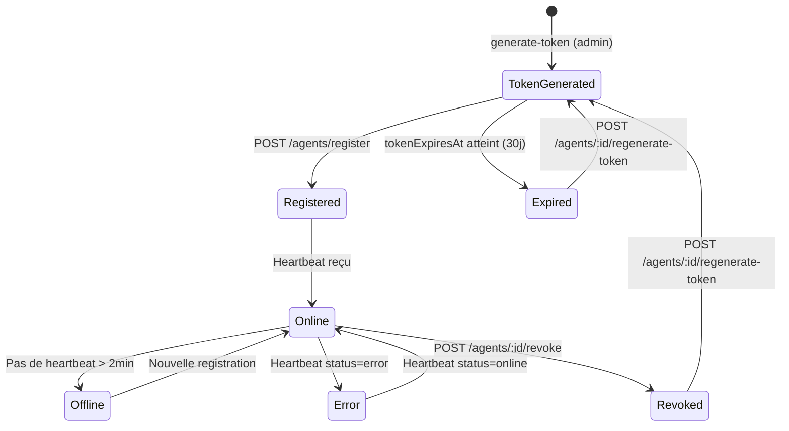

# Module Agents

Le module Agents gère les agents on-premise qui servent de pont entre Sage 100 et la plateforme Cockpit. Il couvre la génération de tokens, la validation à l'installation, le heartbeat périodique (toutes les 5 min), l'ingestion des données synchronisées et la surveillance du statut.

## Structure

```
src/agents/
├── agents.module.ts
├── agents.service.ts
├── agents.controller.ts
└── dto/
    ├── register-agent.dto.ts
    ├── heartbeat.dto.ts
    └── generate-token.dto.ts
```

**Dépendances du module** : `PrismaModule`, `AuditLogModule`, `UsersModule`, `SubscriptionsModule`, `RedisModule` (rate limiting distribué).

---

## Cycle de vie d'un agent



---

## AgentsService — Référence

### Gestion des tokens

#### `generateAgentToken(orgId, dto)`

Génère un token au format `isag_<64hex>` avec une durée de vie de 30 jours. Par défaut, lève une exception si un agent actif existe déjà (sauf si `force: true`).

```typescript
// Token format
const token = `isag_${crypto.randomBytes(32).toString('hex')}`;
// → "isag_a3f8b2c1d4e5..."

const tokenExpiresAt = new Date();
tokenExpiresAt.setDate(tokenExpiresAt.getDate() + 30);
```

!!! warning "Token en clair — affichage unique"
    Le token est retourné **une seule fois** lors de la génération. Il n'est pas chiffré en DB mais est unique. Transmettez-le immédiatement à l'agent via un canal sécurisé.

#### `revokeToken(agentId, orgId)`

Révocation immédiate :

```typescript
await prisma.agent.update({
  where: { id: agentId, organizationId: orgId },
  data: {
    isRevoked: true,
    revokedAt: new Date(),
  },
});
```

L'agent révoqué ne peut plus s'enregistrer ni envoyer de heartbeat.

#### `regenerateToken(agentId, orgId)`

Génère un nouveau token, réinitialise `isRevoked = false` et repart pour 30 jours.

---

### Enregistrement

#### `registerAgent(dto, ipAddress)`

Appelé à chaque démarrage de l'agent. Trouve l'agent par token, vérifie qu'il n'est pas révoqué ni expiré, puis met à jour son statut :

```typescript
await prisma.agent.update({
  where: { token: dto.agent_token },
  data: {
    status: 'online',
    lastSeen: new Date(),
    name: dto.agent_name ?? existing.name,
    version: dto.agent_version,
  },
});
```

---

### Heartbeat

#### `processHeartbeat(dto)`

Appelé toutes les **5 minutes** par l'agent. Met à jour `lastSeen`, le statut et les statistiques de sync :

```typescript
// Si errorCount > 0 → status = 'error'
// Sinon → status = dto.status ('online' par défaut)
const status = dto.errorCount > 0 ? 'error' : (dto.status ?? 'online');
```

#### `markStaleAgentsOffline()` (Cron)

Tâche planifiée qui cherche tous les agents dont `lastSeen` date de plus de 2 minutes et les passe en `offline`.

---

### Surveillance

#### `getAgentStatusByOrg(orgId)`

Retourne la liste des agents avec des champs calculés :

```typescript
// Calcul isExpiringSoon (7 jours avant expiry)
const daysUntilExpiry = tokenExpiresAt
  ? Math.ceil((tokenExpiresAt.getTime() - Date.now()) / 86400000)
  : null;

const isExpiringSoon = daysUntilExpiry !== null && daysUntilExpiry <= 7;
```

#### `getAgentById(id)`

Retourne les détails de l'agent avec le token **partiellement masqué** (affichage preview) :

```typescript
// Token preview: isag_a3f8...c1d4
const tokenPreview = `${token.substring(0, 10)}...${token.substring(token.length - 4)}`;
```

---

### Exécution Temps Réel (Tunnel WebSocket)

Le module Agents gère le tunnel de communication bidirectionnel permettant d'envoyer des commandes SQL directement à l'agent local du client.

#### `getJobById(jobId, organizationId)`

Récupère un `AgentJob` en vérifiant l'isolation tenant :

```typescript
async getJobById(jobId: string, organizationId: string) {
  const job = await this.prisma.agentJob.findUnique({ where: { id: jobId } });
  if (!job || job.organizationId !== organizationId) {
    throw new NotFoundException('Job introuvable');
  }
  return job;
}
```

La logique métier (y compris la vérification tenant) est dans le **service**, pas dans le controller.

#### `executeRealTimeQuery(orgId, sql, gateway)`

Orchestre l'envoi sécurisé d'une requête SQL :

1. **Injection de Scoping** : Injecte les variables de `sageConfig` (ex: `{{database_name}}`) dans le SQL utilisateur.
2. **Validation Sécurité** : Passe le SQL final au `SqlSecurityService` (SELECT-only, pas de DROP/DELETE).
3. **Vérification Licence** : Vérifie que l'organisation n'a pas dépassé son quota quotidien de synchronisation.
4. **Rate Limiting Redis** : Limite à 10 requêtes par minute par organisation (distribué, voir ci-dessous).
5. **Caching** : Vérifie si une requête identique a été exécutée avec succès dans les 5 dernières minutes.
6. **Envoi WebSocket** : Émet l'événement `execute_sql` via la `AgentsGateway`.

#### Rate Limiting Redis distribué

Le rate limiting SQL est implémenté via Redis (pattern INCR + EXPIRE) — distribué et persistant entre redémarrages du serveur :

```typescript
// Clé par organisation, fenêtre 60 secondes, max 10 req
const key = `sql_rl:${organizationId}`;
const count = await this.redis.incr(key);
if (count === 1) await this.redis.expire(key, 60);
if (count > 10) throw new BadRequestException('Limite 10 req/min atteinte');
```

**Fail-open** : si Redis est indisponible, un warning est loggé (`Logger.warn`) mais la requête n'est pas bloquée.

#### Normalisation des résultats
Les résultats renvoyés par l'agent sont automatiquement transformés par le backend :
- Extraction de valeur unique (ex: `SUM`, `COUNT`).
- Formatage JSON standard pour le frontend.
- Cast des types numériques.

---

## Controller — Endpoints

### Endpoints Agent → Plateforme (token agent)

| Méthode | Route | Auth | Description |
|---------|-------|------|-------------|
| `POST` | `/api/v1/agent/validate` | Public | Validation token à l'installation |
| `POST` | `/api/v1/agent/heartbeat` | `AgentTokenGuard` | Heartbeat toutes les 5 min |
| `POST` | `/api/v1/agent/ingest` | `AgentTokenGuard` | Ingestion batch données (5 000 lignes max) |
| `GET`  | `/api/v1/agent/config` | `AgentTokenGuard` | Config distante (intervalles, vues activées) |

### Endpoints Admin (JWT utilisateur)

| Méthode | Route | Auth | Description |
|---------|-------|------|-------------|
| `POST` | `/agents/generate-token` | `manage:agents` | Générer un token agent |
| `GET` | `/agents/status` | `read:agents` | Statut de tous les agents |
| `GET` | `/agents/:id` | `read:agents` | Détails d'un agent |
| `POST` | `/agents/:id/regenerate-token` | `manage:agents` | Régénérer token |
| `POST` | `/agents/:id/revoke` | `manage:agents` | Révoquer token |
| `POST` | `/agents/:id/command` | `manage:agents` | Envoyer commande (`FORCE_FULL_SYNC`) |
| `GET` | `/agents/:id/sync-batches` | `read:agents` | Historique des batches ingest |

---

## DTOs

### RegisterAgentDto

```typescript
class RegisterAgentDto {
  @IsString()
  agent_token: string;           // isag_xxx

  @IsOptional() @IsString()
  sage_type?: string;            // "X3" | "100"

  @IsOptional() @IsString()
  sage_version?: string;

  @IsOptional() @IsString()
  agent_name?: string;

  @IsOptional() @IsString()
  agent_version?: string;
}
```

### HeartbeatDto

```typescript
class HeartbeatDto {
  // Header Authorization: Bearer isag_...
  // (extrait par AgentTokenGuard — pas dans le corps)

  @IsOptional() @IsIn(['online', 'error'])
  status?: string;           // 'online' par défaut

  @IsOptional() @IsString()
  lastSync?: string;         // ISO 8601 de la dernière sync réussie

  @IsOptional() @IsNumber()
  nbRecordsTotal?: number;   // Total de lignes envoyées depuis le démarrage
}
```

!!! info "Intervalle heartbeat"
    L'agent envoie un heartbeat toutes les **5 minutes** (cron `*/5 * * * *`).
    Un agent est marqué `offline` si `lastSeen` dépasse 2 minutes — cette contrainte est gérée
    par `markStaleAgentsOffline()` qui tourne indépendamment.

### ValidateDto (installation)

```typescript
class ValidateAgentDto {
  @IsString()
  token: string;             // isag_...

  @IsOptional() @IsEmail()
  email?: string;            // Email de l'utilisateur Cockpit

  @IsOptional() @IsString()
  machineId?: string;        // Identifiant machine (node-machine-id)

  @IsOptional() @IsArray()
  sageTables?: string[];     // Tables Sage 100 détectées
}
```

### GenerateTokenDto

```typescript
class GenerateTokenDto {
  @IsOptional() @IsString()
  name?: string;    // Nom de l'agent

  @IsOptional() @IsBoolean()
  force?: boolean;  // Forcer même si agent actif existe
}
```

---

## Audit trail des agents

Tous les événements sont loggés via `AuditLogService` :

| Événement | Déclenché par |
|-----------|---------------|
| `agent_token_generated` | `generateAgentToken()` |
| `agent_registered` | `registerAgent()` |
| `agent_heartbeat` | `processHeartbeat()` |
| `agent_error` | Heartbeat avec `status: error` |
| `agent_token_revoked` | `revokeToken()` |
| `agent_token_regenerated` | `regenerateToken()` |

---

## Monitoring — Statuts d'un agent

| Statut | Couleur | Signification |
|--------|---------|---------------|
| `pending` | 🟡 Jaune | Token généré, agent non encore démarré |
| `online` | 🟢 Vert | Heartbeat récent (< 2 min) |
| `offline` | ⚫ Gris | Heartbeat absent > 2 min |
| `error` | 🔴 Rouge | Heartbeat reçu avec `status: error` |

### Dashboard local de l'agent

En complément du portail Cockpit, l'agent expose un dashboard HTML sur la machine cliente :

```
http://127.0.0.1:8444/        → Interface HTML (auto-refresh 10s)
http://127.0.0.1:8444/health  → JSON machine-readable
```

Ce dashboard affiche le statut en temps réel : connexion SQL Server, connexion plateforme, uptime, et l'état de chacune des 12 vues synchronisées (mode, intervalle, dernier sync, nb lignes).

### Champs calculés (réponse API)

```json
{
  "id": "uuid",
  "name": "agent-prod-acme",
  "status": "online",
  "lastSeen": "2026-03-02T10:29:45Z",
  "rowsSynced": 1458230,
  "errorCount": 0,
  "tokenExpiresAt": "2026-04-01T...",
  "isRevoked": false,
  "daysUntilExpiry": 30,
  "isExpiringSoon": false
}
```
