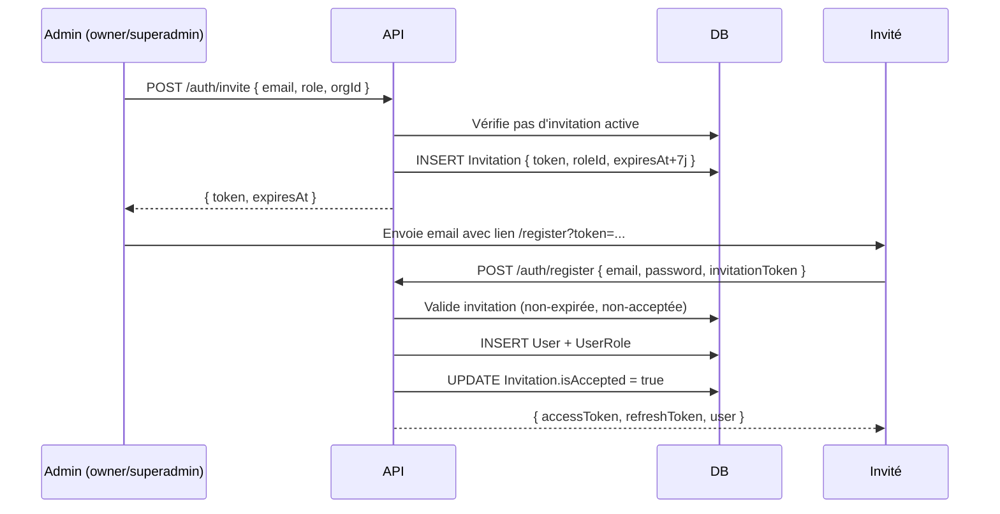

# Module Auth

Le module d'authentification est le socle de toute la sécurité de la plateforme. Il gère les tokens JWT, les stratégies Passport, les guards globaux et les décorateurs.

## Structure

```
src/auth/
├── auth.module.ts
├── auth.service.ts
├── auth.controller.ts
├── dto/
│   ├── login.dto.ts
│   ├── register.dto.ts
│   ├── forgot-password.dto.ts
│   ├── reset-password.dto.ts
│   └── invite-user.dto.ts
├── decorators/
│   ├── public.decorator.ts       (@Public)
│   ├── current-user.decorator.ts (@CurrentUser)
│   ├── organization.decorator.ts (@OrganizationId)
│   ├── permissions.decorator.ts  (@RequirePermissions)
│   └── roles.decorator.ts        (@Roles)
├── guards/
│   ├── jwt-auth.guard.ts         (global)
│   ├── jwt-refresh-auth.guard.ts
│   ├── tenant.guard.ts           (global)
│   ├── permissions.guard.ts
│   └── roles.guard.ts
└── strategies/
    ├── jwt.strategy.ts
    └── jwt-refresh.strategy.ts
```

---

## AuthService — Référence

### `login(dto: LoginDto)`

Authentifie un utilisateur par email/password. Retourne un access token (15min) et un refresh token (7j). Le refresh token est hashé en **bcrypt (factor 12)** avant stockage en DB.

```typescript
const result = await authService.login({ email, password });
// { accessToken, refreshToken, user }
```

### `register(dto: RegisterDto)`

Crée un compte. Si un `invitationToken` est fourni, associe l'utilisateur au rôle de l'invitation et marque l'invitation comme acceptée.

### `logout(userId: string)`

Efface le `hashedRefreshToken` en DB. Le token reste techniquement valide 15 minutes (jusqu'à expiration), mais ne peut plus être renouvelé.

### `refreshTokens(userId: string, refreshToken: string)`

Vérifie le refresh token contre le hash DB. Si valide, génère un nouveau pair de tokens (rotation 1:1).

### `forgotPassword(dto: ForgotPasswordDto)`

Génère un token de réinitialisation (7 jours), le stocke **hashé SHA-256** en DB, et retourne le token en clair (à envoyer par email).

!!! note
    La réponse est identique que l'email existe ou non, pour éviter l'énumération d'emails.

### `resetPassword(dto: ResetPasswordDto)`

Reçoit le token en clair, le hash en SHA-256, cherche le hash en DB. Vérifie qu'il n'est pas expiré, hash le nouveau mot de passe (**bcrypt ×12**) et efface le token.

### `inviteUser(dto: InviteUserDto)`

Vérifie qu'aucune invitation active n'existe pour cet email, crée une `Invitation` en DB avec un token **hashé SHA-256** (7 jours) et le rôle associé. Retourne le token en clair (à envoyer par email).

!!! info "Hachage des tokens sensibles (SHA-256)"
    Les tokens d'invitation et de reset password sont stockés en DB sous forme de hash SHA-256, jamais en clair. Même si la DB est compromise, les tokens restent inutilisables.
    ```typescript
    const rawToken = crypto.randomBytes(32).toString('hex');
    const tokenHash = crypto.createHash('sha256').update(rawToken).digest('hex');
    // DB → tokenHash | Email → rawToken
    ```

---

## Guards détaillés

### JwtAuthGuard (Global)

Appliqué sur **toutes** les routes via `APP_GUARD` dans `app.module.ts`. Contourne automatiquement les routes décorées `@Public()`.

```typescript
// Utilisation dans un controller
@Controller('health')
@Public()  // Bypass JwtAuthGuard ET TenantGuard
export class HealthController { ... }
```

### TenantGuard (Global)

Appliqué en second via `APP_GUARD`. Garantit l'isolation multi-tenant :

- Les SuperAdmins (`manage:all`) passent sans restriction
- Pour les autres utilisateurs, si `organizationId` est présent dans params/body/query, il doit correspondre à celui du JWT

### PermissionsGuard (Non-global)

Activé **uniquement** sur les routes annotées `@RequirePermissions()` + `@UseGuards(PermissionsGuard)` :

```typescript
@Get()
@RequirePermissions({ action: 'read', resource: 'users' })
@UseGuards(PermissionsGuard)
async getUsers() { ... }
```

---

## Décorateurs

### `@Public()`

```typescript
import { Public } from '@/auth/decorators';

@Controller('auth')
export class AuthController {
  @Post('login')
  @Public()  // Accessible sans token
  login(@Body() dto: LoginDto) { ... }
}
```

### `@CurrentUser()`

Extrait l'utilisateur complet ou un champ spécifique depuis `request.user` :

```typescript
@Get('me')
getProfile(
  @CurrentUser() user: User,           // L'objet User complet
  @CurrentUser('id') userId: string,   // Juste l'ID
) { ... }
```

### `@OrganizationId()`

Extrait l'`organizationId` depuis le JWT (via `request.user.organizationId`) :

```typescript
@Get()
findAll(@OrganizationId() orgId: string) {
  return this.service.findAllByOrg(orgId);
}
```

### `@RequirePermissions()`

```typescript
@RequirePermissions({ action: 'manage', resource: 'agents' })
@UseGuards(PermissionsGuard)
```

Format des permissions : `action:resource`

| `action` | Niveau |
|----------|--------|
| `read` | Lecture |
| `write` | Écriture (propre scope) |
| `manage` | Administration complète |

| `resource` | Description |
|-----------|-------------|
| `users` | Utilisateurs |
| `agents` | Agents de synchronisation |
| `logs` | Logs d'audit |
| `dashboards` | Tableaux de bord |
| `all` | Accès total (SuperAdmin) |

---

## Stratégies Passport

### JwtStrategy

Extrait le Bearer token de l'en-tête `Authorization`, le valide avec `JWT_SECRET`, puis charge l'utilisateur depuis la DB avec ses rôles et permissions.

### JwtRefreshStrategy

Identique à `JwtStrategy` mais utilise `JWT_REFRESH_SECRET`. Utilisée uniquement sur `POST /auth/refresh`.

---

## DTOs de validation

```typescript
// LoginDto
class LoginDto {
  @IsEmail()
  email: string;

  @MinLength(8)
  password: string;
}

// InviteUserDto
class InviteUserDto {
  @IsEmail()
  email: string;

  @IsString()
  role: string;  // nom du rôle (ex: "daf")

  @IsUUID()
  organizationId: string;
}
```

---

## Flux d'invitation complet


