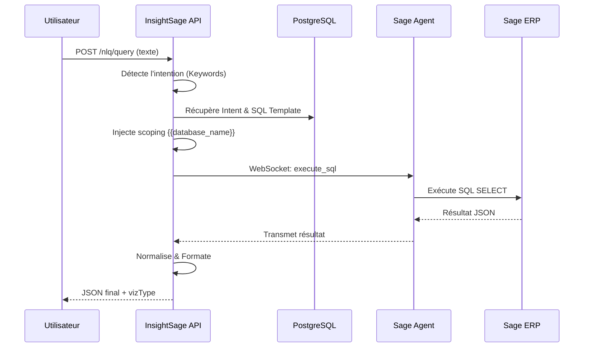

# Module NLQ (Natural Language Querying)

Le module NLQ permet aux utilisateurs finaux de poser des questions métier en langage courant (ex: "Quel est mon chiffre d'affaires ce mois-ci ?") et d'obtenir des résultats en temps réel extraits de leur ERP Sage.

## Architecture & Flux

L'implémentation repose sur une architecture de templates SQL sécurisés plutôt que sur une génération SQL libre, garantissant une sécurité maximale.

## Composants Clés

### 1. Détection d'Intention
Le `NlqService` utilise un moteur de matching par mots-clés pondérés pour lier une phrase utilisateur à une `NlqIntent`. Chaque intention définit une question métier supportée.

### 2. Templates ERP-Specific
Pour chaque intention, une table de `NlqTemplate` contient le code SQL optimisé pour chaque version de Sage supportée (`Sage 100` ou `Sage X3`).

### 3. Scoping Dynamique
Le moteur d'exécution injecte automatiquement les variables de configuration de l'organisation (stockées dans `sageConfig`) dans les placeholders du SQL (ex: `{{database_name}}`).

## Sécurité SQL
Toutes les requêtes NLQ passent par trois niveaux de validation :
1.  **Backend validation** : Regex `^SELECT` obligatoire, interdiction de mots-clés destructeurs (`DROP`, `DELETE`, `UPDATE`).
2.  **Scoping** : Injection forcée du nom de la base de données client.
3.  **Agent Sandbox** : Whitelist des tables SQL autorisées configurée au niveau de l'agent local.

## Sessions & Historique
Chaque requête est tracée dans la table `nlq_sessions` :
- Texte brut de l'utilisateur.
- Intention détectée.
- SQL final généré.
- Latence d'exécution.
- Statut (Success/Error/No Intent).

## Endpoints API

| Méthode | Route | Description |
|---------|-------|-------------|
| `POST` | `/nlq/query` | Analyse une question et lance l'exécution agent. |
| `POST` | `/nlq/add-to-dashboard` | Transforme une session NLQ réussie en widget permanent. |

---

## Guide d'implémentation pour les Data Engineers

Pour ajouter un nouveau cas d'usage NLQ :
1.  Ajouter une entrée dans `nlq_intents` avec ses mots-clés.
2.  Ajouter les entrées correspondantes dans `nlq_templates` pour Sage 100 et Sage X3.
3.  Utiliser les placeholders `{{database_name}}` pour le scoping.
