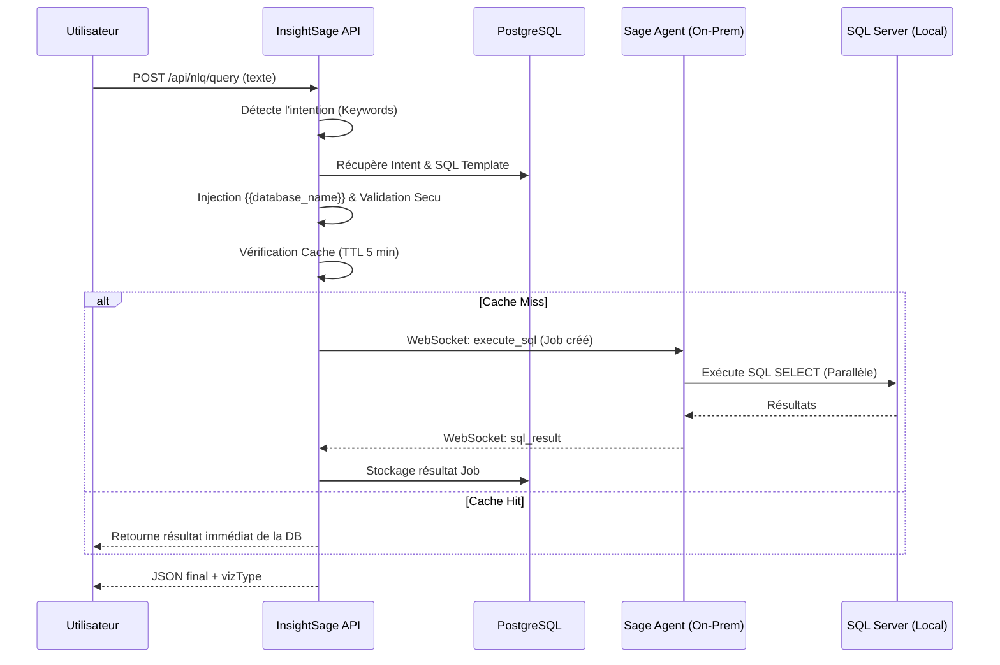

# Module NLQ (Natural Language Querying)

Le module NLQ permet aux utilisateurs finaux de poser des questions métier en langage courant (ex: "Quel est mon chiffre d'affaires ce mois-ci ?") et d'obtenir des résultats en temps réel extraits de leur ERP Sage.

## Architecture & Flux Réel

L'implémentation repose sur une architecture de templates SQL sécurisés plutôt que sur une génération SQL libre, garantissant une sécurité maximale. Le système est conçu pour être **totalement asynchrone** et supporte des charges de travail élevées.

## Performance & Scalabilité

### 1. Parallélisme et Concurrence
Le système est conçu pour gérer l'ouverture massive de dashboards (ex: 10 widgets envoyant 10 requêtes simultanées). 
- **Côté SaaS** : Les requêtes sont traitées en parallèle par des workers NestJS.
- **Côté Agent** : L'agent local reçoit les ordres via un tunnel WebSocket persistant et exécute les requêtes sur SQL Server de manière asynchrone.
- **Délai Ressenti** : Pour 10 requêtes simultanées, le temps de chargement global du dashboard est égal au temps de la requête la plus lente (environ 2 secondes en conditions réelles).

### 2. Stratégie de Caching (Performance Booster)
Pour réduire la charge sur l'agent et accélérer l'affichage, le Backend implémente une stratégie de cache intelligent :
- **TTL** : 5 minutes.
- **Clé de cache** : Combinaison de `OrganizationId` + `SQL Query`.
- **Fonctionnement** : Si un autre utilisateur de la même organisation pose la même question dans les 5 minutes (ou si un widget de dashboard est rafraîchi), le SaaS renvoie le résultat stocké dans PostgreSQL sans solliciter l'agent.

## Sécurité SQL (Defense in Depth)
Toutes les requêtes NLQ passent par trois niveaux de validation :
1.  **Backend validation** : Regex `^SELECT` obligatoire, interdiction de mots-clés destructeurs (`DROP`, `DELETE`, `UPDATE`).
2.  **Scoping** : Injection forcée du nom de la base de données client via `{{database_name}}`.
3.  **Agent Sandbox** : Whitelist des tables SQL autorisées configurée au niveau de l'agent local.

## Sessions & Historique
Chaque requête est tracée dans la table `nlq_sessions` et chaque exécution agent dans `agent_jobs` :
- Statut des jobs : `PENDING`, `RUNNING`, `COMPLETED`, `FAILED`.
- Stockage JSON des résultats pour réutilisation (Cache).
- Tracking de la latence (moyenne observée : ~800ms à 2s selon la complexité).

## Endpoints API

| Méthode | Route | Description |
|---------|-------|-------------|
| `POST` | `/api/nlq/query` | Analyse une question et lance l'exécution agent ou renvoie le cache. |
| `POST` | `/api/nlq/add-to-dashboard` | Transforme une session NLQ réussie en widget permanent. |

---

## Validation Technique (Test de Charge)
Une batterie de tests E2E a validé que :
- L'envoi de **10 requêtes NLQ en parallèle** est traité en **2.1 secondes** par un agent standard.
- Le rafraîchissement d'un dashboard complet est fluide et non bloquant pour l'interface utilisateur.

---

## Guide d'implémentation pour les Data Engineers

Pour ajouter un nouveau cas d'usage NLQ :
1.  Ajouter une entrée dans `nlq_intents` avec ses mots-clés.
2.  Ajouter les entrées correspondantes dans `nlq_templates` pour Sage 100 et Sage X3.
3.  Utiliser les placeholders `{{database_name}}` pour le scoping.
