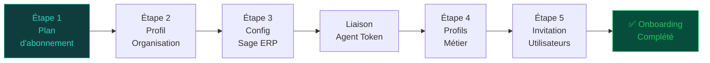
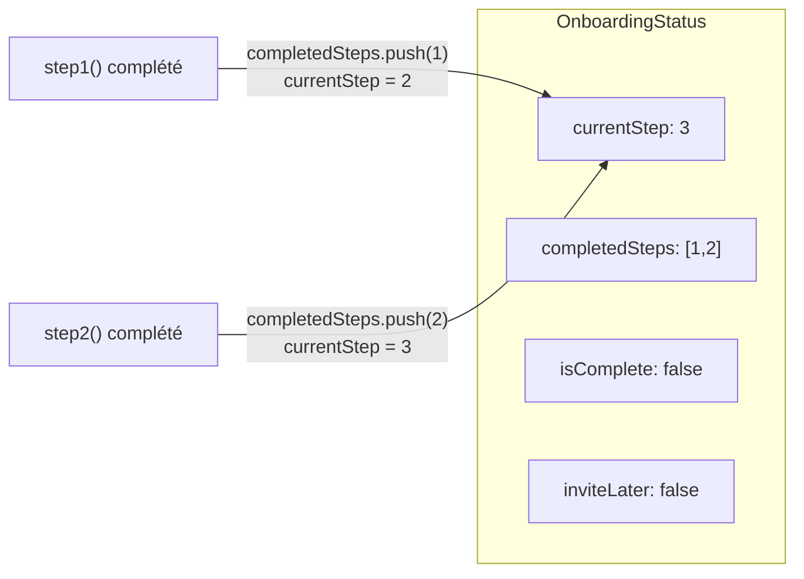

# Module Onboarding

Le module Onboarding guide les nouveaux clients à travers un wizard en 5 étapes pour configurer leur organisation, connecter leur Sage ERP et inviter leurs équipes.

## Architecture du wizard



---

## OnboardingService — Référence

### `getStatus(orgId)`

Retourne l'état actuel du wizard :

```typescript
{
  currentStep: 3,
  completedSteps: [1, 2],
  isComplete: false,
  inviteLater: false,
  organization: {
    name: "Acme Corp",
    planId: "uuid-plan",
    subscriptionPlan: { name: "business", label: "Business" }
  }
}
```

### `step1(orgId, dto)` — Sélection du plan

Met à jour `organization.planId` et marque l'étape 1 comme complétée.

```typescript
// body: { plan: "startup" | "pme" | "business" | "enterprise" }
await prisma.organization.update({
  where: { id: orgId },
  data: { planId: plan.id },
});
await this.completeStep(orgId, 1);
```

### `step2(orgId, dto)` — Profil de l'organisation

Mise à jour des informations de l'entreprise :

```typescript
// body: { name?, sector?, size?, country? }
await prisma.organization.update({
  where: { id: orgId },
  data: { name, sector, size, country },
});
await this.completeStep(orgId, 2);
```

### `step3(orgId, dto)` — Configuration Sage ERP

Enregistre la configuration de connexion Sage :

```typescript
// body: { sageType, sageMode, sageHost?, sagePort? }
await prisma.organization.update({
  where: { id: orgId },
  data: { sageType, sageMode, sageHost, sagePort },
});
await this.completeStep(orgId, 3);
```

!!! info "Types Sage supportés"
    - `sageType: "X3"` — Sage X3 (Enterprise Management)
    - `sageType: "100"` — Sage 100 (ERP PME)
    - `sageMode: "local"` — Serveur SQL on-premise
    - `sageMode: "cloud"` — Sage en mode SaaS

### `linkAgent(orgId, dto)` — Liaison de l'agent

Valide le token de l'agent et l'associe à l'organisation :

```typescript
// body: { agentToken: "isag_xxx" }
const agent = await prisma.agent.findUnique({ where: { token } });
if (!agent || agent.isRevoked) throw new BadRequestException('Token invalide');
if (agent.organizationId !== orgId) throw new ForbiddenException('Token appartient à une autre org');

await this.auditLog.log({ event: 'agent_linked', orgId, payload: { agentId: agent.id } });
```

### `getAvailableProfiles()`

Retourne la liste des profils métier disponibles :

```typescript
const profiles = [
  { key: 'daf',        label: 'DAF / CFO',               description: 'Directeur Administratif et Financier' },
  { key: 'dg',         label: 'DG — Directeur Général',   description: 'Direction générale' },
  { key: 'controller', label: 'Contrôleur Financier',     description: 'Contrôle de gestion' },
  { key: 'manager',    label: 'Responsable de département', description: 'Management opérationnel' },
  { key: 'analyst',    label: 'Analyste (lecture seule)',   description: 'Consultation des données' },
];
```

### `step4(orgId, dto)` — Profils métier

Enregistre les profils sélectionnés pour déterminer les KPI packs à activer :

```typescript
// body: { profiles: ["daf", "controller"] } (min 1)
await prisma.organization.update({
  where: { id: orgId },
  data: { selectedProfiles: profiles },
});
await this.completeStep(orgId, 4);
```

### `step5(orgId, userId, dto)` — Invitations

=== "Inviter maintenant"
    ```typescript
    // body: { invitations: [{ email, role }], inviteLater: false }
    for (const inv of invitations) {
      await this.authService.inviteUser({ email: inv.email, role: inv.role, organizationId: orgId });
    }
    await this.auditLog.log({ event: 'users_invited_bulk', payload: { count: invitations.length } });
    await this.completeStep(orgId, 5, { isComplete: true });
    ```

=== "Reporter les invitations"
    ```typescript
    // body: { inviteLater: true }
    await prisma.onboardingStatus.update({
      where: { organizationId: orgId },
      data: { inviteLater: true, isComplete: true },
    });
    ```

### `testConnection(orgId, dto)` — Test de connexion

Teste la connectivité avec l'agent :

```typescript
// Vérifie que l'agent est online (lastSeen < 2 min)
const agent = await prisma.agent.findFirst({
  where: { organizationId: orgId, status: 'online' }
});
if (!agent) throw new ServiceUnavailableException('Agent hors ligne');
```

---

## Controller — Endpoints

| Méthode | Route | Description |
|---------|-------|-------------|
| `GET` | `/onboarding/status` | État du wizard |
| `POST` | `/onboarding/step1` | Plan d'abonnement |
| `POST` | `/onboarding/step2` | Profil organisation |
| `POST` | `/onboarding/step3` | Config Sage ERP |
| `POST` | `/onboarding/agent-link` | Liaison agent |
| `POST` | `/datasource/discover` | Scan Agent pour lister les dossiers Sage |
| `GET` | `/onboarding/profiles` | Profils disponibles |
| `POST` | `/onboarding/step4` | Profils métier |
| `POST` | `/onboarding/step5` | Invitations |

---

## DTOs

```typescript
class Step1Dto {
  @IsIn(['startup', 'pme', 'business', 'enterprise'])
  plan: string;
}

class Step2Dto {
  @IsOptional() @IsString() name?: string;
  @IsOptional() @IsString() sector?: string;
  @IsOptional() @IsIn(['startup', 'pme', 'enterprise', 'grand-compte']) size?: string;
  @IsOptional() @IsString() country?: string;
}

class Step3Dto {
  @IsIn(['X3', '100'])
  sageType: string;

  @IsIn(['local', 'cloud'])
  sageMode: string;

  @IsOptional() @IsString()  sageHost?: string;
  @IsOptional() @IsNumber()  sagePort?: number;
}

class Step4Dto {
  @IsArray()
  @ArrayMinSize(1)
  @IsIn(['daf', 'dg', 'controller', 'manager', 'analyst'], { each: true })
  profiles: string[];
}

class Step5Dto {
  @IsOptional()
  @IsArray()
  invitations?: Array<{ email: string; role: string }>;

  @IsOptional()
  @IsBoolean()
  inviteLater?: boolean;
}

class AgentLinkDto {
  @IsString()
  agentToken: string;
}
```

---

## Persistance de l'état (OnboardingStatus)



La méthode `completeStep()` gère automatiquement la progression :

```typescript
private async completeStep(orgId: string, step: number, extras?: object) {
  const status = await prisma.onboardingStatus.findUnique({ where: { organizationId: orgId } });
  const completedSteps = [...new Set([...status.completedSteps, step])];
  const nextStep = Math.max(...completedSteps) + 1;

  await prisma.onboardingStatus.update({
    where: { organizationId: orgId },
    data: {
      completedSteps,
      currentStep: nextStep,
      ...extras,
    },
  });

  await this.auditLog.log({ event: 'onboarding_step_completed', payload: { step } });
}
```

---

## Audit trail Onboarding

| Événement | Étape |
|-----------|-------|
| `subscription_plan_selected` | Étape 1 |
| `onboarding_step_completed` | Chaque étape |
| `datasource_configured` | Étape 3 |
| `agent_linked` | Liaison agent |
| `users_invited_bulk` | Étape 5 |
| `onboarding_completed` | Fin du wizard |
