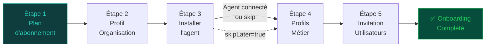

# Module Onboarding

Le module Onboarding guide les nouveaux clients à travers un wizard en **5 étapes** pour configurer leur organisation, installer l'agent Cockpit et inviter leurs équipes. Depuis la v1.1, l'étape 3 ne demande plus de saisie manuelle de la configuration Sage : c'est l'**agent on-premise** qui pousse automatiquement sa config lors de sa première connexion WebSocket.

## Architecture du wizard



!!! info "Étape 3 — Nouvelle architecture (v1.1)"
    **Avant :** l'utilisateur saisissait manuellement `sageType`, `sageMode`, `sageHost`, `sagePort`.

    **Après :** l'utilisateur télécharge l'exécutable de l'agent depuis l'interface, l'installe sur son serveur Sage, et l'agent pousse automatiquement sa configuration via WebSocket lors de sa première connexion. L'étape 3 est alors auto-complétée. Une option **"Configurer plus tard"** (`skipLater`) est disponible.

    Exception : si `sageMode = cloud`, un formulaire minimal (sageType uniquement) reste disponible.

---

## OnboardingService — Référence

### `getStatus(orgId)`

Retourne l'état actuel du wizard :

```typescript
{
  currentStep: 3,
  completedSteps: [1, 2],
  isComplete: false,
  inviteLater: false,
  organization: {
    name: "Acme Corp",
    planId: "uuid-plan",
    subscriptionPlan: { name: "business", label: "Business" }
  }
}
```

### `step1(orgId, dto)` — Sélection du plan

Met à jour `organization.planId` et marque l'étape 1 comme complétée.

```typescript
// body: { plan: "startup" | "pme" | "business" | "enterprise" }
await prisma.organization.update({
  where: { id: orgId },
  data: { planId: plan.id },
});
await this.completeStep(orgId, 1);
```

### `step2(orgId, dto)` — Profil de l'organisation

Mise à jour des informations de l'entreprise :

```typescript
// body: { name?, sector?, size?, country? }
await prisma.organization.update({
  where: { id: orgId },
  data: { name, sector, size, country },
});
await this.completeStep(orgId, 2);
```

### `step3(orgId, userId, dto)` — Initiation de l'installation agent

Comportement bifurqué selon `dto.sageMode` :

=== "Mode cloud"
    ```typescript
    // body: { sageMode: "cloud", sageType?: "X3" | "100" }
    await prisma.organization.update({
      data: { sageType: dto.sageType, sageMode: 'cloud' },
    });
    await this.completeStep(orgId, 3);   // étape complétée immédiatement
    return { agentRequired: false, ... };
    ```

=== "Mode local (défaut)"
    ```typescript
    // body: {} (aucun champ requis)
    // Retourne les liens de téléchargement des dernières releases isLatest
    const releases = await this.agentReleasesService.listReleases({ isLatest: true });
    return {
      agentRequired: true,
      releases,   // [{ platform, arch, version, fileName, fileUrl, checksum }]
    };
    // ⚠ L'étape N'EST PAS complétée ici : elle le sera automatiquement
    //   quand l'agent se connecte et envoie l'event WebSocket `agent_config`
    ```

!!! info "Auto-complétion via WebSocket"
    Quand l'agent se connecte et envoie `agent_config`, le backend met à jour `Organization` (sageType, sageMode, sageHost, sagePort) et appelle `markStepComplete(orgId, 3)` automatiquement.

### `getAgentReleases()` — Releases disponibles

```typescript
// GET /onboarding/agent-releases
// Authentifié (JWT client)
const releases = await this.agentReleasesService.listReleases({ isLatest: true });
// Réponse :
[
  {
    platform: "windows", arch: "x64", version: "1.2.3",
    fileName: "cockpit-agent-1.2.3-win-x64.exe",
    fileUrl: "https://cdn.../agent-releases/1.2.3/windows/x64/cockpit-agent.exe",
    checksum: "sha256:abc123..."
  },
  { platform: "linux", arch: "x64", ... }
]
```

### `linkAgent(orgId, userId, dto)` — Liaison ou report de l'agent

=== "Lier un agent (token valide)"
    ```typescript
    // body: { agentToken: "isag_xxx" }
    const agent = await prisma.agent.findUnique({ where: { token } });
    if (!agent || agent.isRevoked || agent.tokenExpiresAt < new Date())
      throw new BadRequestException('Token invalide ou expiré');
    if (agent.organizationId !== orgId)
      throw new BadRequestException('Token appartient à une autre org');

    await this.auditLog.log({ event: 'agent_linked', payload: { agentId: agent.id } });
    ```

=== "Reporter la configuration (skipLater)"
    ```typescript
    // body: { skipLater: true }
    const completedSteps = [...currentSteps, 3].sort();
    await prisma.onboardingStatus.update({
      data: {
        agentConfigLater: true,    // flag mémorisant le report
        completedSteps,
        currentStep: Math.max(currentStep, 4),
        isComplete: completedSteps.length >= 5,
      },
    });
    await this.auditLog.log({ event: 'agent_config_skipped', payload: {} });
    // L'utilisateur pourra lier son agent depuis Settings > Agents
    ```

### `getAvailableProfiles()`

Retourne la liste des profils métier disponibles :

```typescript
const profiles = [
  { key: 'daf',        label: 'DAF / CFO',               description: 'Directeur Administratif et Financier' },
  { key: 'dg',         label: 'DG — Directeur Général',   description: 'Direction générale' },
  { key: 'controller', label: 'Contrôleur Financier',     description: 'Contrôle de gestion' },
  { key: 'manager',    label: 'Responsable de département', description: 'Management opérationnel' },
  { key: 'analyst',    label: 'Analyste (lecture seule)',   description: 'Consultation des données' },
];
```

### `step4(orgId, dto)` — Profils métier

Enregistre les profils sélectionnés pour déterminer les KPI packs à activer :

```typescript
// body: { profiles: ["daf", "controller"] } (min 1)
await prisma.organization.update({
  where: { id: orgId },
  data: { selectedProfiles: profiles },
});
await this.completeStep(orgId, 4);
```

### `step5(orgId, userId, dto)` — Invitations

=== "Inviter maintenant"
    ```typescript
    // body: { invitations: [{ email, role }], inviteLater: false }
    for (const inv of invitations) {
      await this.authService.inviteUser({ email: inv.email, role: inv.role, organizationId: orgId });
    }
    await this.auditLog.log({ event: 'users_invited_bulk', payload: { count: invitations.length } });
    await this.completeStep(orgId, 5, { isComplete: true });
    ```

=== "Reporter les invitations"
    ```typescript
    // body: { inviteLater: true }
    await prisma.onboardingStatus.update({
      where: { organizationId: orgId },
      data: { inviteLater: true, isComplete: true },
    });
    ```

### `testConnection(orgId, dto)` — Test de connexion

Teste la connectivité avec l'agent :

```typescript
// Vérifie que l'agent est online (lastSeen < 2 min)
const agent = await prisma.agent.findFirst({
  where: { organizationId: orgId, status: 'online' }
});
if (!agent) throw new ServiceUnavailableException('Agent hors ligne');
```

---

## Controller — Endpoints

| Méthode | Route | Description |
|---------|-------|-------------|
| `GET` | `/onboarding/status` | État du wizard (+ info organisation) |
| `POST` | `/onboarding/step1` | Plan d'abonnement |
| `POST` | `/onboarding/step2` | Profil organisation |
| `POST` | `/onboarding/step3` | Initiation installation agent (retourne releases ou complète si cloud) |
| `GET` | `/onboarding/agent-releases` | Dernières releases agent par plateforme |
| `POST` | `/onboarding/agent-link` | Lier un agent (`agentToken`) ou reporter (`skipLater: true`) |
| `POST` | `/datasource/test-connection` | Test de connexion temps-réel via WebSocket |
| `POST` | `/datasource/discover` | Scan des dossiers/sociétés Sage via agent |
| `GET` | `/onboarding/profiles` | Profils métier disponibles |
| `POST` | `/onboarding/step4` | Profils métier |
| `POST` | `/onboarding/step5` | Invitations (`inviteLater: true` disponible) |

---

## DTOs

```typescript
class Step1Dto {
  @IsIn(['startup', 'pme', 'business', 'enterprise'])
  plan: string;
}

class Step2Dto {
  @IsOptional() @IsString() name?: string;
  @IsOptional() @IsString() sector?: string;
  @IsOptional() @IsIn(['startup', 'pme', 'enterprise', 'grand-compte']) size?: string;
  @IsOptional() @IsString() country?: string;
}

// Step3 — simplifié : plus de saisie manuelle host/port (fournis par l'agent)
class Step3Dto {
  // Uniquement pour le mode cloud (l'agent n'est pas requis)
  @IsOptional() @IsIn(['X3', '100'])
  sageType?: string;

  @IsOptional() @IsIn(['local', 'cloud'])
  sageMode?: string;
  // sageHost et sagePort supprimés — poussés automatiquement par l'agent via WebSocket
}

class AgentLinkDto {
  // Option 1 : lier un agent par token
  @IsOptional() @IsString()
  agentToken?: string;

  // Option 2 : reporter la config agent (Configurer plus tard)
  @IsOptional() @IsBoolean()
  skipLater?: boolean;
}

class Step4Dto {
  @IsArray()
  @ArrayMinSize(1)
  @IsIn(['daf', 'dg', 'controller', 'manager', 'analyst'], { each: true })
  profiles: string[];
}

class Step5Dto {
  @IsOptional()
  @IsArray()
  invitations?: Array<{ email: string; role: string }>;

  @IsOptional()
  @IsBoolean()
  inviteLater?: boolean;
}
```

---

## Persistance de l'état (OnboardingStatus)

```prisma
model OnboardingStatus {
  id             String   @id @default(uuid())
  organizationId String   @unique
  currentStep    Int      @default(1)
  completedSteps Int[]                   // ex: [1, 2, 3]
  isComplete     Boolean  @default(false) // true quand completedSteps.length >= 5
  inviteLater    Boolean  @default(false) // step 5 reporté
  agentConfigLater Boolean @default(false) // step 3 reporté via skipLater
  createdAt      DateTime @default(now())
  updatedAt      DateTime @updatedAt
}
```

!!! tip "Critère de complétion"
    L'onboarding est marqué complet (`isComplete = true`) dès que **5 étapes sont présentes** dans `completedSteps`, quel que soit l'ordre. Les étapes skipées (step 3 via `skipLater`, step 5 via `inviteLater`) comptent comme complétées.

La méthode `completeStep()` gère automatiquement la progression :

```typescript
private async completeStep(orgId: string, step: number, userId?: string) {
  const status = await this.getOrCreateStatus(orgId);
  const completedSteps = status.completedSteps.includes(step)
    ? status.completedSteps
    : [...status.completedSteps, step].sort((a, b) => a - b);
  const nextStep = Math.max(status.currentStep, step + 1);
  const isComplete = completedSteps.length >= 5;

  await prisma.onboardingStatus.update({
    where: { organizationId: orgId },
    data: { completedSteps, currentStep: nextStep, isComplete },
  });

  await this.auditLog.log({ event: 'onboarding_step_completed', payload: { step, isComplete } });
  if (isComplete) {
    await this.auditLog.log({ event: 'onboarding_completed', payload: { completedAt: new Date() } });
  }
}
```

---

## Audit trail Onboarding

| Événement | Étape | Déclencheur |
|-----------|-------|-------------|
| `subscription_plan_selected` | 1 | `step1()` |
| `onboarding_step_completed` | Chaque étape | `completeStep()` |
| `datasource_configured` | 3 (cloud) | `step3()` mode cloud |
| `agent_config_received` | 3 (local) | Event WebSocket `agent_config` |
| `agent_config_skipped` | 3 (skip) | `linkAgent({ skipLater: true })` |
| `agent_linked` | 3 | `linkAgent({ agentToken })` |
| `users_invited_bulk` | 5 | `step5()` |
| `onboarding_completed` | Fin | Automatique quand `isComplete = true` |
