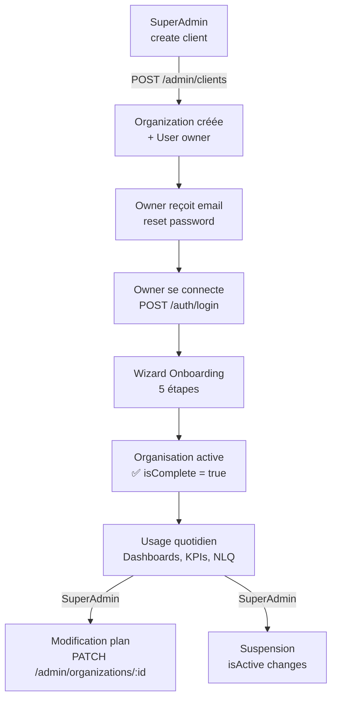

# Module Organisations

Le module Organizations gère les informations de l'organisation courante (tenant). Chaque utilisateur authentifié appartient à une organisation et peut consulter/modifier ses informations selon ses droits.

## Structure

```
src/organizations/
├── organizations.module.ts
├── organizations.service.ts
├── organizations.controller.ts
└── dto/
    └── update-organization.dto.ts
```

---

## OrganizationsService — Référence

### `findMine(orgId)`

Retourne l'organisation avec ses relations clés :

```typescript
await prisma.organization.findUnique({
  where: { id: orgId },
  include: {
    subscriptionPlan: {
      select: { id: true, name: true, label: true, maxUsers: true, maxKpis: true }
    },
    onboardingStatus: true,
    _count: {
      select: { users: true, dashboards: true, agents: true }
    },
  },
});
```

**Réponse exemple :**
```json
{
  "id": "uuid-org",
  "name": "Acme Corp",
  "sector": "Manufacturing",
  "size": "pme",
  "country": "France",
  "sageType": "X3",
  "sageMode": "local",
  "sageHost": "192.168.1.100",
  "sagePort": 1433,
  "selectedProfiles": ["daf", "controller"],
  "subscriptionPlan": {
    "name": "business",
    "label": "Business",
    "maxUsers": 25,
    "maxKpis": 100
  },
  "onboardingStatus": {
    "currentStep": 5,
    "isComplete": true
  },
  "_count": {
    "users": 12,
    "dashboards": 3,
    "agents": 1
  }
}
```

### `updateMine(orgId, userId, dto)`

Met à jour les informations de l'organisation et log l'action dans l'audit trail.

---

## Controller — Endpoints

| Méthode | Route | Auth | Description |
|---------|-------|------|-------------|
| `GET` | `/organizations/me` | Authentifié | Obtenir son organisation |
| `PATCH` | `/organizations/me` | Authentifié | Modifier son organisation |

---

## DTO de mise à jour

```typescript
class UpdateOrganizationDto {
  @IsOptional() @IsString()
  name?: string;

  @IsOptional() @IsString()
  sector?: string;

  @IsOptional() @IsIn(['startup', 'pme', 'enterprise', 'grand-compte'])
  size?: string;

  @IsOptional() @IsString()
  country?: string;

  @IsOptional() @IsIn(['X3', '100'])
  sageType?: string;

  @IsOptional() @IsIn(['local', 'cloud'])
  sageMode?: string;

  @IsOptional() @IsString()
  sageHost?: string;

  @IsOptional() @IsNumber()
  sagePort?: number;

  @IsOptional() @IsArray()
  selectedProfiles?: string[];

  @IsOptional() @IsUUID()
  planId?: string;
}
```

---

## Gestion SuperAdmin (module Admin)

Les opérations admin sur les organisations (cross-tenant) sont dans `/admin/organizations` :

| Opération | Endpoint |
|-----------|---------|
| Lister toutes | `GET /admin/organizations` |
| Détails | `GET /admin/organizations/:id` |
| Modifier | `PATCH /admin/organizations/:id` |
| Supprimer (cascade) | `DELETE /admin/organizations/:id` |
| Créer (avec admin) | `POST /admin/clients` |

!!! danger "Suppression en cascade"
    `DELETE /admin/organizations/:id` supprime irréversiblement :
    les utilisateurs, agents, dashboards, widgets, rôles, invitations et onboarding de l'organisation.
    Les logs d'audit sont conservés (`onDelete: SetNull`).

---

## Lifecycle d'une organisation


