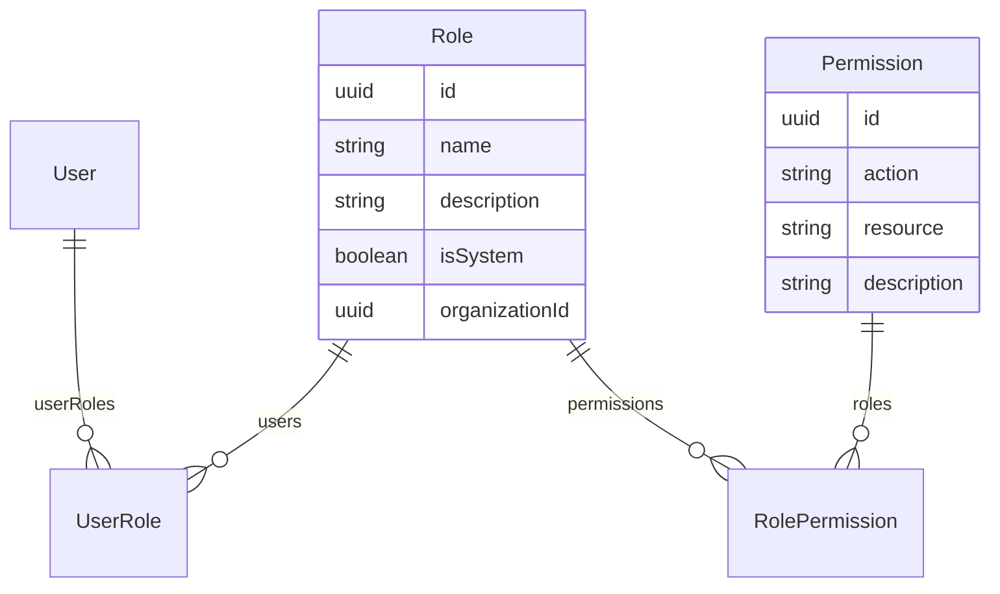

# Module Rôles & Permissions

Le module Roles implémente un système RBAC (Role-Based Access Control) granulaire à deux niveaux : des rôles système globaux et des rôles personnalisés par organisation.

## Structure

```
src/roles/
├── roles.module.ts
├── roles.service.ts
├── roles.controller.ts
└── dto/
    ├── create-role.dto.ts
    └── update-role.dto.ts
```

---

## Modèle de données RBAC



---

## Rôles système (seeded)

Créés par `prisma/seed.ts`. Ces rôles ont `isSystem: true` et `organizationId: null` (scope global).

| Rôle | `name` | Description |
|------|--------|-------------|
| Super Admin | `superadmin` | Équipe Nafaka Tech — accès total cross-tenant |
| Propriétaire | `owner` | Propriétaire de l'organisation |
| DAF/CFO | `daf` | Direction financière et administrative |
| Contrôleur | `controller` | Contrôle de gestion |
| Analyste | `analyst` | Lecture seule |

---

## Matrice des permissions système

Permissions seedées avec leur mapping rôle → permission :

| Permission | `superadmin` | `owner` | `daf` | `controller` | `analyst` |
|-----------|:-:|:-:|:-:|:-:|:-:|
| `manage:all` | ✅ | — | — | — | — |
| `manage:users` | ✅ | ✅ | — | — | — |
| `read:users` | ✅ | ✅ | ✅ | ✅ | — |
| `manage:agents` | ✅ | ✅ | — | — | — |
| `read:agents` | ✅ | ✅ | ✅ | ✅ | — |
| `read:logs` | ✅ | ✅ | ✅ | ✅ | — |
| `manage:dashboards` | ✅ | ✅ | ✅ | — | — |
| `read:dashboards` | ✅ | ✅ | ✅ | ✅ | ✅ |

---

## RolesService — Référence

### `findAll(orgId)`

Retourne les rôles système + les rôles personnalisés de l'organisation :

```typescript
await prisma.role.findMany({
  where: {
    OR: [
      { isSystem: true },
      { organizationId: orgId },
    ],
  },
  include: {
    permissions: { include: { permission: true } },
    _count: { select: { users: true } },
  },
});
```

### `findById(id)`

Retourne un rôle avec ses permissions et le nombre d'utilisateurs assignés.

### `findAllPermissions()`

Retourne toutes les permissions disponibles du système :

```typescript
await prisma.permission.findMany({
  orderBy: [{ resource: 'asc' }, { action: 'asc' }],
});
```

### `create(orgId, dto)`

Crée un rôle personnalisé pour l'organisation. Ne peut pas créer de rôle système.

```typescript
await prisma.role.create({
  data: {
    name: dto.name,
    description: dto.description,
    isSystem: false,
    organizationId: orgId,
    permissions: {
      create: dto.permissionIds.map(pid => ({
        permission: { connect: { id: pid } }
      })),
    },
  },
});
```

### `update(id, orgId, dto)`

Met à jour un rôle non-système appartenant à l'organisation. Remplace toutes les permissions (delete all + recreate).

### `delete(id, orgId)`

Supprime un rôle non-système. Lève une exception si le rôle est `isSystem: true`.

---

## Controller — Endpoints

| Méthode | Route | Auth | Description |
|---------|-------|------|-------------|
| `GET` | `/roles` | Authentifié | Lister les rôles |
| `GET` | `/roles/permissions` | Authentifié | Lister les permissions |
| `POST` | `/roles` | `manage:users` | Créer un rôle custom |
| `GET` | `/roles/:id` | Authentifié | Détails d'un rôle |
| `PATCH` | `/roles/:id` | `manage:users` | Modifier un rôle |
| `DELETE` | `/roles/:id` | `manage:users` | Supprimer un rôle |

---

## DTOs

```typescript
class CreateRoleDto {
  @IsString()
  @MinLength(2)
  name: string;

  @IsOptional()
  @IsString()
  description?: string;

  @IsArray()
  @IsUUID(4, { each: true })
  permissionIds: string[];
}

class UpdateRoleDto extends PartialType(CreateRoleDto) {}
```

---

## Exemples d'usage

### Créer un rôle finance

```bash
curl -X POST http://localhost:3000/api/roles \
  -H "Authorization: Bearer <token>" \
  -H "Content-Type: application/json" \
  -d '{
    "name": "finance-readonly",
    "description": "Lecture des KPIs financiers uniquement",
    "permissionIds": ["<uuid-read-dashboards>", "<uuid-read-logs>"]
  }'
```

### Assigner un rôle à un utilisateur

Via le module Admin (SuperAdmin) :

```bash
curl -X POST http://localhost:3000/api/admin/users \
  -d '{ "email": "...", "roleIds": ["<uuid-role>"] }'
```

---

## Seed RBAC

Le fichier `prisma/seed.ts` initialise toute la structure RBAC au démarrage :

```typescript
// Création des permissions
const permissions = await Promise.all([
  prisma.permission.upsert({ where: { action_resource: { action: 'manage', resource: 'all' } }, ... }),
  prisma.permission.upsert({ where: { action_resource: { action: 'manage', resource: 'users' } }, ... }),
  prisma.permission.upsert({ where: { action_resource: { action: 'read', resource: 'users' } }, ... }),
  // ... etc
]);

// Création des rôles système
const superadminRole = await prisma.role.upsert({
  where: { name: 'superadmin' },
  create: { name: 'superadmin', isSystem: true, description: 'SuperAdmin' },
  update: {},
});

// Association rôle → permissions
await prisma.rolePermission.createMany({
  data: [{ roleId: superadminRole.id, permissionId: manageAllPermission.id }],
  skipDuplicates: true,
});
```
