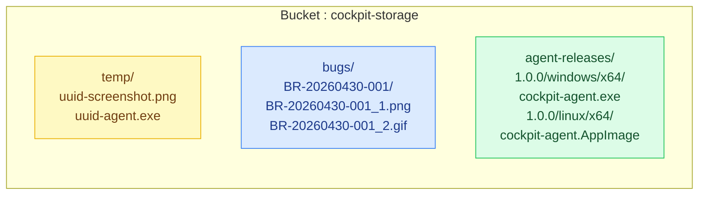
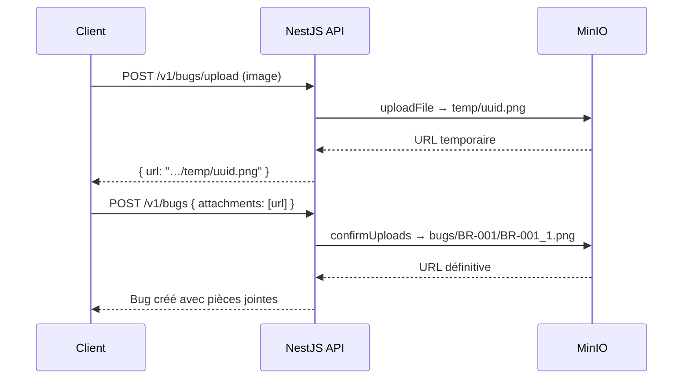

# Stockage fichiers — StorageModule

Le `StorageModule` fournit un service centralisé de gestion des fichiers via **MinIO self-hosted** (S3-compatible).
Il supporte un fallback sur le système de fichiers local (`fs-extra`) si MinIO n'est pas configuré.

!!! info "Prérequis infrastructure"
    Ce module nécessite un serveur MinIO opérationnel avec le bucket `cockpit-storage` créé.
    Voir le [Guide d'installation MinIO](../../developer/storage-minio.md) pour la mise en place complète.

---

## Structure des fichiers

```
src/storage/
├── storage.module.ts   ← Module NestJS (ConfigModule importé, StorageService exporté)
├── storage.service.ts  ← S3Client MinIO + fs-extra fallback
└── README.md
```

---

## Configuration

### Variables d'environnement requises

| Variable | Exemple | Description |
|---|---|---|
| `R2_ENDPOINT` | `http://localhost:9000` | URL du serveur MinIO |
| `R2_ACCESS_KEY_ID` | `cockpit_app` | Utilisateur applicatif MinIO |
| `R2_SECRET_ACCESS_KEY` | `xxxxx` | Mot de passe applicatif |
| `R2_BUCKET_NAME` | `cockpit-storage` | Bucket unique de l'application |
| `R2_PUBLIC_URL` | `http://localhost:9000/cockpit-storage` | URL de base pour les liens retournés |
| `UPLOAD_DIR` | `uploads` | Dossier local (fallback si MinIO indisponible) |
| `APP_URL` | `http://localhost:3000` | Base URL locale pour les liens fallback |

!!! note "Nommage R2_*"
    Les variables sont nommées `R2_*` par compatibilité historique avec Cloudflare R2.
    Elles pointent ici vers MinIO — l'API S3 est identique, seul `forcePathStyle: true` diffère.

### Stratégie primaire / repli

| Priorité | Backend | Condition |
|---|---|---|
| **1 — Primaire** | MinIO (S3) | `R2_ACCESS_KEY_ID`, `R2_SECRET_ACCESS_KEY` et `R2_ENDPOINT` renseignés |
| **2 — Repli** | Système de fichiers local | Variables `R2_*` absentes ou MinIO inaccessible |

---

## Structure de stockage dans MinIO

L'application utilise **un seul bucket** avec des sous-dossiers par usage :



| Sous-dossier | Module | Contenu | Durée |
|---|---|---|---|
| `temp/` | BugsModule | Images uploadées avant confirmation | Court (nettoyage manuel) |
| `bugs/{bugId}/` | BugsModule | Pièces jointes confirmées, renommées `{bugId}_N.ext` | Permanent |
| `agent-releases/{v}/{platform}/{arch}/` | AgentReleasesModule | Exécutables agent on-premise | Permanent |

---

## API du StorageService

### `uploadFile(file, folder?, customKey?)`

Upload un fichier Multer vers MinIO (ou en local si MinIO indisponible).
Retourne l'URL publique du fichier créé.

```typescript
// Upload temporaire (BugsController)
const url = await storageService.uploadFile(file);
// → "http://localhost:9000/cockpit-storage/temp/uuid-screenshot.png"  (MinIO)
// → "http://localhost:3000/uploads/temp/uuid-screenshot.png"          (fallback)

// Upload avec dossier cible explicite (AgentReleasesService)
const url = await storageService.uploadFile(file, 'agent-releases', 'agent-releases/1.0.0/windows/x64/cockpit-agent.exe');
// → "http://localhost:9000/cockpit-storage/agent-releases/1.0.0/windows/x64/cockpit-agent.exe"
```

| Paramètre | Type | Défaut | Description |
|---|---|---|---|
| `file` | `Express.Multer.File` | — | Fichier reçu par Multer |
| `folder` | `string` | `'temp'` | Sous-dossier cible dans le bucket |
| `customKey` | `string` | UUID généré | Clé complète (remplace le nom auto) |

**Retourne :** `Promise<string>` — URL publique du fichier.

---

### `confirmUploads(urls, bugId)`

Déplace les fichiers du dossier `temp/` vers `bugs/{bugId}/` et les renomme séquentiellement.
Appelé automatiquement par `BugsService.create()` après création du ticket.

```typescript
const finalUrls = await storageService.confirmUploads(
  ['http://.../temp/uuid-screenshot.png'],
  'BR-20260430-001',
);
// Résultat : ['http://.../bugs/BR-20260430-001/BR-20260430-001_1.png']
```

**Workflow :**



---

### `deleteFile(fileUrl)`

Supprime un fichier depuis son URL publique (MinIO ou local).
Utilisé par `AgentReleasesService.deleteRelease()`.

```typescript
await storageService.deleteFile('http://localhost:9000/cockpit-storage/agent-releases/1.0.0/windows/x64/cockpit-agent.exe');
```

---

## Modules consommateurs

### BugsModule (`src/bugs/`)

| Endpoint | Méthode | Action stockage |
|---|---|---|
| `POST /v1/bugs/upload` | `uploadFile(file)` | Upload image → `temp/` (max 10 MB, images uniquement) |
| `POST /v1/bugs` | `confirmUploads(urls, bugId)` | Déplace `temp/` → `bugs/{bugId}/`, renomme |

### AgentReleasesModule (`src/admin/agent-releases/`)

| Endpoint | Méthode | Action stockage |
|---|---|---|
| `POST /admin/agent-releases` | `uploadFile(file, 'agent-releases', key)` | Upload exécutable → `agent-releases/{v}/{p}/{a}/` |
| `DELETE /admin/agent-releases/:id` | `deleteFile(url)` | Supprime le fichier du bucket |

---

## Importer StorageModule

```typescript
import { StorageModule } from '../storage/storage.module';

@Module({
  imports: [StorageModule, PrismaModule],
  controllers: [BugsController],
  providers: [BugsService],
})
export class BugsModule {}
```

!!! note "Pas de module global"
    `StorageModule` n'est pas déclaré `@Global()`. Il doit être explicitement importé
    dans chaque module consommateur (`BugsModule`, `AgentReleasesModule`).

---

## Migration locale → MinIO

Si des fichiers ont été uploadés **avant** l'installation de MinIO (stockage local `fs-extra`), les URLs en base de données pointent encore vers le serveur NestJS (`http://localhost:3000/uploads/…`). Il faut les mettre à jour pour pointer vers MinIO.

### Étape 1 — Synchroniser les fichiers physiques

```powershell
# Copier tous les fichiers locaux vers le bucket MinIO
& "C:\tools\minio\mc.exe" mirror "C:\Cockpit\api\uploads\" cockpit/cockpit-storage/
```

### Étape 2 — Mettre à jour les URLs en base de données

**Via l'Admin Cockpit (recommandé) :**

1. Ouvrir **Admin Cockpit → Paramètres → Stockage**
2. Vérifier le nombre de fichiers locaux restants
3. Cliquer **Migrer maintenant**

**Via l'API :**

```bash
# Vérifier l'état avant migration
curl -H "Authorization: Bearer <token>" \
  http://localhost:3000/admin/storage/migration-status

# Lancer la migration
curl -X POST -H "Authorization: Bearer <token>" \
  http://localhost:3000/admin/storage/migrate-local-to-minio
```

### Résultat

| Modèle | Champ mis à jour | Format avant | Format après |
|--------|-----------------|-------------|-------------|
| `Bug` | `attachments[]` | `http://localhost:3000/uploads/bugs/…` | `http://…:9000/cockpit-storage/bugs/…` |
| `AgentRelease` | `fileUrl` | `http://localhost:3000/uploads/agent-releases/…` | `http://…:9000/cockpit-storage/agent-releases/…` |

!!! success "Idempotent"
    La migration peut être lancée plusieurs fois sans risque. Seules les URLs commençant par `APP_URL/UPLOAD_DIR/` sont modifiées.
