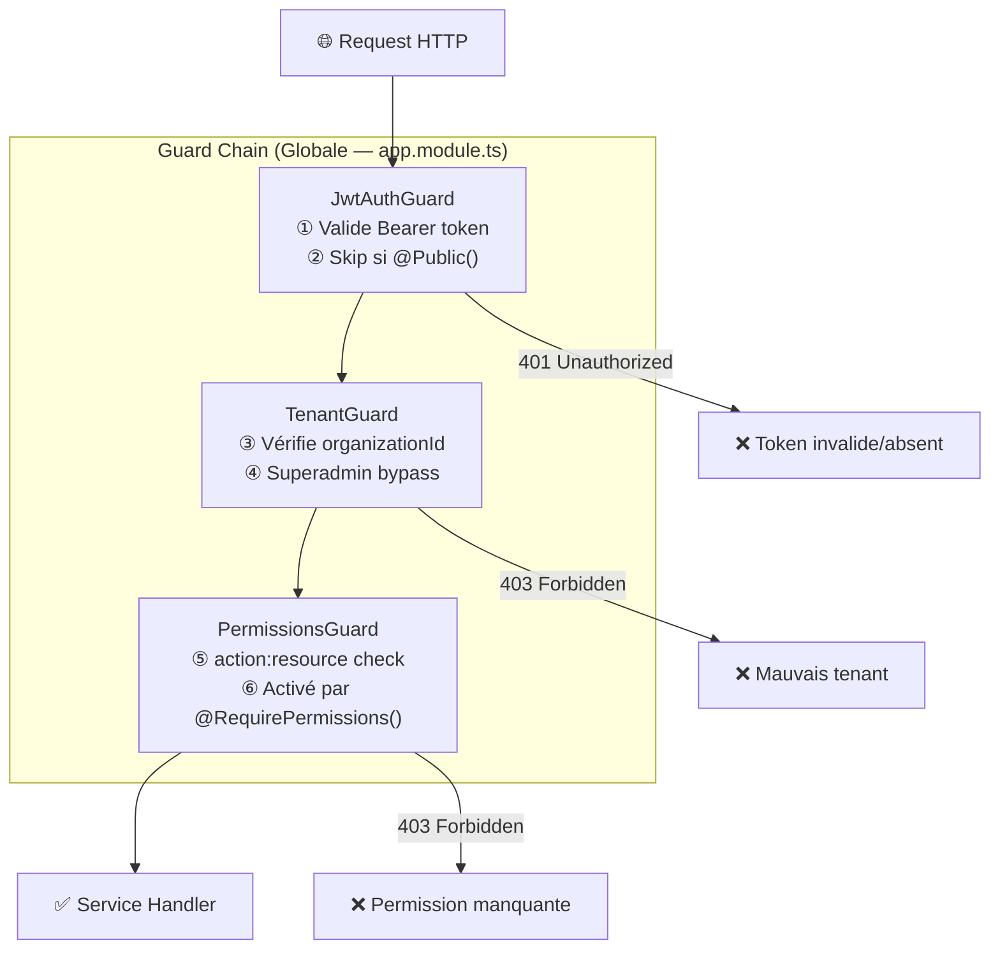
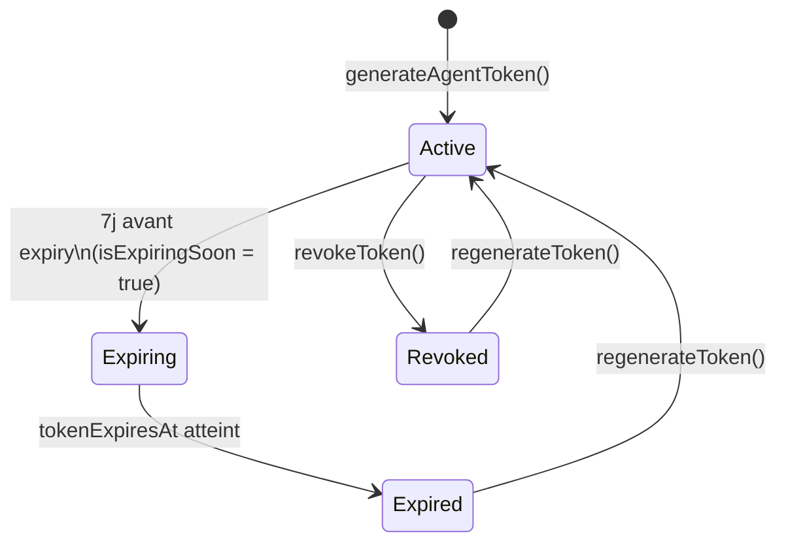

# Sécurité

## Vue d'ensemble du modèle de sécurité



---

## 1. Authentification JWT

### Tokens et durées de vie

| Token | TTL | Algorithme | Stockage |
|-------|-----|-----------|----------|
| **Access Token** | 15 minutes | HS256 | `localStorage` |
| **Refresh Token** | 7 jours | HS256 | `localStorage` + DB (bcrypt hash) |
| **Agent Token** | 30 jours | Généré aléatoirement | DB (`isag_xxxx` format) |
| **Invitation Token** | 7 jours | Généré aléatoirement | DB |
| **Reset Password Token** | 7 jours | Généré aléatoirement | DB |

### Format du payload JWT (Access Token)

```typescript
interface JwtPayload {
  sub: string;          // userId
  email: string;        // masqué après usage
  organizationId: string; // isolation tenant
  roles: string[];      // noms des rôles
  permissions: string[]; // ex: ["read:users", "manage:agents"]
  iat: number;          // issued at
  exp: number;          // expiration
}
```

### Stratégie JWT

```typescript
// src/auth/strategies/jwt.strategy.ts
@Injectable()
export class JwtStrategy extends PassportStrategy(Strategy) {
  constructor(config: ConfigService, prisma: PrismaService) {
    super({
      jwtFromRequest: ExtractJwt.fromAuthHeaderAsBearerToken(),
      ignoreExpiration: false,
      secretOrKey: config.get('JWT_SECRET'),
    });
  }

  async validate(payload: JwtPayload) {
    // Charge l'utilisateur avec ses rôles et permissions depuis la DB
    const user = await this.prisma.user.findUnique({
      where: { id: payload.sub },
      include: { userRoles: { include: { role: { include: { permissions: true } } } } }
    });
    return user; // Attaché à request.user
  }
}
```

### Rotation des refresh tokens

À chaque appel à `POST /auth/refresh` :
1. Le refresh token est extrait du `Authorization: Bearer` header
2. Le hash DB est comparé via `bcrypt.compare()`
3. Un **nouveau** access token ET refresh token sont générés
4. L'ancien refresh token est invalidé (rotation 1:1)

---

## 2. Guard chain détaillée

### JwtAuthGuard

```typescript
// Déclenché automatiquement sur toutes les routes (APP_GUARD)
export class JwtAuthGuard extends AuthGuard('jwt') {
  canActivate(context: ExecutionContext) {
    // Vérifie si la route est @Public()
    const isPublic = this.reflector.getAllAndOverride<boolean>(IS_PUBLIC_KEY, [
      context.getHandler(),
      context.getClass(),
    ]);
    if (isPublic) return true; // Bypass complet

    return super.canActivate(context); // Validation JWT
  }
}
```

**Routes publiques** (décorées `@Public()`) :
- `POST /auth/login`
- `POST /auth/register`
- `POST /auth/forgot-password`
- `POST /auth/reset-password`
- `POST /auth/refresh`
- `POST /agents/register`
- `POST /agents/heartbeat`
- `GET /health`
- `GET /subscriptions/plans`

### TenantGuard

```typescript
export class TenantGuard implements CanActivate {
  canActivate(context: ExecutionContext): boolean {
    const request = context.switchToHttp().getRequest();
    const user = request.user;

    // SuperAdmin (manage:all) peut accéder à tous les tenants
    const isSuperAdmin = user.permissions?.includes('manage:all');
    if (isSuperAdmin) return true;

    // Extraire l'organizationId de la requête
    const orgId = request.params?.organizationId
      || request.body?.organizationId
      || request.query?.organizationId;

    // Si l'org est spécifiée, elle doit correspondre à celle du JWT
    if (orgId && orgId !== user.organizationId) {
      throw new ForbiddenException('Cross-tenant access denied');
    }

    return true;
  }
}
```

### PermissionsGuard

Activé uniquement sur les routes annotées avec `@RequirePermissions()` :

```typescript
// Exemple d'utilisation dans un controller
@Get('audit')
@RequirePermissions({ action: 'read', resource: 'logs' })
@UseGuards(PermissionsGuard)
async getAuditLogs() { ... }
```

---

## 3. RBAC — Contrôle d'accès basé sur les rôles

### Rôles système

| Rôle | Description | Portée |
|------|-------------|--------|
| `superadmin` | Équipe Nafaka Tech | Cross-tenant, toutes permissions |
| `owner` | Propriétaire de l'organisation | Son organisation |
| `daf` | Directeur Administratif et Financier | Son organisation |
| `controller` | Contrôleur financier | Son organisation |
| `analyst` | Analyste en lecture seule | Son organisation |

### Matrice des permissions système

| Resource | Action | `superadmin` | `owner` | `daf` | `controller` | `analyst` |
|----------|--------|:-:|:-:|:-:|:-:|:-:|
| `all` | `manage` | ✅ | — | — | — | — |
| `users` | `manage` | ✅ | ✅ | — | — | — |
| `users` | `read` | ✅ | ✅ | ✅ | ✅ | — |
| `agents` | `manage` | ✅ | ✅ | — | — | — |
| `agents` | `read` | ✅ | ✅ | ✅ | ✅ | — |
| `logs` | `read` | ✅ | ✅ | ✅ | ✅ | — |
| `dashboards` | `manage` | ✅ | ✅ | ✅ | — | — |
| `dashboards` | `read` | ✅ | ✅ | ✅ | ✅ | ✅ |

### Rôles personnalisés

Les organisations peuvent créer leurs propres rôles avec des permissions sur mesure :

```typescript
POST /roles
{
  "name": "finance-viewer",
  "description": "Lecture seule sur les KPIs financiers",
  "permissionIds": ["<uuid-read-dashboards>", "<uuid-read-logs>"]
}
```

---

## 4. Masquage PII (Données Personnelles)

### Principe

L'`AuditLogService` (global, injecté partout) applique un masquage automatique avant d'écrire en base :

```typescript
// src/logs/audit-log.service.ts
private sanitizePayload(payload: Record<string, unknown>): Record<string, unknown> {
  const sanitized = { ...payload };

  for (const key of Object.keys(sanitized)) {
    const value = sanitized[key];
    const lowerKey = key.toLowerCase();

    // Redaction des mots de passe
    if (lowerKey.includes('password') || lowerKey.includes('secret')) {
      sanitized[key] = '[REDACTED]';
    }

    // Masquage des emails (jean.dupont@acme.com → j***@acme.com)
    else if (lowerKey.includes('email') && typeof value === 'string') {
      const [local, domain] = value.split('@');
      sanitized[key] = `${local.charAt(0)}***@${domain}`;
    }

    // Récursion sur les objets imbriqués
    else if (value && typeof value === 'object' && !Array.isArray(value)) {
      sanitized[key] = this.sanitizePayload(value as Record<string, unknown>);
    }
  }

  return sanitized;
}
```

### Champs toujours exclus des réponses API

La constante `SAFE_USER_SELECT` dans `users.service.ts` exclut systématiquement :

```typescript
const SAFE_USER_SELECT = {
  id: true,
  email: true,
  firstName: true,
  lastName: true,
  isActive: true,
  emailVerified: true,
  organizationId: true,
  createdAt: true,
  updatedAt: true,
  // EXCLUT : passwordHash, hashedRefreshToken,
  //           resetPasswordToken, resetPasswordExpires
};
```

---

## 5. Isolation multi-tenant

### Au niveau Guard

Le `TenantGuard` bloque toute tentative cross-tenant avant même d'atteindre le service.

### Au niveau Service

Toutes les queries Prisma incluent l'`organizationId` :

```typescript
// Exemple dans agents.service.ts
async getAgentStatusByOrg(orgId: string) {
  return this.prisma.agent.findMany({
    where: { organizationId: orgId }, // Isolation stricte
    orderBy: { lastSeen: 'desc' },
  });
}
```

### Au niveau DB (Cascade)

```prisma
model User {
  organization Organization @relation(
    fields: [organizationId],
    references: [id],
    onDelete: Cascade  // Suppression en cascade
  )
}
```

---

## 6. Sécurité des tokens Agent

### Format et génération

```typescript
// Token format: isag_<random_bytes_hex>
const token = `isag_${crypto.randomBytes(32).toString('hex')}`;
```

### Cycle de vie



### Révocation

```typescript
// Révocation immédiate
await this.prisma.agent.update({
  where: { id: agentId, organizationId: orgId },
  data: {
    isRevoked: true,
    revokedAt: new Date(),
  },
});
```

L'agent révoqué ne peut plus passer le guard de validation de token sur `POST /agents/heartbeat`.

---

## 7. Chiffrement des mots de passe

```typescript
// bcrypt avec saltRounds = 10
const passwordHash = await bcrypt.hash(password, 10);

// Vérification
const isValid = await bcrypt.compare(inputPassword, user.passwordHash);
```

---

## 8. Headers de sécurité recommandés (Production)

Configurer via Nginx ou un middleware Helmet :

```nginx
add_header X-Content-Type-Options "nosniff";
add_header X-Frame-Options "DENY";
add_header X-XSS-Protection "1; mode=block";
add_header Strict-Transport-Security "max-age=31536000; includeSubDomains";
add_header Content-Security-Policy "default-src 'self'";
```

```typescript
// Dans main.ts (NestJS)
import helmet from 'helmet';
app.use(helmet());
app.enableCors({
  origin: process.env.FRONTEND_URL,
  credentials: true,
});
```
