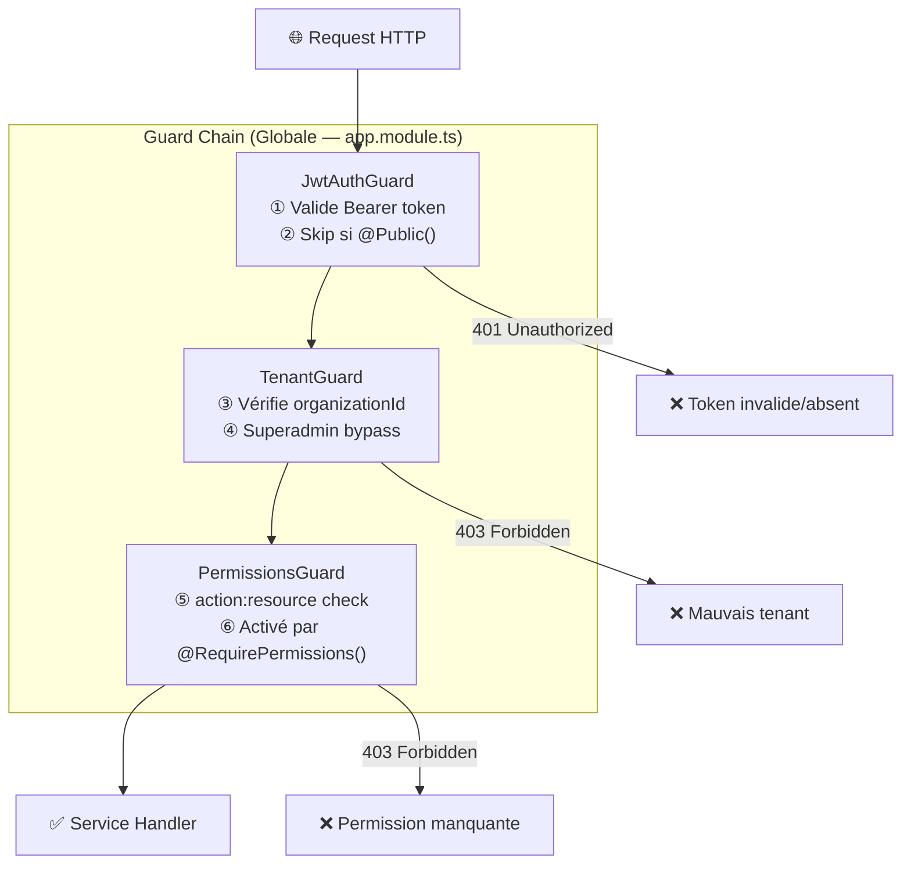
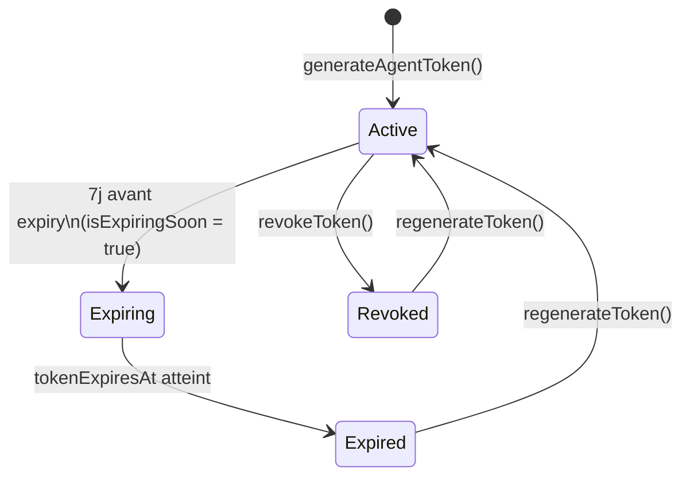

# Sécurité

## Vue d'ensemble du modèle de sécurité



---

## 1. Authentification JWT

### Tokens et durées de vie

| Token | TTL | Algorithme | Stockage |
|-------|-----|-----------|----------|
| **Access Token** | 15 minutes | HS256 | `localStorage` |
| **Refresh Token** | 7 jours | HS256 | `localStorage` + DB (bcrypt hash) |
| **Agent Token** | 30 jours | Généré aléatoirement | DB (`isag_xxxx` format) |
| **Invitation Token** | 7 jours | Généré aléatoirement | DB |
| **Reset Password Token** | 7 jours | Généré aléatoirement | DB |

### Format du payload JWT (Access Token)

```typescript
interface JwtPayload {
  sub: string;          // userId
  email: string;        // masqué après usage
  organizationId: string; // isolation tenant
  roles: string[];      // noms des rôles
  permissions: string[]; // ex: ["read:users", "manage:agents"]
  iat: number;          // issued at
  exp: number;          // expiration
}
```

### Stratégie JWT

```typescript
// src/auth/strategies/jwt.strategy.ts
@Injectable()
export class JwtStrategy extends PassportStrategy(Strategy) {
  constructor(config: ConfigService, prisma: PrismaService) {
    super({
      jwtFromRequest: ExtractJwt.fromAuthHeaderAsBearerToken(),
      ignoreExpiration: false,
      secretOrKey: config.get('JWT_SECRET'),
    });
  }

  async validate(payload: JwtPayload) {
    // Charge l'utilisateur avec ses rôles et permissions depuis la DB
    const user = await this.prisma.user.findUnique({
      where: { id: payload.sub },
      include: { userRoles: { include: { role: { include: { permissions: true } } } } }
    });
    return user; // Attaché à request.user
  }
}
```

### Rotation des refresh tokens

À chaque appel à `POST /auth/refresh` :
1. Le refresh token est extrait du `Authorization: Bearer` header
2. Le hash DB est comparé via `bcrypt.compare()`
3. Un **nouveau** access token ET refresh token sont générés
4. L'ancien refresh token est invalidé (rotation 1:1)

---

## 2. Guard chain détaillée

### JwtAuthGuard

```typescript
// Déclenché automatiquement sur toutes les routes (APP_GUARD)
export class JwtAuthGuard extends AuthGuard('jwt') {
  canActivate(context: ExecutionContext) {
    // Vérifie si la route est @Public()
    const isPublic = this.reflector.getAllAndOverride<boolean>(IS_PUBLIC_KEY, [
      context.getHandler(),
      context.getClass(),
    ]);
    if (isPublic) return true; // Bypass complet

    return super.canActivate(context); // Validation JWT
  }
}
```

**Routes publiques** (décorées `@Public()`) :
- `POST /auth/login`
- `POST /auth/register`
- `POST /auth/forgot-password`
- `POST /auth/reset-password`
- `POST /auth/refresh`
- `POST /agents/register`
- `POST /agents/heartbeat`
- `GET /health`
- `GET /subscriptions/plans`

### TenantGuard

```typescript
export class TenantGuard implements CanActivate {
  canActivate(context: ExecutionContext): boolean {
    const request = context.switchToHttp().getRequest();
    const user = request.user;

    // SuperAdmin (manage:all) peut accéder à tous les tenants
    const isSuperAdmin = user.permissions?.includes('manage:all');
    if (isSuperAdmin) return true;

    // Extraire l'organizationId de la requête
    const orgId = request.params?.organizationId
      || request.body?.organizationId
      || request.query?.organizationId;

    // Si l'org est spécifiée, elle doit correspondre à celle du JWT
    if (orgId && orgId !== user.organizationId) {
      throw new ForbiddenException('Cross-tenant access denied');
    }

    return true;
  }
}
```

### PermissionsGuard

Activé uniquement sur les routes annotées avec `@RequirePermissions()` :

```typescript
// Exemple d'utilisation dans un controller
@Get('audit')
@RequirePermissions({ action: 'read', resource: 'logs' })
@UseGuards(PermissionsGuard)
async getAuditLogs() { ... }
```

---

## 3. RBAC — Contrôle d'accès basé sur les rôles

### Rôles système

| Rôle | Description | Portée |
|------|-------------|--------|
| `superadmin` | Équipe Nafaka Tech | Cross-tenant, toutes permissions |
| `owner` | Propriétaire de l'organisation | Son organisation |
| `daf` | Directeur Administratif et Financier | Son organisation |
| `controller` | Contrôleur financier | Son organisation |
| `analyst` | Analyste en lecture seule | Son organisation |

### Matrice des permissions système

| Resource | Action | `superadmin` | `owner` | `daf` | `controller` | `analyst` |
|----------|--------|:-:|:-:|:-:|:-:|:-:|
| `all` | `manage` | ✅ | — | — | — | — |
| `users` | `manage` | ✅ | ✅ | — | — | — |
| `users` | `read` | ✅ | ✅ | ✅ | ✅ | — |
| `agents` | `manage` | ✅ | ✅ | — | — | — |
| `agents` | `read` | ✅ | ✅ | ✅ | ✅ | — |
| `logs` | `read` | ✅ | ✅ | ✅ | ✅ | — |
| `dashboards` | `manage` | ✅ | ✅ | ✅ | — | — |
| `dashboards` | `read` | ✅ | ✅ | ✅ | ✅ | ✅ |

### Rôles personnalisés

Les organisations peuvent créer leurs propres rôles avec des permissions sur mesure :

```typescript
POST /roles
{
  "name": "finance-viewer",
  "description": "Lecture seule sur les KPIs financiers",
  "permissionIds": ["<uuid-read-dashboards>", "<uuid-read-logs>"]
}
```

---

## 4. Masquage PII (Données Personnelles)

### Principe

L'`AuditLogService` (global, injecté partout) applique un masquage automatique avant d'écrire en base :

```typescript
// src/logs/audit-log.service.ts
private sanitizePayload(payload: Record<string, unknown>): Record<string, unknown> {
  const sanitized = { ...payload };

  for (const key of Object.keys(sanitized)) {
    const value = sanitized[key];
    const lowerKey = key.toLowerCase();

    // Redaction des mots de passe
    if (lowerKey.includes('password') || lowerKey.includes('secret')) {
      sanitized[key] = '[REDACTED]';
    }

    // Masquage des emails (jean.dupont@acme.com → j***@acme.com)
    else if (lowerKey.includes('email') && typeof value === 'string') {
      const [local, domain] = value.split('@');
      sanitized[key] = `${local.charAt(0)}***@${domain}`;
    }

    // Récursion sur les objets imbriqués
    else if (value && typeof value === 'object' && !Array.isArray(value)) {
      sanitized[key] = this.sanitizePayload(value as Record<string, unknown>);
    }
  }

  return sanitized;
}
```

### Champs toujours exclus des réponses API

La constante `SAFE_USER_SELECT` dans `users.service.ts` exclut systématiquement :

```typescript
const SAFE_USER_SELECT = {
  id: true,
  email: true,
  firstName: true,
  lastName: true,
  isActive: true,
  emailVerified: true,
  organizationId: true,
  createdAt: true,
  updatedAt: true,
  // EXCLUT : passwordHash, hashedRefreshToken,
  //           resetPasswordToken, resetPasswordExpires
};
```

---

## 5. Isolation multi-tenant

### Au niveau Guard

Le `TenantGuard` bloque toute tentative cross-tenant avant même d'atteindre le service.

### Au niveau Service

Toutes les queries Prisma incluent l'`organizationId` :

```typescript
// Exemple dans agents.service.ts
async getAgentStatusByOrg(orgId: string) {
  return this.prisma.agent.findMany({
    where: { organizationId: orgId }, // Isolation stricte
    orderBy: { lastSeen: 'desc' },
  });
}
```

### Au niveau DB (Cascade)

```prisma
model User {
  organization Organization @relation(
    fields: [organizationId],
    references: [id],
    onDelete: Cascade  // Suppression en cascade
  )
}
```

---

## 6. Sécurité des tokens Agent

### Format et génération

```typescript
// Token format: isag_<random_bytes_hex>
const token = `isag_${crypto.randomBytes(32).toString('hex')}`;
```

### Cycle de vie



### Révocation

```typescript
// Révocation immédiate
await this.prisma.agent.update({
  where: { id: agentId, organizationId: orgId },
  data: {
    isRevoked: true,
    revokedAt: new Date(),
  },
});
```

L'agent révoqué ne peut plus passer le guard de validation de token sur `POST /agents/heartbeat`.

---

## 7. Chiffrement des mots de passe

```typescript
// bcrypt avec saltRounds = 12 (recommandation OWASP pour nouvelles applications)
const passwordHash = await bcrypt.hash(password, 12);

// Vérification
const isValid = await bcrypt.compare(inputPassword, user.passwordHash);
```

!!! info "Facteur 12 vs 10"
    Le facteur 12 (vs 10 historique) représente ~4× plus de calcul par tentative, rendant le brute-force significativement plus coûteux. Appliqué sur les mots de passe utilisateurs ET le hachage des refresh tokens.

---

## 8. Hachage des tokens sensibles (SHA-256)

Les tokens d'invitation et de réinitialisation de mot de passe sont stockés en DB sous forme de hash SHA-256, jamais en clair :

```typescript
// Génération + stockage
const rawToken = crypto.randomBytes(32).toString('hex');
const tokenHash = crypto.createHash('sha256').update(rawToken).digest('hex');

// Stockage en DB : tokenHash (jamais rawToken)
// Envoi par email : rawToken

// Vérification à la réception
const incomingHash = crypto.createHash('sha256').update(dto.token).digest('hex');
const record = await prisma.invitation.findUnique({
  where: { token: incomingHash }
});
```

Résultat : même si la DB est compromise, les tokens en clair restent inconnus.

---

## 9. Headers de sécurité (Helmet)

Helmet est configuré dans `main.ts` avec une **Content Security Policy** stricte :

```typescript
app.use(
  helmet({
    contentSecurityPolicy: {
      directives: {
        defaultSrc: ["'self'"],
        styleSrc: ["'self'", "'unsafe-inline'"],
        scriptSrc: ["'self'", "'unsafe-inline'"], // Requis pour Swagger UI
        imgSrc: ["'self'", 'data:'],
      },
    },
  }),
);
```

Helmet ajoute automatiquement : `X-Content-Type-Options`, `X-Frame-Options`, `X-XSS-Protection`, `Strict-Transport-Security` (en production HTTPS).

---

## 10. CORS

```typescript
const allowedOrigins = [
  configService.get<string>('FRONTEND_URL') || 'http://localhost:3001',
  'http://localhost:5173', // Admin Frontend dev
  'http://localhost:3000', // Backend local
];

app.enableCors({
  origin: (origin, callback) => {
    if (!origin || allowedOrigins.includes(origin)) {
      callback(null, true);
    } else {
      callback(new Error('Not allowed by CORS'));
    }
  },
  credentials: true,
});
```

!!! warning "Pas d'origine `null`"
    L'origine `null` (ex: fichiers HTML locaux) n'est jamais autorisée, même en développement, pour éviter les attaques CSRF via `file://`.

---

## 11. Protection Swagger UI

La documentation Swagger (`/docs`) est protégée par JWT. Toute tentative d'accès sans token valide affiche une page de connexion HTML :

```typescript
expressApp.use(['/docs', '/docs-json', '/docs-yaml'], (req, res, next) => {
  const token = extractBearerToken(req) || req.cookies['swagger_token'];
  if (token && jwtSecret) {
    try {
      jwt.verify(token, jwtSecret);
      return next();
    } catch { /* Token invalide */ }
  }
  res.status(401).type('html').send(SWAGGER_LOGIN_PAGE);
});
```

Le token Swagger est stocké dans un cookie `SameSite=Strict` côté navigateur.

---

## 12. Rate Limiting distribué (Redis)

### Rate limiting global (ThrottlerGuard)

Toutes les requêtes sont limitées via `@nestjs/throttler` (60 req/min par IP par défaut) avec Redis comme store distribué via `RedisModule`.

### Rate limiting SQL par organisation

Les requêtes SQL temps réel envoyées aux agents sont limitées à **10 req/min par organisation** via Redis :

```typescript
// Clé Redis : sql_rl:{organizationId}
const key = `sql_rl:${organizationId}`;
const count = await this.redis.incr(key);
if (count === 1) await this.redis.expire(key, 60); // TTL 60s
if (count > MAX_REQUESTS_PER_MINUTE) {
  throw new BadRequestException(`Limite de requêtes atteinte (10/min). Veuillez patienter.`);
}
```

**Stratégie fail-open** : si Redis est indisponible, un warning est loggé mais la requête n'est pas bloquée, pour éviter une interruption de service.

---

## 13. Monitoring d'erreurs (Sentry)

Sentry est initialisé conditionnellement au démarrage si `SENTRY_DSN` est défini :

```typescript
const sentryDsn = configService.get<string>('SENTRY_DSN');
if (sentryDsn) {
  Sentry.init({
    dsn: sentryDsn,
    environment: configService.get<string>('NODE_ENV') || 'development',
  });
}
```

Laisser `SENTRY_DSN` vide en dev pour désactiver (aucun impact sur le fonctionnement).

---

## 14. Cache Redis des permissions (PermissionsGuard)

### Problème initial

`PermissionsGuard` effectuait une requête DB à chaque requête protégée pour charger `UserRoles → Role → RolePermissions → Permission`. Sur des routes fréquentes (ex: `/dashboards`), cela générait une requête Prisma supplémentaire à chaque appel.

### Solution

Les permissions sont mises en cache Redis sous la clé `perms:{userId}` avec un TTL de **5 minutes** :

```typescript
// permissions.guard.ts
private async getUserPermissions(userId: string): Promise<Set<string> | null> {
  const cacheKey = `perms:${userId}`;

  // 1. Tentative lecture cache
  const cached = await this.redis.get(cacheKey);
  if (cached) return new Set<string>(JSON.parse(cached));

  // 2. Cache miss → DB
  const dbUser = await this.usersService.findByIdSafe(userId);
  const permissions = new Set<string>();
  for (const ur of dbUser.userRoles) {
    for (const rp of ur.role.permissions) {
      permissions.add(`${rp.permission.action}:${rp.permission.resource}`);
    }
  }

  // 3. Mise en cache 5 min
  await this.redis.set(cacheKey, JSON.stringify([...permissions]), { EX: 300 });
  return permissions;
}
```

**Stratégie fail-open** : si Redis est indisponible, le guard continue sans cache (fallback DB silencieux).

!!! warning "Invalidation du cache"
    Si les permissions d'un utilisateur sont modifiées (attribution/retrait de rôle via `PATCH /roles` ou `POST /users/:id/roles`), le cache n'est pas invalidé immédiatement. Les nouvelles permissions s'appliqueront dans un délai maximum de **5 minutes**. Pour une invalidation immédiate, supprimer manuellement la clé Redis `perms:{userId}`.

---

## 15. Gestion globale des erreurs (HttpExceptionFilter)

### Objectif

Empêcher les stack traces et détails d'erreurs internes de fuiter dans les réponses HTTP en production.

### Implémentation

```typescript
// src/common/filters/http-exception.filter.ts
@Catch()
export class HttpExceptionFilter implements ExceptionFilter {
  catch(exception: unknown, host: ArgumentsHost) {
    // HttpException → réponse normalisée avec le message d'origine
    if (exception instanceof HttpException) {
      return res.status(status).json({ statusCode, error, message, path, timestamp });
    }

    // Erreur inattendue (500) :
    //   - Production → message générique (aucun détail interne)
    //   - Développement → message d'erreur complet
    const message = this.isProd
      ? 'Une erreur interne est survenue. Veuillez réessayer.'
      : exception.message;

    this.logger.error(`Unhandled exception on ${method} ${url}`, exception.stack);
  }
}
```

**Format de réponse normalisé** (toutes les erreurs) :

```json
{
  "statusCode": 404,
  "error": "Not Found",
  "message": "Utilisateur introuvable",
  "path": "/api/users/abc",
  "timestamp": "2026-03-24T12:00:00.000Z"
}
```

Enregistré globalement dans `main.ts` via `app.useGlobalFilters(new HttpExceptionFilter())`.

---

## 16. Traçabilité des accès superadmin cross-tenant

### Contexte

Le `TenantGuard` permet aux superadmins (permission `manage:all`) d'accéder à n'importe quel tenant sans restriction. Ces accès n'étaient pas distingués dans l'audit log des accès normaux.

### Solution

Le `TenantGuard` injecte un flag `isSuperAdminAccess` dans la requête lors d'un bypass :

```typescript
// tenant.guard.ts
if (this.isSuperAdmin(user)) {
  request.isSuperAdminAccess = true; // ← Flag pour l'AuditInterceptor
  return true;
}
```

L'`AuditInterceptor` inclut ce flag dans le payload de l'audit log :

```typescript
// audit.interceptor.ts — payload enrichi
payload: {
  source: 'http',
  method,
  path,
  status: 'success',
  ...(isSuperAdminAccess && { superadmin_cross_tenant: true }), // ← tracé
}
```

**Résultat** : les audit logs des superadmins contiennent `superadmin_cross_tenant: true`, permettant de filtrer et auditer tous les accès cross-tenant depuis l'interface admin.
