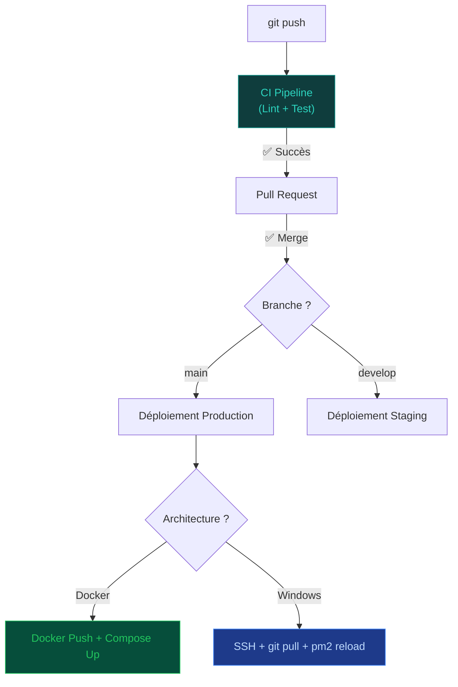

# CI/CD — GitHub Actions

Cette documentation décrit les pipelines automatisés pour Cockpit. Nous supportons deux modes de déploiement : **Docker (Linux/WSL2)** et **Natif (Windows Server)**.

---

## 🚀 Vue d'ensemble des flux



---

## 1. Intégration Continue (CI)

Le pipeline CI est commun aux deux architectures. Il garantit que le code est sain avant tout déploiement.

### `.github/workflows/ci-backend.yml`
Exécute : ESLint, Prettier, Type Check (TSC) et Tests Unitaires (Jest).

### `.github/workflows/ci-frontend.yml`
Exécute : ESLint, Type Check (TSC) et Tests Unitaires (Vitest).

---

## 2. Déploiement Continu (CD) — Mode Windows Natif

Ce pipeline automatise les étapes du guide [Déploiement sans Docker](deployment-sans-docker.md) en se connectant au serveur via SSH.

### `.github/workflows/deploy-windows.yml`

```yaml
name: Deploy — Windows Native (IIS)

on:
  push:
    branches: [main]

jobs:
  deploy:
    name: Deploy to Windows Server
    runs-on: ubuntu-latest
    
    steps:
      - name: Deploy via SSH (PowerShell)
        uses: appleboy/ssh-action@v1
        with:
          host: ${{ secrets.PROD_HOST }}
          username: ${{ secrets.PROD_USER }}
          key: ${{ secrets.PROD_SSH_KEY }}
          script_stop: true
          # On force l'utilisation de PowerShell sur le serveur Windows
          script: |
            powershell.exe -Command "
              Write-Host '--- Début Déploiement Backend ---'
              cd C:\Cockpit\repos\insightsage_backend
              git pull origin main
              npm install --legacy-peer-deps
              npm run build
              # Migration Prisma (si nécessaire)
              `$env:NODE_ENV='production'
              npx prisma db push
              pm2 reload cockpit-api
              
              Write-Host '--- Début Déploiement Frontends ---'
              cd C:\Cockpit\repos\Client-cockpit
              git pull origin main
              npm install
              npm run build
              
              cd C:\Cockpit\repos\admin-cockpit
              git pull origin main
              npm install
              npm run build
              
              Write-Host '✅ Déploiement Windows réussi'
            "
```

---

## 3. Déploiement Continu (CD) — Mode Docker

Ce pipeline est utilisé si votre infrastructure repose sur Docker et Docker Compose.

### `.github/workflows/deploy-docker.yml`

```yaml
name: Deploy — Docker (Linux)

on:
  push:
    branches: [main]

jobs:
  deploy:
    runs-on: ubuntu-latest
    steps:
      - name: SSH Deploy
        uses: appleboy/ssh-action@v1
        with:
          host: ${{ secrets.PROD_HOST }}
          username: ${{ secrets.PROD_USER }}
          key: ${{ secrets.PROD_SSH_KEY }}
          script: |
            cd /opt/cockpit
            docker compose -f docker-compose.prod.yml pull
            docker compose -f docker-compose.prod.yml up -d --no-deps api cockpit
            docker image prune -f
```

---

## 4. Configuration Requise

### Secrets GitHub
Pour que les pipelines fonctionnent, configurez les secrets dans `Settings > Secrets and variables > Actions` :

| Secret | Description |
|---|---|
| `PROD_HOST` | IP publique de votre serveur Windows |
| `PROD_USER` | Nom d'utilisateur (ex: `Administrator`) |
| `PROD_SSH_KEY` | Clé privée SSH (doit correspondre à la clé publique dans `authorized_keys`) |

### Activation de OpenSSH sur Windows Server 2022
Pour que GitHub Actions puisse se connecter à votre serveur Windows :

1.  **Installer le serveur SSH** :
    ```powershell
    Add-WindowsCapability -Online -Name OpenSSH.Server~~~~0.0.1.0
    ```
2.  **Démarrer le service** :
    ```powershell
    Start-Service sshd
    Set-Service -Name sshd -StartupType 'Automatic'
    ```
3.  **Ajouter votre clé publique** :
    -   Créez le dossier `C:\Users\VotreUser\.ssh\`.
    -   Créez un fichier `authorized_keys` et collez-y votre clé publique.
4.  **Ouvrir le port 22** : 
    -   Assurez-vous que le port 22 est ouvert dans le firewall réseau et Windows.

---

## 5. Build de la documentation (MkDocs)

La documentation est déployée automatiquement sur GitHub Pages à chaque push sur `main`.

### `.github/workflows/docs.yml`
Utilise `mkdocs-material` pour générer le site statique et le pousser sur la branche `gh-pages`.

---

## Lancer la doc localement

```bash
pip install mkdocs-material mkdocs-mermaid2-plugin
cd Insightsage_backend
mkdocs serve
```
