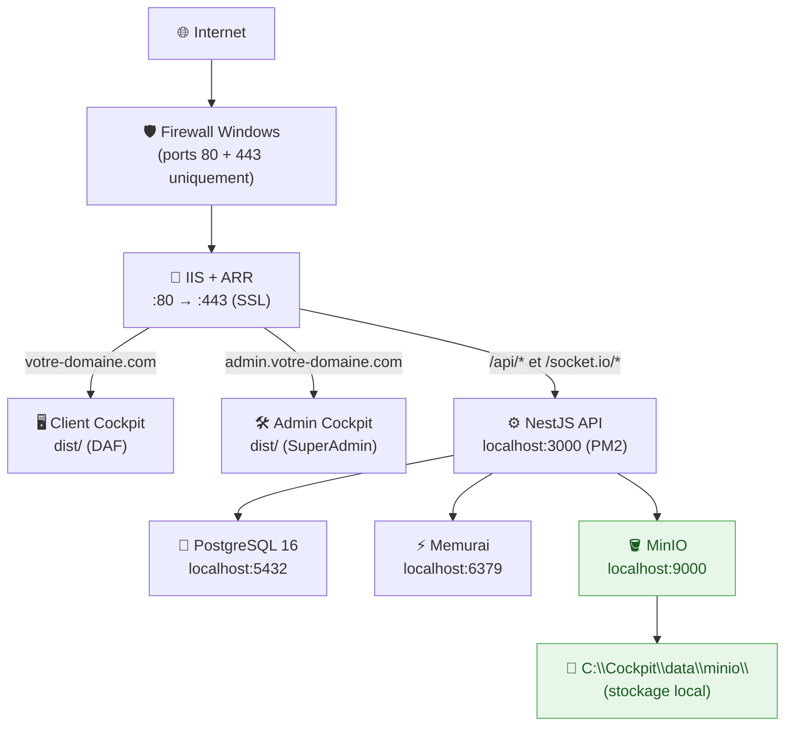

# Stockage objet — MinIO self-hosted (Windows natif)

!!! info "Contexte"
    Ce guide s'inscrit dans l'architecture de déploiement sans Docker définie dans
    [Déploiement — Windows natif](deployment-sans-docker.md).
    MinIO s'installe exactement comme Memurai : un binaire Windows géré par NSSM comme service natif.

---

## 1. Architecture cible



| Composant | Port | Accès |
|---|---|---|
| MinIO API (S3 compatible) | `9000` | Interne uniquement (NestJS) |
| MinIO Console web | `9001` | Interne uniquement (administration) |
| Données stockées | — | `C:\Cockpit\data\minio\` |

!!! warning "Isolation réseau"
    Les ports 9000 et 9001 ne doivent **jamais** être exposés à Internet.
    MinIO est un composant interne, accessible uniquement depuis NestJS via `localhost:9000`.

---

## 2. Prérequis

- Déploiement Windows natif existant fonctionnel ([guide de référence](deployment-sans-docker.md))
- NSSM installé dans `C:\tools\nssm\` (déjà requis pour Nginx si utilisé)
- Accès administrateur au serveur
- Volume de données disponible (recommandé : disque `D:\`)

### Téléchargements nécessaires

| Outil | Description | Source |
|---|---|---|
| `minio.exe` | Serveur MinIO pour Windows | `dl.min.io/server/minio/release/windows-amd64/minio.exe` |
| `mc.exe` | MinIO Client (CLI admin) | `dl.min.io/client/mc/release/windows-amd64/mc.exe` |
| NSSM | Service wrapper Windows | `nssm.cc` (si pas encore installé) |

---

## 3. Installation du binaire

### 3.1 Créer la structure de dossiers

```powershell
# Dossier binaires MinIO
New-Item -ItemType Directory -Force -Path C:\tools\minio

# Dossier données MinIO
New-Item -ItemType Directory -Force -Path C:\Cockpit\data\minio

# Dossier logs MinIO
New-Item -ItemType Directory -Force -Path C:\Cockpit\logs\minio
```

### 3.2 Placer les binaires

Télécharger `minio.exe` et `mc.exe`, puis les placer dans `C:\tools\minio\` :

```
C:\tools\minio\
├── minio.exe     ← serveur MinIO
└── mc.exe        ← client CLI admin
```

### 3.3 Vérifier les binaires

```powershell
& "C:\tools\minio\minio.exe" --version
# Réponse attendue : minio version RELEASE.xxxx-xx-xx...

& "C:\tools\minio\mc.exe" --version
# Réponse attendue : mc version RELEASE.xxxx-xx-xx...
```

---

## 4. Créer le service Windows via NSSM

### 4.1 Définir les identifiants MinIO

Choisir des identifiants forts. Ces valeurs seront aussi renseignées dans `.env.prod`.

!!! danger "Sécurité des identifiants"
    - `MINIO_ROOT_USER` : minimum 3 caractères (recommandé : `cockpit_minio`)
    - `MINIO_ROOT_PASSWORD` : **minimum 8 caractères** — utiliser un mot de passe cryptographique fort
    ```powershell
    # Générer un mot de passe fort (PowerShell)
    $bytes = New-Object byte[] 32
    [System.Security.Cryptography.RandomNumberGenerator]::Create().GetBytes($bytes)
    [System.BitConverter]::ToString($bytes).Replace('-','').ToLower().Substring(0,32)
    ```

### 4.2 Installer le service

```powershell
# Créer le service CockpitMinio
C:\tools\nssm\win64\nssm.exe install CockpitMinio "C:\tools\minio\minio.exe"

# Répertoire de travail
C:\tools\nssm\win64\nssm.exe set CockpitMinio AppDirectory "C:\tools\minio"

# Arguments : serveur + dossier données + port console
C:\tools\nssm\win64\nssm.exe set CockpitMinio AppParameters `
  "server C:\Cockpit\data\minio --address :9000 --console-address :9001"

# Variables d'environnement (remplacer les valeurs)
C:\tools\nssm\win64\nssm.exe set CockpitMinio AppEnvironmentExtra `
  "MINIO_ROOT_USER=cockpit_minio" `
  "MINIO_ROOT_PASSWORD=REMPLACER_PAR_MDP_FORT"

# Logs du service
C:\tools\nssm\win64\nssm.exe set CockpitMinio AppStdout "C:\Cockpit\logs\minio\minio-out.log"
C:\tools\nssm\win64\nssm.exe set CockpitMinio AppStderr "C:\Cockpit\logs\minio\minio-error.log"

# Démarrage automatique avec Windows
C:\tools\nssm\win64\nssm.exe set CockpitMinio Start SERVICE_AUTO_START

# Démarrer le service
C:\tools\nssm\win64\nssm.exe start CockpitMinio
```

### 4.3 Vérifier le démarrage

```powershell
# Statut du service
Get-Service CockpitMinio | Select-Object Name, Status, StartType
# Status doit être : Running

# Test de l'API S3
Invoke-WebRequest -Uri "http://localhost:9000/minio/health/live" -UseBasicParsing
# Réponse attendue : StatusCode 200
```

!!! success "Vérification visuelle"
    Ouvrir `http://localhost:9001` dans un navigateur sur le serveur.
    La console web MinIO doit afficher la page de connexion.
    Se connecter avec `MINIO_ROOT_USER` et `MINIO_ROOT_PASSWORD`.

---

## 5. Initialisation — Bucket et politique d'accès

### 5.1 Configurer le client mc

```powershell
# Enregistrer l'alias "cockpit" pointant vers le serveur local
& "C:\tools\minio\mc.exe" alias set cockpit http://localhost:9000 `
  cockpit_minio REMPLACER_PAR_MDP_FORT

# Vérifier la connexion
& "C:\tools\minio\mc.exe" admin info cockpit
```

### 5.2 Créer le bucket applicatif

L'application utilise **un seul bucket** (`cockpit-storage`) avec des sous-dossiers pour chaque usage :

```powershell
& "C:\tools\minio\mc.exe" mb cockpit/cockpit-storage

# Vérifier
& "C:\tools\minio\mc.exe" ls cockpit
```

La structure de dossiers est créée automatiquement par l'application au premier upload :

```
cockpit-storage/
├── temp/                              ← uploads bugs temporaires (avant confirmation)
├── bugs/
│   └── BR-20260430-001/
│       ├── BR-20260430-001_1.png      ← pièces jointes confirmées
│       └── BR-20260430-001_2.png
└── agent-releases/
    └── 1.0.0/
        └── windows/
            └── x64/
                └── cockpit-agent.exe  ← exécutables agent on-premise
```

### 5.3 Rendre le bucket accessible publiquement en lecture

!!! warning "Étape obligatoire"
    Par défaut, MinIO bloque tous les accès anonymes. Sans cette commande, les URLs de fichiers retournées par l'API (`R2_PUBLIC_URL/...`) renvoient une erreur `Access Denied` dans le navigateur.

```powershell
# Autoriser la lecture publique (GET anonyme) sur tout le bucket
& "C:\tools\minio\mc.exe" anonymous set download cockpit/cockpit-storage

# Vérifier
& "C:\tools\minio\mc.exe" anonymous get cockpit/cockpit-storage
# → Access permission for `cockpit/cockpit-storage` is `download`
```

Cette politique est **persistée dans MinIO** — elle n'a besoin d'être appliquée qu'une seule fois, même après redémarrage.

---

### 5.4 Créer un utilisateur applicatif dédié

!!! tip "Bonne pratique"
    Ne pas utiliser le compte root dans l'application NestJS.
    Créer un utilisateur applicatif avec des droits limités au bucket.

```powershell
# Créer l'utilisateur applicatif NestJS
& "C:\tools\minio\mc.exe" admin user add cockpit cockpit_app REMPLACER_PAR_MDP_APP

# Attacher la politique readwrite
& "C:\tools\minio\mc.exe" admin policy attach cockpit readwrite --user cockpit_app

# Vérifier
& "C:\tools\minio\mc.exe" admin user list cockpit
```

---

## 6. Variables d'environnement

Ajouter dans `C:\Cockpit\repos\insightsage_backend\.env.prod` :

```env
# ─── MinIO self-hosted ────────────────────────────────────────────────────────
R2_ACCESS_KEY_ID=cockpit_app
R2_SECRET_ACCESS_KEY=REMPLACER_PAR_MDP_APP
R2_ENDPOINT=http://localhost:9000
R2_BUCKET_NAME=cockpit-storage
R2_PUBLIC_URL=http://localhost:9000/cockpit-storage

# ─── Fallback local (si MinIO indisponible) ───────────────────────────────────
UPLOAD_DIR=uploads
APP_URL=https://votre-domaine.com
```

| Variable | Description |
|---|---|
| `R2_ENDPOINT` | URL interne du serveur MinIO |
| `R2_ACCESS_KEY_ID` | Utilisateur applicatif (pas le root) |
| `R2_SECRET_ACCESS_KEY` | Mot de passe de l'utilisateur applicatif |
| `R2_BUCKET_NAME` | Bucket unique `cockpit-storage` |
| `R2_PUBLIC_URL` | URL de base pour construire les liens publics |

!!! note "Nommage R2_*"
    Le `StorageService` utilise les variables `R2_*` (nommées ainsi par compatibilité Cloudflare R2).
    Elles pointent ici vers MinIO — c'est intentionnel, l'API S3 est identique.

---

## 7. Firewall Windows

```powershell
# Bloquer MinIO API vers l'extérieur
New-NetFirewallRule -Name "Block-MinIO-API" `
  -DisplayName "Block MinIO API 9000" `
  -Direction Inbound -Protocol TCP -LocalPort 9000 -Action Block

# Bloquer la Console web vers l'extérieur
New-NetFirewallRule -Name "Block-MinIO-Console" `
  -DisplayName "Block MinIO Console 9001" `
  -Direction Inbound -Protocol TCP -LocalPort 9001 -Action Block
```

!!! warning "Console web — accès local uniquement"
    La console MinIO sur le port 9001 est un outil d'administration.
    Elle doit rester accessible **uniquement depuis le serveur lui-même** (bureau à distance / RDP).
    Ne jamais l'exposer via le reverse proxy IIS/Nginx.

---

## 8. Intégration NestJS — StorageModule

Le `StorageModule` est déjà en place dans `src/storage/`. Il utilise `@aws-sdk/client-s3` avec `forcePathStyle: true` (obligatoire avec MinIO).

### Modules consommateurs actuels

| Module | Usage | Endpoint |
|---|---|---|
| `BugsModule` | Upload images + confirmation dans `bugs/{bugId}/` | `POST /v1/bugs/upload` |
| `AgentReleasesModule` | Upload exécutables dans `agent-releases/{v}/{p}/{a}/` | `POST /admin/agent-releases` |

### Point de configuration critique

```typescript
// src/storage/storage.service.ts — initS3Client()
this.s3Client = new S3Client({
  region: 'us-east-1',
  endpoint,                 // R2_ENDPOINT → http://localhost:9000
  credentials: { accessKeyId, secretAccessKey },
  forcePathStyle: true,     // obligatoire avec MinIO
});
```

---

## 9. Vérifications post-installation

### Health check MinIO

```powershell
Invoke-WebRequest -Uri "http://localhost:9000/minio/health/live"  -UseBasicParsing
Invoke-WebRequest -Uri "http://localhost:9000/minio/health/ready" -UseBasicParsing
# StatusCode 200 attendu sur les deux
```

### Test d'upload via mc

```powershell
echo "test" > C:\Cockpit\logs\minio\test.txt
& "C:\tools\minio\mc.exe" cp C:\Cockpit\logs\minio\test.txt cockpit/cockpit-storage/test.txt
& "C:\tools\minio\mc.exe" ls cockpit/cockpit-storage/
& "C:\tools\minio\mc.exe" rm cockpit/cockpit-storage/test.txt
```

### Test depuis NestJS

```powershell
pm2 logs cockpit-api --lines 20
# Ne doit pas contenir d'erreur "ECONNREFUSED" ou "InvalidAccessKeyId"
```

---

## 10. Migration des fichiers locaux vers MinIO

Si l'API tournait avant l'installation de MinIO, des fichiers ont été sauvegardés localement dans `UPLOAD_DIR` (défaut : `uploads/`). Deux étapes sont nécessaires :

### Étape 1 — Synchroniser les fichiers physiques

```powershell
# Copier tous les fichiers locaux vers le bucket cockpit-storage
& "C:\tools\minio\mc.exe" mirror "C:\Cockpit\api\uploads\" cockpit/cockpit-storage/

# Vérifier
& "C:\tools\minio\mc.exe" ls --recursive cockpit/cockpit-storage/ | head -20
```

!!! info "mc mirror est idempotent"
    Si des fichiers sont déjà présents dans le bucket, `mc mirror` ne les écrase pas.

### Étape 2 — Mettre à jour les URLs en base de données

Les enregistrements `Bug.attachments` et `AgentRelease.fileUrl` pointent encore vers l'ancienne URL locale. L'Admin Cockpit fournit une interface pour corriger ça sans SQL manuel.

**Via l'Admin Cockpit :**

1. Ouvrir l'interface Admin → **Paramètres → Stockage**
2. La section affiche le nombre de fichiers locaux restants
3. Cliquer **Migrer maintenant**

**Via curl (CI/CD ou script) :**

```bash
# Vérifier
curl -H "Authorization: Bearer <token_superadmin>" \
  http://localhost:3000/admin/storage/migration-status

# Migrer
curl -X POST -H "Authorization: Bearer <token_superadmin>" \
  http://localhost:3000/admin/storage/migrate-local-to-minio
```

### Vérification post-migration

```powershell
# Santé MinIO visible dans le health check global
Invoke-WebRequest -Uri "http://localhost:3000/health/db" -UseBasicParsing | Select-Object -ExpandProperty Content
# → "minio":"connected"

# Relancer le status : doit retourner total:0
Invoke-WebRequest -Uri "http://localhost:3000/admin/storage/migration-status" `
  -Headers @{ Authorization = "Bearer <token>" } -UseBasicParsing
# → "total":0
```

---

## 11. Procédure de mise à jour du binaire MinIO

```powershell
# 1. Arrêter le service
Stop-Service CockpitMinio

# 2. Sauvegarder l'ancien binaire
Copy-Item C:\tools\minio\minio.exe C:\tools\minio\minio.exe.bak

# 3. Remplacer le nouveau binaire (téléchargé depuis dl.min.io)

# 4. Redémarrer
Start-Service CockpitMinio

# 5. Vérifier
& "C:\tools\minio\mc.exe" admin info cockpit
```

!!! tip "Mise à jour sans interruption"
    En mode standalone (un seul serveur), un court arrêt est inévitable.
    Planifier la mise à jour en dehors des heures de pointe.

---

## 12. Sauvegarde des données

!!! warning "Données critiques"
    Les données MinIO (`D:\Cockpit\data\minio\`) doivent être incluses dans la stratégie de sauvegarde.

```powershell
$date = Get-Date -Format 'yyyyMMdd_HHmm'
& "C:\tools\minio\mc.exe" mirror cockpit/ "C:\Cockpit\backup\minio_$date\" --overwrite

# Ou via robocopy (service arrêté recommandé)
robocopy "C:\Cockpit\data\minio" "C:\Cockpit\backup\minio_$date" /E /Z /LOG:"C:\Cockpit\logs\minio\backup_$date.log"
```

---

## 13. Checklist pré-production

### MinIO

- [ ] Service `CockpitMinio` démarrage **Automatique** (`services.msc`)
- [ ] `Get-Service CockpitMinio` → **Running**
- [ ] `http://localhost:9000/minio/health/live` → **200**
- [ ] Console web accessible : `http://localhost:9001` (depuis le serveur)
- [ ] Bucket `cockpit-storage` créé
- [ ] Utilisateur applicatif `cockpit_app` créé (pas le compte root dans `.env.prod`)
- [ ] Ports 9000 et 9001 **bloqués** vers l'extérieur (règles Firewall)
- [ ] Dossier `C:\Cockpit\data\minio\` créé et accessible

### Variables d'environnement

- [ ] `R2_ENDPOINT=http://localhost:9000` dans `.env.prod`
- [ ] `R2_ACCESS_KEY_ID=cockpit_app` (utilisateur applicatif, pas le root)
- [ ] `R2_SECRET_ACCESS_KEY` renseigné
- [ ] `R2_BUCKET_NAME=cockpit-storage`
- [ ] `R2_PUBLIC_URL=http://localhost:9000/cockpit-storage`

### Intégration NestJS

- [ ] `@aws-sdk/client-s3` installé (`package.json`)
- [ ] `forcePathStyle: true` présent dans `StorageService.initS3Client()`
- [ ] Test d'upload via mc réussi
- [ ] Aucune erreur MinIO dans les logs PM2 au démarrage

### Sauvegarde

- [ ] Stratégie de sauvegarde incluant `D:\Cockpit\data\minio\`
- [ ] Test de restauration effectué au moins une fois

---

## Annexe — Commandes utiles au quotidien

```powershell
# ─── Service Windows ─────────────────────────────────────────────────────────
Start-Service CockpitMinio
Stop-Service  CockpitMinio
Restart-Service CockpitMinio
Get-Service CockpitMinio | Select-Object Name, Status, StartType

# ─── Administration via mc ───────────────────────────────────────────────────
& "C:\tools\minio\mc.exe" admin info cockpit
& "C:\tools\minio\mc.exe" ls cockpit
& "C:\tools\minio\mc.exe" ls --recursive cockpit/cockpit-storage/
& "C:\tools\minio\mc.exe" du cockpit/cockpit-storage

# Supprimer un fichier spécifique
& "C:\tools\minio\mc.exe" rm cockpit/cockpit-storage/temp/uuid-fichier.png

# Copier un fichier local vers MinIO
& "C:\tools\minio\mc.exe" cp C:\fichier.pdf cockpit/cockpit-storage/test.pdf

# ─── Logs ────────────────────────────────────────────────────────────────────
Get-Content C:\Cockpit\logs\minio\minio-out.log   -Tail 50
Get-Content C:\Cockpit\logs\minio\minio-error.log -Tail 50

# ─── Santé ───────────────────────────────────────────────────────────────────
Invoke-WebRequest -Uri "http://localhost:9000/minio/health/live"  -UseBasicParsing
Invoke-WebRequest -Uri "http://localhost:9000/minio/health/ready" -UseBasicParsing

# ─── Utilisateurs ────────────────────────────────────────────────────────────
& "C:\tools\minio\mc.exe" admin user list cockpit
& "C:\tools\minio\mc.exe" admin user setpassword cockpit cockpit_app NOUVEAU_MDP
```

---

## Dépannage — Erreurs fréquentes

### `Access Denied` sur une URL de fichier dans le navigateur

Le bucket n'a pas de politique de lecture publique. Appliquer une seule fois :

```powershell
& "C:\tools\minio\mc.exe" anonymous set download cockpit/cockpit-storage
```

---

### `mc: The Access Key Id you provided does not exist`

L'alias `mc` et MinIO utilisent des credentials différents. Les credentials de l'alias doivent correspondre exactement à `MINIO_ROOT_USER` / `MINIO_ROOT_PASSWORD` de l'instance MinIO.

**Sous NSSM (prod) :** vérifier que les env vars définies via `nssm set CockpitMinio AppEnvironmentExtra` correspondent à l'alias mc :

```powershell
# Vérifier les env vars du service
C:\tools\nssm\win64\nssm.exe get CockpitMinio AppEnvironmentExtra

# Reconfigurer l'alias mc pour correspondre
& "C:\tools\minio\mc.exe" alias set cockpit http://127.0.0.1:9000 cockpit_minio VOTRE_MDP_ROOT

# Vérifier
& "C:\tools\minio\mc.exe" admin info cockpit
```

!!! warning "pm2 restart ≠ pm2 start --update-env"
    `pm2 restart cockpit-minio` redémarre le processus **sans** recharger les variables d'environnement du fichier ecosystem. Utiliser `pm2 start ecosystem.config.js --update-env` pour appliquer des changements d'env vars.

---

### MinIO démarre mais `cockpit_app` est introuvable

L'utilisateur applicatif n'est pas persisté dans le bon répertoire de données. Vérifier que `C:\minio-data` est bien le répertoire utilisé à chaque démarrage, puis recréer l'utilisateur :

```powershell
& "C:\tools\minio\mc.exe" admin user add cockpit cockpit_app VOTRE_MDP_APP
& "C:\tools\minio\mc.exe" admin policy attach cockpit readwrite --user cockpit_app
```
