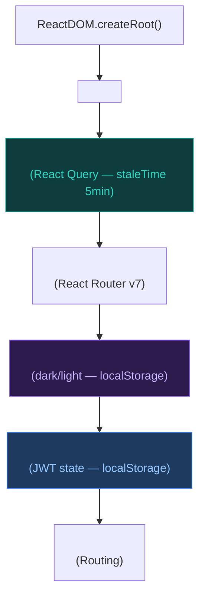

# Architecture Frontend

L'Admin Cockpit est une Single Page Application (SPA) React construite avec Vite, TypeScript strict et une architecture en features.

## Structure du projet

```
admin-cockpit/
├── src/
│   ├── api/
│   │   ├── client.ts          # Axios instance + interceptors
│   │   └── index.ts           # Endpoints typés par domaine
│   ├── components/
│   │   ├── layout/
│   │   │   ├── MainLayout.tsx  # Shell: sidebar + header + main
│   │   │   ├── Header.tsx      # Top bar avec user menu
│   │   │   └── Sidebar.tsx     # Navigation latérale
│   │   ├── shared/
│   │   │   ├── DataTable.tsx   # Table réutilisable (TanStack)
│   │   │   ├── LoadingSpinner.tsx
│   │   │   ├── ConfirmDialog.tsx
│   │   │   └── ThemeProvider.tsx
│   │   └── ui/                 # Composants Shadcn/UI (Radix)
│   ├── features/               # Domaines métier
│   │   ├── auth/               # Login, Register, Reset
│   │   ├── dashboard/          # Page d'accueil stats
│   │   ├── organizations/      # CRUD organisations
│   │   ├── users/              # CRUD utilisateurs
│   │   ├── roles/              # RBAC management
│   │   ├── agents/             # Monitoring agents
│   │   ├── subscriptions/      # Plans d'abonnement
│   │   ├── audit-logs/         # Logs avec filtres
│   │   ├── health/             # État du système
│   │   └── profile/            # Profil utilisateur
│   ├── hooks/
│   │   ├── use-api.ts          # React Query hooks
│   │   └── use-toast.ts
│   ├── i18n/
│   │   ├── index.ts            # Config i18next
│   │   ├── fr.ts               # Traductions FR
│   │   └── en.ts               # Traductions EN
│   ├── lib/
│   │   └── utils.ts            # cn(), formatDate(), getInitials()
│   ├── types/
│   │   └── index.ts            # Interfaces TypeScript
│   ├── App.tsx                  # Routing principal
│   └── main.tsx                 # Bootstrap + Providers
├── package.json
├── vite.config.ts
├── tailwind.config.js
└── tsconfig.json
```

---

## Hiérarchie des Providers



---

## Routing (`App.tsx`)

### Routes publiques

| Route | Composant | Description |
|-------|-----------|-------------|
| `/login` | `LoginPage` | Authentification |
| `/forgot-password` | `ForgotPasswordPage` | Demande reset |
| `/reset-password` | `ResetPasswordPage` | Nouveau mot de passe |

### Routes protégées (via `ProtectedRoute`)

```typescript
function ProtectedRoute({ children }) {
  const { isAuthenticated, isLoading } = useAuth();
  if (isLoading) return <LoadingSpinner fullScreen />;
  if (!isAuthenticated) return <Navigate to="/login" replace />;
  return <>{children}</>;
}
```

| Route | Composant | Description |
|-------|-----------|-------------|
| `/dashboard` | `DashboardPage` | Stats globales |
| `/organizations` | `OrganizationsPage` | Liste des orgs |
| `/organizations/:id` | `OrganizationDetailPage` | Détails org |
| `/users` | `UsersPage` | Liste des utilisateurs |
| `/users/:id` | `UserDetailPage` | Profil utilisateur |
| `/roles` | `RolesPage` | Gestion RBAC |
| `/roles/:id` | `RoleDetailPage` | Détails rôle |
| `/agents` | `AgentsPage` | Monitoring agents |
| `/agents/:id` | `AgentDetailPage` | Détails agent |
| `/audit-logs` | `AuditLogsPage` | Logs filtrables |
| `/subscription-plans` | `SubscriptionPlansPage` | Plans |
| `/subscription-plans/:id` | `SubscriptionPlanDetailPage` | Détails plan |
| `/health` | `HealthPage` | Santé système |
| `/profile` | `ProfilePage` | Mon profil |

---

## Couche API (`src/api/`)

### `client.ts` — Axios instance

```typescript
export const api = axios.create({
  baseURL: import.meta.env.VITE_API_URL || 'http://localhost:3000/api',
  headers: { 'Content-Type': 'application/json' },
});
```

**Interceptors :**

1. **Request interceptor** : Ajoute automatiquement `Authorization: Bearer <accessToken>` depuis localStorage
2. **Response interceptor** : Sur `401`, tente de rafraîchir le token via `POST /auth/refresh`. Si le refresh échoue → `window.location.href = '/login'`

### `index.ts` — APIs par domaine

Chaque domaine expose ses fonctions :

```typescript
// Exemple : agentsApi
export const agentsApi = {
  getStatus: () => api.get('/agents/status'),
  getById: (id) => api.get(`/agents/${id}`),
  generateToken: (data) => api.post('/agents/generate-token', data),
  regenerateToken: (id) => api.post(`/agents/${id}/regenerate-token`),
  revokeToken: (id) => api.post(`/agents/${id}/revoke`),
};
```

---

## Configuration Vite

```typescript
// vite.config.ts
export default defineConfig({
  plugins: [react()],
  resolve: {
    alias: { '@': path.resolve(__dirname, './src') },  // @/components/...
  },
  server: {
    port: 5173,
    proxy: {
      '/api': { target: 'http://localhost:3000', changeOrigin: true },
    },
  },
});
```

!!! tip "Alias `@`"
    Toutes les importations utilisent l'alias `@/` plutôt que les chemins relatifs `../../..`.
    Ex: `import { Button } from '@/components/ui/button'`

---

## TypeScript strict

```json
// tsconfig.json — options clés
{
  "strict": true,
  "noUnusedLocals": true,
  "noUnusedParameters": true,
  "noFallthroughCasesInSwitch": true,
  "noUncheckedSideEffectImports": true
}
```

Le code est compilé avec le mode `bundler` (`moduleResolution: "bundler"`) optimisé pour Vite.

---

## Convention d'organisation des features

Chaque feature suit le même pattern :

```
features/organizations/
├── OrganizationsPage.tsx         # Page liste (index)
├── OrganizationDetailPage.tsx    # Page détail
├── CreateOrganizationModal.tsx   # Modal création
├── EditOrganizationModal.tsx     # Modal édition
└── __tests__/
    └── CreateOrganizationModal.test.tsx
```

Les mutations (create, update, delete) utilisent `useMutation` de React Query avec `queryClient.invalidateQueries()` après succès.
