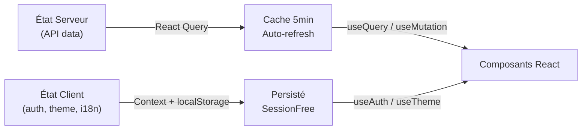
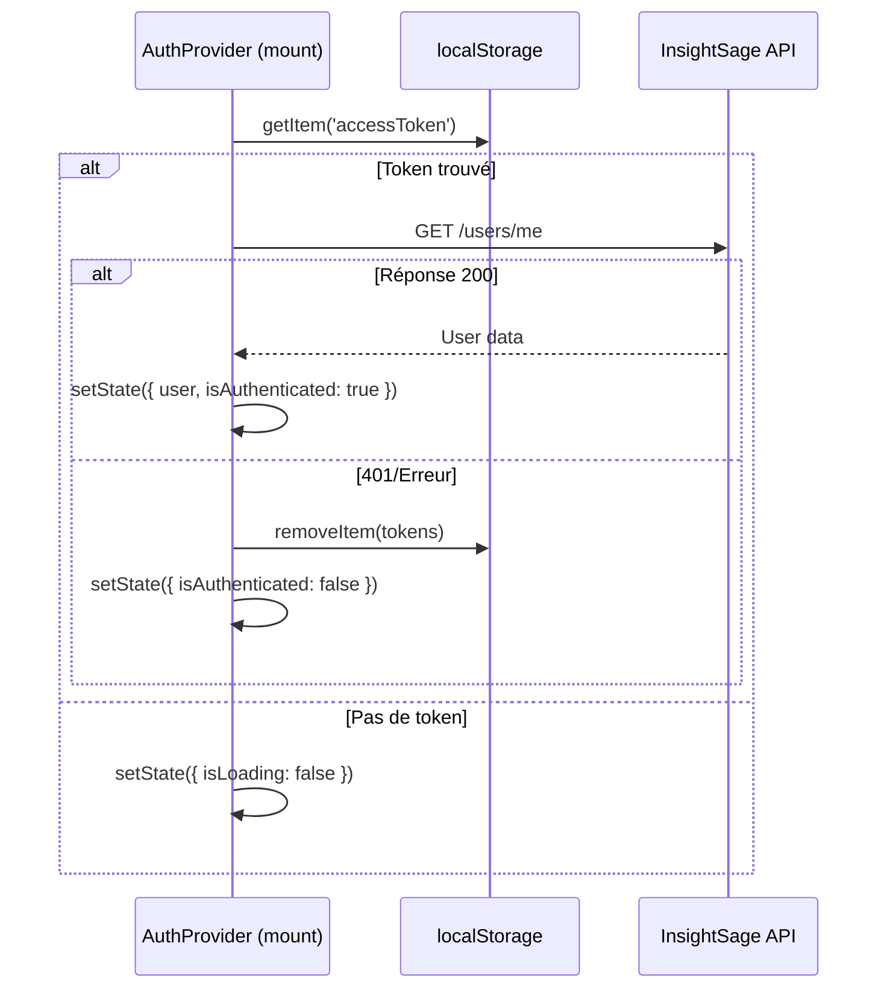
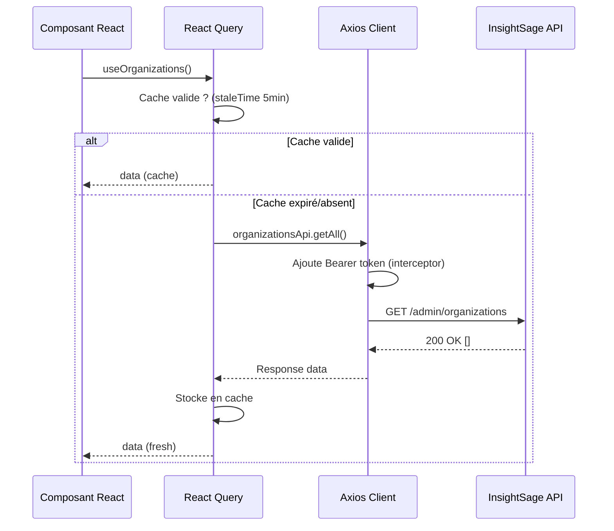

# Gestion d'état

L'Admin Cockpit distingue deux types d'état : l'état serveur (géré par React Query) et l'état client local (AuthContext, ThemeProvider).

## Stratégie globale



---

## 1. AuthContext — État d'authentification

### Interface

```typescript
interface AuthContextValue {
  // État
  user: User | null;
  accessToken: string | null;
  isAuthenticated: boolean;
  isLoading: boolean;

  // Actions
  login: (credentials: LoginCredentials) => Promise<void>;
  logout: () => Promise<void>;
  updateProfile: (data: { firstName?: string; lastName?: string }) => Promise<void>;
}
```

### Flux d'initialisation



### Actions

=== "login()"
    ```typescript
    const login = async (credentials: LoginCredentials) => {
      const response = await authApi.login(credentials);
      const { accessToken, refreshToken, user } = response.data;
      localStorage.setItem('accessToken', accessToken);
      localStorage.setItem('refreshToken', refreshToken);
      setState({ user, accessToken, isAuthenticated: true, isLoading: false });
    };
    ```

=== "logout()"
    ```typescript
    const logout = async () => {
      try { await authApi.logout(); } catch {} // Ignore erreurs
      localStorage.removeItem('accessToken');
      localStorage.removeItem('refreshToken');
      setState({ user: null, accessToken: null, isAuthenticated: false, isLoading: false });
    };
    ```

=== "updateProfile()"
    ```typescript
    const updateProfile = async (data) => {
      const response = await authApi.updateMe(data);
      setState(prev => ({ ...prev, user: response.data }));
    };
    ```

### Utilisation

```typescript
const { user, isAuthenticated, login, logout } = useAuth();

// Protection de route
if (!isAuthenticated) return <Navigate to="/login" />;

// Afficher l'utilisateur connecté
<span>{user?.firstName} {user?.lastName}</span>
```

---

## 2. React Query — État serveur

### Configuration globale (`main.tsx`)

```typescript
const queryClient = new QueryClient({
  defaultOptions: {
    queries: {
      retry: 1,
      refetchOnWindowFocus: false,
      staleTime: 5 * 60 * 1000,  // 5 minutes
    },
  },
});
```

### Hooks disponibles (`src/hooks/use-api.ts`)

| Hook | Query Key | Endpoint |
|------|-----------|----------|
| `useOrganizations()` | `['organizations']` | `GET /admin/organizations` |
| `useOrganization(id)` | `['organizations', id]` | `GET /admin/organizations/:id` |
| `useAdminUsers()` | `['admin-users']` | `GET /admin/users` |
| `useAdminUser(id)` | `['admin-users', id]` | `GET /admin/users/:id` |
| `useRoles()` | `['roles']` | `GET /roles` |
| `useRole(id)` | `['roles', id]` | `GET /roles/:id` |
| `useRolePermissions()` | `['role-permissions']` | `GET /roles/permissions` |
| `useAgents()` | `['agents-status']` | `GET /agents/status` |
| `useAgent(id)` | `['agents', id]` | `GET /agents/:id` |
| `useDashboardStats()` | `['dashboard-stats']` | `GET /admin/dashboard-stats` |
| `useAuditLogs(filters)` | `['audit-logs', filters]` | `GET /logs/audit` |
| `useAuditLogEventTypes()` | `['audit-log-events']` | `GET /logs/audit/events` |
| `useSubscriptionPlans()` | `['subscription-plans']` | `GET /admin/subscription-plans` |
| `useSubscriptionPlan(id)` | `['subscription-plans', id]` | `GET /admin/subscription-plans/:id` |
| `useActivePlans()` | `['subscription-plans', 'active']` | `GET /subscriptions/plans` |

### Cas particulier — Auto-refresh agents

Le hook `useAgents()` se rafraîchit **automatiquement toutes les 30 secondes** quand la fenêtre est active :

```typescript
export function useAgents() {
  return useQuery({
    queryKey: ['agents-status'],
    queryFn: async () => {
      const resp = await agentsApi.getStatus();
      return resp.data as Agent[];
    },
    refetchInterval: 30 * 1000,           // 30s
    refetchIntervalInBackground: false,   // Pause quand onglet inactif
  });
}
```

### Pattern mutation + invalidation

```typescript
// Exemple dans CreateOrganizationModal.tsx
const queryClient = useQueryClient();

const createMutation = useMutation({
  mutationFn: (data) => organizationsApi.createClient(data),
  onSuccess: () => {
    queryClient.invalidateQueries({ queryKey: ['organizations'] });
    toast({ title: 'Organisation créée', variant: 'success' });
    onClose();
  },
  onError: (error) => {
    toast({ title: 'Erreur', description: error.message, variant: 'destructive' });
  },
});
```

---

## 3. ThemeProvider — Mode dark/light

```typescript
// État persisté en localStorage
const [theme, setTheme] = useState<'dark' | 'light'>(() => {
  return (localStorage.getItem('theme') as Theme) || 'dark';
});

// Application sur le DOM
useEffect(() => {
  document.documentElement.classList.remove('light', 'dark');
  document.documentElement.classList.add(theme);
  localStorage.setItem('theme', theme);
}, [theme]);
```

### Utilisation

```typescript
const { theme, toggleTheme } = useTheme();
<button onClick={toggleTheme}>
  {theme === 'dark' ? <Sun /> : <Moon />}
</button>
```

---

## 4. React Hook Form + Zod

Les formulaires utilisent **React Hook Form** avec validation **Zod** :

```typescript
import { useForm } from 'react-hook-form';
import { zodResolver } from '@hookform/resolvers/zod';
import { z } from 'zod';

const schema = z.object({
  email: z.string().email('Email invalide'),
  password: z.string().min(8, 'Minimum 8 caractères'),
});

type FormValues = z.infer<typeof schema>;

const { register, handleSubmit, formState: { errors } } = useForm<FormValues>({
  resolver: zodResolver(schema),
});
```

---

## 5. Interceptor Axios — Refresh automatique

```typescript
// src/api/client.ts
api.interceptors.response.use(
  (response) => response,
  async (error: AxiosError) => {
    if (error.response?.status === 401) {
      const refreshToken = localStorage.getItem('refreshToken');
      if (refreshToken) {
        try {
          const response = await axios.post(`${API_URL}/auth/refresh`, {}, {
            headers: { Authorization: `Bearer ${refreshToken}` }
          });
          const { accessToken, refreshToken: newRT } = response.data;
          localStorage.setItem('accessToken', accessToken);
          localStorage.setItem('refreshToken', newRT);

          // Retry la requête originale avec le nouveau token
          originalRequest.headers.Authorization = `Bearer ${accessToken}`;
          return api(originalRequest);
        } catch {
          // Refresh échoué → redirection login
          localStorage.removeItem('accessToken');
          localStorage.removeItem('refreshToken');
          window.location.href = '/login';
        }
      }
    }
    return Promise.reject(error);
  }
);
```

---

## Flux complet — Requête protégée


