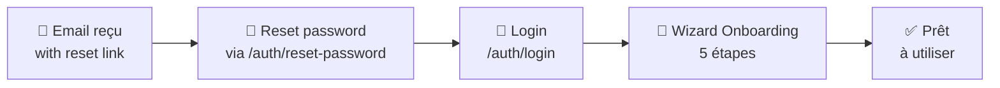

# Gestion des Organisations

Ce guide couvre l'ensemble du cycle de vie d'une organisation cliente sur la plateforme Cockpit, de sa création à sa suppression.

## Créer un nouveau client

### Via Admin Cockpit (recommandé)

1. Connectez-vous au **Admin Cockpit** avec un compte SuperAdmin
2. Menu → **Organisations** → Bouton **Nouveau client**
3. Remplissez le formulaire :

   | Champ | Exemple | Requis |
   |-------|---------|:------:|
   | Nom de l'organisation | "Acme Corp SAS" | ✅ |
   | Email de l'administrateur | "admin@acme.com" | ✅ |
   | Prénom admin | "Marie" | ✅ |
   | Nom admin | "Dupont" | ✅ |

4. Cliquez **Créer** — le système crée automatiquement :
   - L'organisation
   - L'utilisateur admin (rôle `owner`)
   - Un token de reset password (7 jours)

5. **Transmettez le token de reset** à l'administrateur client par email

### Via API

```bash
curl -X POST https://api.cockpit.nafaka.tech/api/admin/clients \
  -H "Authorization: Bearer <superadmin_token>" \
  -H "Content-Type: application/json" \
  -d '{
    "organizationName": "Acme Corp SAS",
    "adminEmail": "admin@acme.com",
    "adminFirstName": "Marie",
    "adminLastName": "Dupont"
  }'
```

---

## Processus d'onboarding client

Après la création, l'administrateur client suit le wizard en 5 étapes :



### Étapes du wizard

| Étape | Contenu | Endpoint |
|-------|---------|----------|
| **1** | Choisir le plan (Startup/PME/Business/Enterprise) | `POST /onboarding/step1` |
| **2** | Profil organisation (secteur, taille, pays) | `POST /onboarding/step2` |
| **3** | Configurer Sage ERP (type, mode, hôte) | `POST /onboarding/step3` |
| **Lien** | Connecter l'agent avec son token | `POST /onboarding/agent-link` |
| **4** | Sélectionner les profils métier | `POST /onboarding/step4` |
| **5** | Inviter les collaborateurs (ou plus tard) | `POST /onboarding/step5` |

### Vérifier l'avancement du wizard

```bash
curl -H "Authorization: Bearer <token_client>" \
  https://api.cockpit.nafaka.tech/api/onboarding/status
```

Réponse :
```json
{
  "currentStep": 3,
  "completedSteps": [1, 2],
  "isComplete": false
}
```

---

## Modifier une organisation

### Via Admin Cockpit

1. **Organisations** → Cliquez sur l'organisation
2. Bouton **Modifier** → Formulaire d'édition
3. Champs modifiables : Nom, Secteur, Taille, Pays, Config Sage, Plan d'abonnement

### Via API (SuperAdmin)

```bash
curl -X PATCH https://api.cockpit.nafaka.tech/api/admin/organizations/ORG_ID \
  -H "Authorization: Bearer <superadmin_token>" \
  -d '{
    "planId": "uuid-business-plan",
    "sector": "Finance",
    "country": "France"
  }'
```

### Auto-modification (Owner/Admin)

L'administrateur de l'organisation peut modifier ses propres informations :

```bash
curl -X PATCH https://api.cockpit.nafaka.tech/api/organizations/me \
  -H "Authorization: Bearer <owner_token>" \
  -d '{ "name": "Acme Corp — Updated" }'
```

---

## Changer le plan d'abonnement

!!! warning "Impact immédiat"
    Le changement de plan prend effet immédiatement. Si le nouveau plan a des limites inférieures
    (ex: `maxUsers` réduit), les utilisateurs existants **ne sont pas supprimés** mais ne peuvent
    plus être ajoutés.

1. Dans Admin Cockpit → **Organisations** → Sélectionner l'org
2. **Modifier** → Changer le champ **Plan d'abonnement**
3. Sauvegarder

Ou via API :
```bash
PATCH /admin/organizations/ORG_ID  { "planId": "uuid-enterprise-plan" }
```

---

## Suspension d'une organisation

Actuellement, la suspension se fait en désactivant les utilisateurs un par un via :

```bash
PATCH /admin/users/USER_ID  { "isActive": false }
```

!!! info "Fonctionnalité à venir"
    Une suspension globale d'organisation (`isActive: false` sur l'org) est planifiée.

---

## Supprimer une organisation

!!! danger "Action irréversible"
    La suppression déclenche une **cascade complète** :
    utilisateurs, agents, dashboards, widgets, rôles, invitations, onboarding.

    Les **logs d'audit** sont conservés avec `organizationId = null`.

### Via Admin Cockpit

1. **Organisations** → Cliquer sur l'org
2. **Supprimer** → Confirmation requise (saisir le nom de l'org)

### Via API

```bash
curl -X DELETE https://api.cockpit.nafaka.tech/api/admin/organizations/ORG_ID \
  -H "Authorization: Bearer <superadmin_token>"
```

---

## Consulter les statistiques globales

```bash
GET /admin/dashboard-stats
```

```json
{
  "totalOrganizations": 42,
  "totalUsers": 318,
  "agents": { "online": 38, "offline": 3, "error": 1 },
  "recentActivity": [...]
}
```

---

## Matrice des permissions par rôle

| Action | SuperAdmin | Owner | DAF | Controller | Analyst |
|--------|:---------:|:-----:|:---:|:---------:|:-------:|
| Voir l'organisation | ✅ | ✅ | ✅ | ✅ | ✅ |
| Modifier l'organisation | ✅ | ✅ | — | — | — |
| Changer le plan | ✅ | — | — | — | — |
| Créer une org | ✅ | — | — | — | — |
| Supprimer une org | ✅ | — | — | — | — |
| Cross-tenant access | ✅ | — | — | — | — |
