# Plans d'Abonnement

## Les 4 plans disponibles

```mermaid
graph LR
    S["🌱 Startup\n99€/mois\n3 users | 10 KPIs"] --> P
    P["📈 PME\n299€/mois\n10 users | 30 KPIs"] --> B
    B["🏢 Business\n699€/mois\n25 users | 100 KPIs\n✅ NLQ"] --> E
    E["🏛️ Enterprise\nSur devis\nIllimité\n✅ NLQ + Reports"]

    style S fill:#1e293b,stroke:#0d9488
    style P fill:#1e293b,stroke:#0d9488
    style B fill:#0f3d3d,stroke:#0d9488,color:#2dd4bf
    style E fill:#0f3d3d,stroke:#eab308,color:#fbbf24
```



### Comparaison détaillée

| Fonctionnalité | Startup | PME | Business | Enterprise |
|----------------|:-------:|:---:|:--------:|:----------:|
| **Prix/mois** | 99€ | 299€ | 699€ | Sur devis |
| **Utilisateurs max** | 3 | 10 | 25 | Illimité |
| **KPIs max** | 10 | 30 | 100 | Illimité |
| **Widgets max** | 5 | 15 | 50 | Illimité |
| **Sync/jour (agent)** | 48 | 144 | 480 | Illimité |
| **KPI packs** | Finance | Finance + Stock | Tous | Tous |
| **NLQ** | ❌ | ❌ | ✅ | ✅ |
| **Rapports avancés** | ❌ | ❌ | ❌ | ✅ |
| **Support** | Email | Email + Chat | Prioritaire | Dédié |

---

## Créer un nouveau plan

### Via Admin Cockpit

1. **Plans d'abonnement** → **Nouveau plan**
2. Remplir le formulaire

### Via API

```bash
curl -X POST https://api.cockpit.nafaka.tech/api/admin/subscription-plans \
  -H "Authorization: Bearer <superadmin_token>" \
  -H "Content-Type: application/json" \
  -d '{
    "name": "startup-plus",
    "label": "Startup Plus",
    "description": "Startup avec NLQ inclus",
    "priceMonthly": 199,
    "maxUsers": 5,
    "maxKpis": 20,
    "maxWidgets": 10,
    "maxAgentSyncPerDay": 96,
    "allowedKpiPacks": ["finance", "ventes"],
    "hasNlq": true,
    "hasAdvancedReports": false,
    "sortOrder": 2
  }'
```

!!! note "Champs `null` = illimité"
    Pour le plan Enterprise, passez `maxUsers: null`, `maxKpis: null`, `maxWidgets: null`.

---

## Modifier un plan existant

```bash
curl -X PATCH https://api.cockpit.nafaka.tech/api/admin/subscription-plans/PLAN_ID \
  -H "Authorization: Bearer <superadmin_token>" \
  -d '{
    "priceMonthly": 349,
    "maxUsers": 15,
    "hasNlq": true
  }'
```

Les modifications sont immédiates pour toutes les organisations abonnées à ce plan.

---

## Assigner un plan à une organisation

### Via Admin Cockpit

1. **Organisations** → Sélectionner l'org → **Modifier**
2. Changer **Plan d'abonnement** → Sauvegarder

### Via API

```bash
PATCH /admin/organizations/ORG_ID
{ "planId": "uuid-business-plan" }
```

!!! warning "Downgrade"
    En cas de downgrade (ex: Business → Startup), les données existantes dépassant les nouvelles
    limites **ne sont pas supprimées automatiquement**. Il faut les supprimer manuellement.

---

## KPI Packs

Les KPI packs contrôlent les catégories d'indicateurs disponibles pour une organisation.

| Pack | Contenu | Plans |
|------|---------|-------|
| `finance` | CA, marges, trésorerie, AR Aging, DMP | Tous |
| `stock` | Niveaux stocks, rotations, ruptures | PME+ |
| `ventes` | Commandes, pipeline commercial, top clients | PME+ |
| `rh` | Effectifs, masse salariale, absentéisme | Business+ |

Modifier les packs d'un plan :
```bash
PATCH /admin/subscription-plans/PLAN_ID
{ "allowedKpiPacks": ["finance", "stock", "ventes", "rh"] }
```

---

## Désactiver un plan

Désactiver retire le plan des offres disponibles sans impacter les orgs existantes.

```bash
DELETE /admin/subscription-plans/PLAN_ID
# Met isActive = false — ne supprime pas
```

!!! warning "Avant de désactiver"
    1. Identifier les organisations sur ce plan : `GET /admin/organizations` → filtrer par `planId`
    2. Les migrer vers un autre plan
    3. Désactiver le plan

---

## Intégration Stripe (futur)

Le schéma Prisma inclut les champs pour l'intégration billing :

```json
{
  "stripeProductId": "prod_xxx",
  "stripePriceId": "price_xxx"
}
```

Workflow prévu :
1. Créer le produit/prix sur Stripe
2. Associer les IDs via `PATCH /admin/subscription-plans/:id`
3. Webhook Stripe → mise à jour automatique du plan en DB

---

## Endpoint public (sans auth)

```bash
# Accessible sans token — pour afficher les plans aux prospects
GET https://api.cockpit.nafaka.tech/api/subscriptions/plans
```

Retourne uniquement les plans `isActive: true` triés par `sortOrder`.
