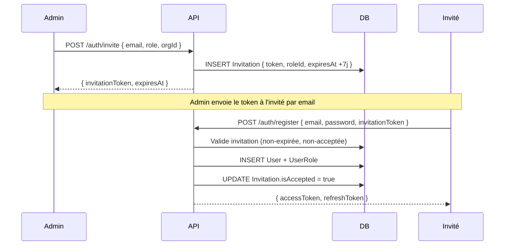

# Gestion des Utilisateurs

## Deux façons d'ajouter un utilisateur

| Méthode | Quand l'utiliser | Qui peut le faire |
|---------|-----------------|-------------------|
| **Invitation** | L'utilisateur doit créer son propre mot de passe | Owner, SuperAdmin |
| **Création directe** | Compte préparé par l'admin | SuperAdmin uniquement |

---

## Méthode 1 : Invitation par email

### Via Admin Cockpit

1. **Utilisateurs** → **Inviter un utilisateur**
2. Remplir le formulaire :
   - **Email** de l'utilisateur
   - **Rôle** à attribuer (daf, controller, analyst...)
   - **Organisation** cible
3. Cliquer **Envoyer l'invitation**

### Ce qui se passe en coulisses



### Via API

```bash
curl -X POST https://api.cockpit.nafaka.tech/api/auth/invite \
  -H "Authorization: Bearer <owner_token>" \
  -H "Content-Type: application/json" \
  -d '{
    "email": "daf@acme.com",
    "role": "daf",
    "organizationId": "uuid-org"
  }'
```

Réponse :
```json
{
  "message": "Invitation envoyée",
  "invitationToken": "token-7j-à-envoyer-par-email",
  "expiresAt": "2026-03-09T10:00:00Z"
}
```

!!! warning "Expiration 7 jours"
    Le token d'invitation expire après 7 jours. Si l'invité n'a pas activé son compte,
    supprimez l'invitation et envoyez-en une nouvelle.

---

## Méthode 2 : Création directe (SuperAdmin)

Crée un compte sans invitation, avec un mot de passe temporaire.

### Via Admin Cockpit

1. **Utilisateurs** → **Créer un utilisateur**
2. Remplir : Email, Prénom, Nom, Mot de passe temporaire, Organisation, Rôle(s)
3. **Créer**
4. Communiquer les credentials à l'utilisateur

### Via API

```bash
curl -X POST https://api.cockpit.nafaka.tech/api/admin/users \
  -H "Authorization: Bearer <superadmin_token>" \
  -d '{
    "email": "controller@acme.com",
    "password": "TempPass123!",
    "firstName": "Paul",
    "lastName": "Martin",
    "organizationId": "uuid-org",
    "roleIds": ["uuid-role-controller"]
  }'
```

---

## Consulter et modifier un utilisateur

### Profil utilisateur

```bash
GET /admin/users/USER_ID
```

Réponse (champs sensibles exclus automatiquement) :
```json
{
  "id": "uuid",
  "email": "daf@acme.com",
  "firstName": "Marie",
  "lastName": "Dupont",
  "isActive": true,
  "emailVerified": false,
  "organizationId": "uuid-org",
  "userRoles": [
    { "role": { "name": "daf", "permissions": [...] } }
  ]
}
```

### Modifier firstName/lastName

```bash
PATCH /admin/users/USER_ID
{ "firstName": "Marie-Claire", "lastName": "Dupont-Martin" }
```

### Désactiver/Réactiver un compte

```bash
PATCH /admin/users/USER_ID
{ "isActive": false }  # Désactiver
{ "isActive": true }   # Réactiver
```

!!! info "Effet de `isActive: false`"
    L'utilisateur ne peut plus se connecter. Ses tokens existants sont invalidés
    au prochain appel (le JWT est vérifié contre `isActive` dans la stratégie).

---

## Réinitialisation de mot de passe

### Par l'utilisateur lui-même

1. Sur la page login → **Mot de passe oublié ?**
2. Saisir l'email
3. Recevoir le lien de reset par email (valable 7 jours)
4. Définir un nouveau mot de passe

### Par l'admin (via reset forcé)

```bash
# 1. Générer un token de reset
POST /auth/forgot-password { "email": "user@acme.com" }
# → retourne un token (à envoyer manuellement à l'utilisateur)

# 2. L'utilisateur reset
POST /auth/reset-password { "token": "...", "newPassword": "NvxPass123!" }
```

---

## Supprimer un utilisateur

```bash
DELETE /admin/users/USER_ID
```

!!! danger "Suppression en cascade"
    La suppression supprime également :
    - Les `UserRole` associés
    - Les `Dashboard` et `Widget` créés par l'utilisateur
    - Les entrées `AuditLog` pointant vers cet utilisateur sont conservées

---

## Gestion des rôles

### Assigner un rôle via création directe

```json
POST /admin/users
{ ..., "roleIds": ["uuid-role-daf", "uuid-role-analyst"] }
```

### Rôles disponibles

| Rôle | Profil | Permissions clés |
|------|--------|-----------------|
| `superadmin` | Équipe Nafaka | `manage:all` |
| `owner` | Propriétaire org | `manage:users`, `manage:agents`, `read:logs` |
| `daf` | DAF/CFO | `read:users`, `read:agents`, `read:logs`, `manage:dashboards` |
| `controller` | Contrôleur | `read:users`, `read:agents`, `read:logs`, `read:dashboards` |
| `analyst` | Analyste | `read:dashboards` uniquement |

### Rôles personnalisés

```bash
POST /roles
{
  "name": "compliance-reader",
  "description": "Lecture logs uniquement",
  "permissionIds": ["uuid-read-logs"]
}
```

---

## Bulk invite (Onboarding — Étape 5)

Lors du wizard d'onboarding, l'étape 5 permet d'inviter plusieurs utilisateurs d'un coup :

```bash
POST /onboarding/step5
{
  "invitations": [
    { "email": "daf@acme.com",       "role": "daf" },
    { "email": "ctrl@acme.com",      "role": "controller" },
    { "email": "analyst@acme.com",   "role": "analyst" }
  ],
  "inviteLater": false
}
```

Ou si l'équipe n'est pas encore prête :

```json
{ "inviteLater": true }
```

L'onboarding est marqué `isComplete: true` dans les deux cas.
