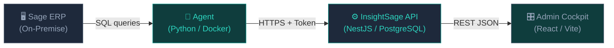
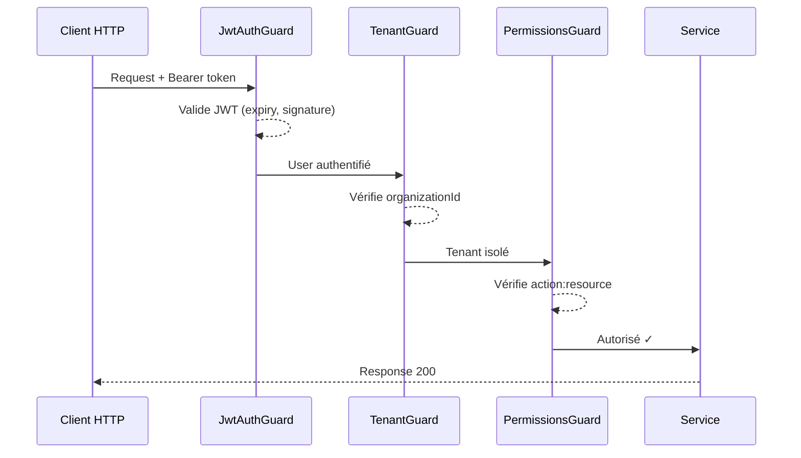

  <h1>Cockpit Platform</h1>
  

    Documentation officielle de la plateforme d'administration Cockpit —
    un écosystème complet conçu pour les entreprises qui exploitent <strong>Sage ERP</strong>
    et souhaitent centraliser la gestion de leurs données, utilisateurs et organisations.
  

  
<strong>Multi-tenant</strong>Architecture stricte

  
<strong>RBAC</strong>5 rôles système

  
<strong>JWT</strong>Access + Refresh tokens

  
<strong>4 plans</strong>Startup → Enterprise

  
<strong>99.9%</strong>Disponibilité cible

## Vue d'ensemble

La plateforme **Cockpit** est composée de trois éléments interconnectés :

| Composant | Technologie | Rôle |
|-----------|-------------|------|
| **InsightSage API** | NestJS + Prisma + PostgreSQL | Backend central multi-tenant |
| **Admin Cockpit** | React + Vite + Tailwind | Interface d'administration SuperAdmin |
| **Agent** | Python / Docker | Pont sécurisé vers Sage ERP |

## Sections de la documentation

  <a href="getting-started/" class="cockpit-card">
    <h3>🚀 Démarrage rapide</h3>
    
Installer et lancer la plateforme en moins de 10 minutes. Prérequis, variables d'environnement, premier login.

  </a>
  <a href="architecture/overview/" class="cockpit-card">
    <h3>🏗️ Architecture</h3>
    
Schéma haut-niveau, flux de données, stack technique complète et choix d'architecture.

  </a>
  <a href="backend/setup/" class="cockpit-card">
    <h3>⚙️ Backend API</h3>
    
Installation, configuration, référence complète des endpoints, modules et sécurité.

  </a>
  <a href="frontend/architecture/" class="cockpit-card">
    <h3>🎛️ Admin Cockpit</h3>
    
Architecture frontend, design system, gestion d'état, pages et navigation.

  </a>
  <a href="agent/overview/" class="cockpit-card">
    <h3>🤖 L'Agent</h3>
    
Pont sécurisé entre Sage ERP et l'API. Installation, configuration et dépannage.

  </a>
  <a href="guides/organizations/" class="cockpit-card">
    <h3>📖 Guides Fonctionnels</h3>
    
Guides pas-à-pas pour les opérations admin courantes : organisations, utilisateurs, abonnements.

  </a>
  <a href="developer/standards/" class="cockpit-card">
    <h3>🛠️ Développeur & DevOps</h3>
    
Standards de code, suite de tests, déploiement Docker et pipelines CI/CD.

  </a>
  <a href="backend/security/" class="cockpit-card">
    <h3>🔐 Sécurité</h3>
    
JWT, RBAC granulaire, isolation multi-tenant, masquage PII et conformité.

  </a>

## Modèle de sécurité en un coup d'œil

!!! info "Environnements supportés"
    - **Développement** : `.env.dev` — Hot reload avec `npm run start:dev`
    - **Test** : `.env.test` — Jest avec base de données isolée
    - **Production** : `.env.prod` — Node.js `dist/main.js`

## Prérequis rapides

| Outil | Version minimale | Rôle |
|-------|-----------------|------|
| Node.js | 20.x LTS | Runtime backend & frontend |
| npm | 10.x | Gestionnaire de paquets |
| PostgreSQL | 14+ | Base de données (via Supabase) |
| Git | 2.x | Versionnement |

---

!!! tip "Vous êtes développeur ?"
    Commencez par la section [Démarrage rapide](getting-started.md) puis consultez la
    [Référence API](backend/api-reference.md) et les [Standards de développement](developer/standards.md).

!!! tip "Vous êtes administrateur ?"
    Consultez les [Guides Fonctionnels](guides/organizations.md) pour les opérations quotidiennes.
