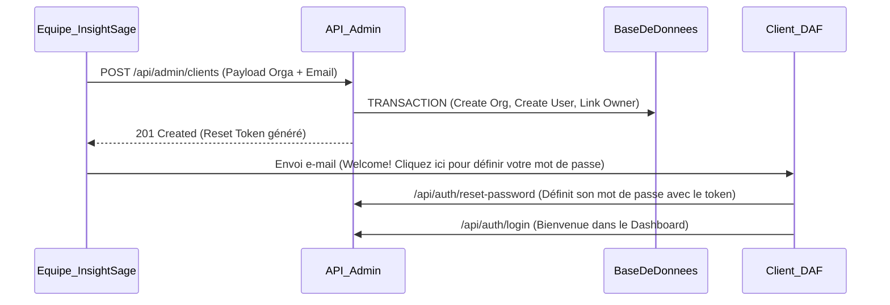

# Module Admin (InsightSage)

Ce module est le point d'entrée centralisé pour l'onboarding de nouveaux clients sur la plateforme InsightSage.

InsightSage opérant sous le modèle logiciel **"SaaS Fermé" (Closed SaaS)**, l'inscription publique est volontairement désactivée. Aucun utilisateur lambda ne peut créer librement un espace d'entreprise en ligne. Tout nouvel espace (tenant/organisation) est instancié exclusivement par les équipes d'InsightSage (SuperAdministrateurs).

## Flux d'Onboarding d'un Client

La création d'un client passe par l'unique route `POST /api/admin/clients`.

Cette route est :
- Hautement sécurisée par un jeton JWT (`JwtAuthGuard`).
- Strictement réservée aux membres de l'équipe système InsightSage (`PermissionsGuard` avec `@RequirePermissions({ action: 'manage', resource: 'all' })`).

### Fonctionnement Interne (`AdminService`)

Lors de l'appel à la route de création, un **Transactionnel Prisma (`$transaction`)** est mis en place pour garantir l'intégrité de la base de données :
1. **Création de l'Organisation** : Un nouveau tenant (Client/Compte) est créé en base.
2. **Création du Root User** : L'utilisateur administratif racine (ex: Le DAF du client) est créé et rattaché à son organisation. L'utilisateur reçoit automatiquement le rôle métier principal (`daf`).
3. **Liaison Owner** : La base assure la rétro-liaison où cet utilisateur devient le *propriétaire* (Owner) officiel de sa propre organisation.
4. **Génération de mot de passe** : Le système génère arbitrairement un mot de passe impossible à deviner (non envoyé).
5. **Génération d'un Reset Token** : Afin de donner un accès propre au client, le système émet un jeton de récupération de mot de passe (qui expire dans les 7 jours).

### Test et Simulation (En Développement)

En environnement de développement local (`NODE_ENV=development`), puisque les emails ne sont pas (encore) envoyés, le serveur triche pour faciliter vos tests : 
L'endpoint `/api/admin/clients` renvoie directement le jeton de configuration en clair dans son objet de retour JSON (sous le noeud `debug.setupToken`).

Vous pouvez copier ce `setupToken` et exécuter la route publique de l'Auth Module `POST /api/auth/reset-password` pour définir physiquement le premier mot de passe du DAF et commencer vos tests de navigation côté Client !

## Schéma Rapide d'Installation :

